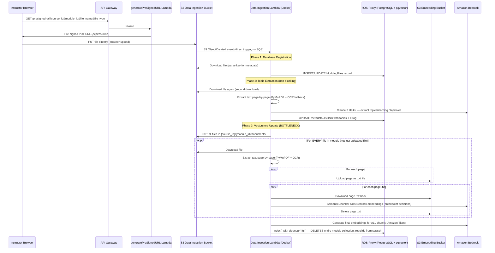
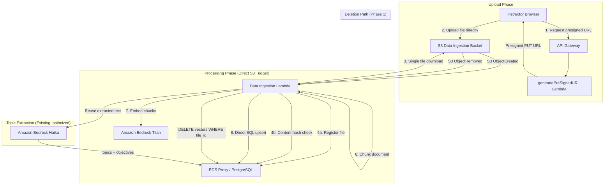
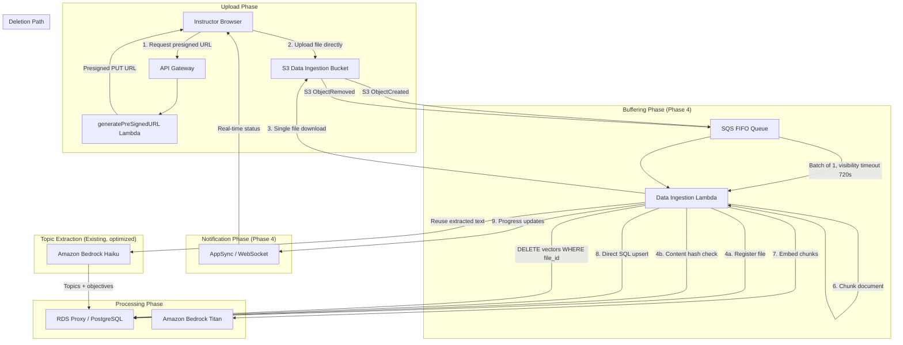
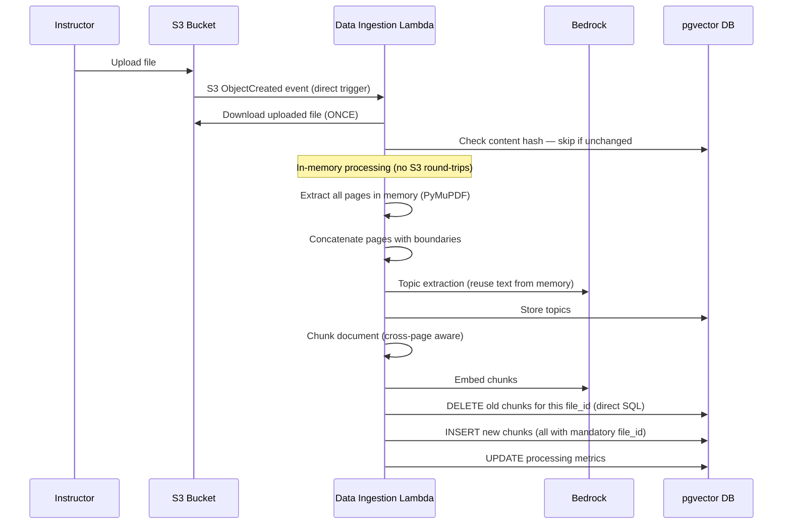
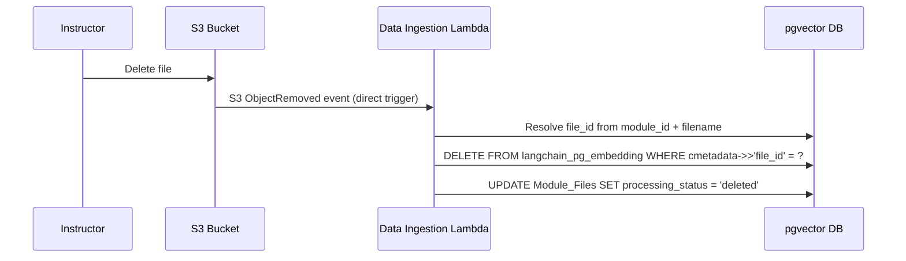

# Design Document: Data Ingestion Optimization

## Current Process Summary

This section documents the existing file upload and data ingestion pipeline end-to-end as implemented in the codebase today.

### End-to-End Flow



### Infrastructure Configuration

| Resource | Configuration |
|----------|--------------|
| Lambda runtime | Docker container, Python 3.11 |
| Memory | 512 MB |
| Timeout | 600 seconds (10 minutes) |
| Trigger | S3 ObjectCreated event (direct, no queue) |
| VPC | Yes (for RDS Proxy access) |
| Tracing | X-Ray active |
| Embedding model | Amazon Titan (model ID from SSM parameter) |
| Topic extraction model | Claude 3 Haiku (hardcoded) |
| Vector DB | PostgreSQL + pgvector via `langchain-postgres` PGVector |
| Record manager | `langchain-classic` SQLRecordManager |
| Chunking | `langchain-experimental` SemanticChunker |

### S3 Key Structure

```
{course_id}/{module_id}/documents/{file_name}.{file_type}
```

Supported file types: `pdf`, `docx`, `pptx`, `txt`, `xlsx`, `xps`, `mobi`, `cbz`

### Detailed Bottleneck Analysis

#### 1. Full Module Reprocessing (Critical)

`process_documents()` in `processing/documents.py` lists ALL files under the module's `documents/` prefix and reprocesses every single one on every upload. It then calls `index()` with `cleanup="full"`, which deletes the entire module's vector collection and rebuilds it from scratch.

**Impact**: A module with 20 files causes all 20 to be re-downloaded, re-parsed, re-chunked, and re-embedded every time a 21st file is added. Processing time scales as O(n) with total module files, not O(1) for the new file.

#### 2. Intermediate S3 Round-Trips (High)

`store_doc_texts()` extracts each page's text and uploads it to the embedding bucket as a `.txt` file. Then `store_doc_chunks()` immediately re-downloads those same `.txt` files, chunks them, and deletes them. This introduces:
- N upload API calls (one per page)
- N download API calls (one per page)
- N delete API calls (one per page)
- Network latency multiplied 3x per page

For a 50-page PDF, that's 150 unnecessary S3 API calls.

#### 3. SemanticChunker Per-Page Isolation (High)

Each page is chunked independently. `SemanticChunker` calls Bedrock embeddings for every page to determine semantic breakpoints. This means:
- Cross-page context is lost (a concept spanning pages 4-5 gets split awkwardly)
- Bedrock embedding calls for chunking decisions multiply with page count
- Each page's chunk boundaries are decided without awareness of adjacent pages

#### 4. Sequential Processing (Medium)

Pages are processed one at a time in a `for` loop. No use of `concurrent.futures`, `asyncio`, or batch APIs. Embedding generation is also sequential — each chunk is embedded individually rather than in batches.

#### 5. Double File Download (Medium)

The uploaded file is downloaded twice from S3:
1. Once in `extract_text_from_pdf()` for topic extraction
2. Once in `store_doc_texts()` for vectorstore processing

#### 6. No Progress Feedback (UX)

After the presigned URL upload completes, the instructor has zero visibility into processing status. The Lambda runs silently for potentially minutes with no feedback mechanism.

#### 7. No Burst Protection (Reliability)

S3 events trigger Lambda directly. If an instructor uploads 10 files rapidly, 10 concurrent Lambda invocations fire — each one reprocessing ALL module files. This creates:
- Thundering herd on RDS Proxy connections
- Redundant overlapping work
- Potential for race conditions on the vectorstore

#### 8. No Content-Based Deduplication

If the same file is re-uploaded (identical content), it is fully reprocessed. The ETag check exists for topic extraction but not for vectorstore processing.

---

## Architecture Principle

> **"PGVector is the source of truth. LangChain is optional convenience."**

All vector record management follows this rule:

- **All indexing = direct SQL upserts** — no reliance on LangChain's record manager abstractions
- **`file_id` = primary partition key** for all vector operations (insert, delete, query)
- **`content_hash` = dedup gate** — skip reprocessing when content is unchanged
- **Deletion = deterministic SQL delete** — `DELETE FROM langchain_pg_embedding WHERE cmetadata->>'file_id' = ?`
- **LangChain PGVector** may still be used for convenience (e.g., `add_documents()` for insertion), but all record management and deletion is raw SQL
- **SQLRecordManager is removed** — it adds framework ambiguity bugs without solving problems that direct SQL doesn't solve better

This removes an entire class of "framework ambiguity bugs" where LangChain's cleanup modes behave unpredictably, and establishes a simple, auditable indexing contract.

---

## Overview of Improvements

The optimization strategy targets each bottleneck while staying within the existing AWS infrastructure (Lambda, S3, Bedrock, pgvector). No new services are introduced in the core fix. SQS and AppSync are added only in Phase 4 after the pipeline is stable and correct.

### Summary of Changes

| # | Optimization | Bottleneck Addressed | Expected Impact | Phase |
|---|---|---|---|---|
| 1 | Mandatory `file_id` in chunk metadata | Enables incremental deletion | Required foundation for all other optimizations | 1 |
| 2 | Direct SQL incremental indexing | Full module reprocessing | ~95% reduction in processing time for subsequent uploads | 1 |
| 3 | Content hash deduplication | Reprocessing identical files | Skip processing entirely for unchanged content | 1 |
| 4 | File deletion cleanup | Stale embeddings from deleted files | Ensures deleted files are no longer searchable | 1 |
| 5 | Benchmark SemanticChunker vs RecursiveCharacterTextSplitter | Hidden embedding cost in chunking | Data collection for chunking strategy switch decision | 1 |
| 6 | In-memory page processing | Intermediate S3 round-trips | Eliminates 3N S3 calls per file (N = page count) | 2 |
| 7 | Processing metrics | Observability gap | Per-file duration, chunk count, error tracking | 2 |
| 8 | Switch chunking strategy (if data supports) | SemanticChunker double-embedding cost | RecursiveCharacterTextSplitter may give 90% quality at 10% cost | 2 |
| 9 | Batch embedding API calls | Per-chunk API overhead | Reduce Bedrock API calls by ~90% | 3 |
| 10 | Memory tuning (1024 vs 2048 MB) | Resource constraints | Requires benchmarking with real workloads | 3 |
| 11 | SQS FIFO queue | Burst uploads / thundering herd | Serialization + backpressure | 4 |
| 12 | AppSync progress notifications | No feedback | Real-time status for instructors | 4 |
| 13 | Parallel page extraction | Sequential processing | Theoretical improvement — needs benchmarking | 4 |
| 14 | Reserved concurrency tuning | RDS connection exhaustion | Prevents connection pool saturation | 4 |

### Technical Risk Assessment

| Risk | Severity | Mitigation |
|------|----------|-----------|
| **Direct SQL indexing correctness** | Medium | Validate delete+insert atomicity within a transaction. Test with concurrent uploads. Straightforward SQL — no framework abstraction risk. |
| SemanticChunker double-embedding cost | High | Generates embeddings just to decide chunk boundaries — affects unit economics of EVERY file. Benchmark in Phase 1 to inform Phase 2 switch decision. |
| Parallel page extraction under GIL | Low | PyMuPDF is CPU-bound; Python GIL limits true parallelism. Likely only saves a few seconds. Defer to Phase 4. |
| Memory configuration | Low | Lambda CPU scales with memory. Benchmark 1024 vs 2048 MB with real workloads before committing. |
| SQS ordering semantics (Phase 4) | Low | Only introduced after core indexing is proven correct. No risk of debugging queue issues during core fix. |

---

## Implementation Phases

### Phase 1: Core Fix (80-90% of total benefit)

These changes deliver the vast majority of performance improvement. They fix the root cause (full rebuild + no dedup) using direct SQL — no new infrastructure required.

1. **Mandatory `file_id` in chunk metadata** — Every chunk MUST include `file_id` in its metadata. Without this, incremental deletion (`DELETE WHERE cmetadata->>'file_id' = ?`) is impossible. The current code conditionally sets `file_id` — this must become unconditional.
2. **Direct SQL incremental indexing** — Replace `cleanup="full"` (which rebuilds the entire module's vectors) with per-file direct SQL operations:
   - `DELETE FROM langchain_pg_embedding WHERE cmetadata->>'file_id' = ?` (remove old chunks)
   - Insert new chunks via `PGVector.add_documents()` or direct SQL INSERT
   - No SQLRecordManager. No `cleanup="incremental"`. Simple, auditable SQL.
3. **Content hash deduplication** — Compute and store a content hash; skip reprocessing when file content hasn't changed.
4. **File deletion cleanup** — When an instructor deletes a file, execute `DELETE FROM langchain_pg_embedding WHERE cmetadata->>'file_id' = '<file_id>'` to remove stale embeddings. Currently the `ObjectRemoved` event path is a no-op.
5. **Benchmark SemanticChunker vs RecursiveCharacterTextSplitter** — SemanticChunker generates embeddings just to decide chunk boundaries, affecting unit economics of every file processed. Run the benchmark as part of Phase 1 prototype work to collect data for the Phase 2 switch decision. Don't switch yet — just measure.

**Infrastructure changes (Phase 1)**: Minimal. DB migration (add `content_hash`, `processing_status` columns), Lambda code changes. No SQS, no AppSync. Keep the existing direct S3 → Lambda trigger.

### Phase 2: Efficiency (additional 10-15%)

6. **Remove intermediate S3 uploads/downloads** — Process text entirely in-memory instead of uploading per-page `.txt` files to S3 and re-downloading them.
7. **Processing metrics** — Track `processing_duration_ms`, `chunk_count`, `embedding_count`, `last_error`, `retry_count` in the `Module_Files.metadata` JSONB column.
8. **Switch chunking strategy (if benchmark data supports it)** — If Phase 1 benchmark shows RecursiveCharacterTextSplitter delivers comparable retrieval quality, switch to eliminate the double-embedding cost.

### Phase 3: Batch Optimization

9. **Batch embedding API calls** — Group chunks into batches of 20 for Bedrock API calls. Reduces API call count by ~90%.
10. **Memory tuning** — Lambda CPU scales with memory. Start at 1024 MB, benchmark 2048 MB with real workloads. Embedding API calls dominate wall-clock time and aren't significantly affected by memory/CPU — benchmarking is needed to determine actual impact.

### Phase 4: Scaling + Polish (only after pipeline is stable and correct)

11. **SQS FIFO queue** — Serializes per-module processing, provides burst protection. ContentBasedDeduplication is a minor bonus (5-minute window only). Includes DLQ, message grouping by `{course_id}/{module_id}`.
12. **AppSync progress notifications** — Real-time status updates for instructors. If Phase 1 reduces processing from ~25 minutes to ~30 seconds, the "no feedback" problem mostly disappears on its own.
13. **Parallel page extraction** — PyMuPDF is CPU-bound with Python GIL limitations; likely only saves a few seconds. Benchmark before adopting.
14. **Reserved concurrency tuning** — Prevent RDS connection pool exhaustion under concurrent load.

---

## Architecture

### Phase 1-3: Optimized Pipeline Architecture (Direct S3 Trigger)



### Phase 4: Scaling Architecture (SQS + AppSync added)



### Before vs After: Single File Upload (Phase 1)



### File Deletion Flow (Phase 1)



---

## Components and Interfaces

### Component 1: Optimized Data Ingestion Lambda

**Purpose**: Process a single uploaded file incrementally — download once, process in memory, upsert only new chunks via direct SQL. Handle file deletions by cleaning up stale vectors.

**Interface**:
```
Configuration:
  - Memory: 1024 MB (benchmark 2048 MB in Phase 3)
  - Timeout: 900s (15 minutes, increased from 600s)
  - Event source: S3 direct trigger (Phase 1-3), SQS (Phase 4)
  - Environment variables (new in Phase 4 only):
      APPSYNC_ENDPOINT: AppSync real-time endpoint
      NOTIFICATION_ENABLED: "true"
```

**Responsibilities**:
- Single file download from S3
- Content hash computation and deduplication check
- In-memory text extraction (no intermediate S3 writes, Phase 2)
- Cross-page-aware chunking
- Embedding generation (batched in Phase 3)
- **Direct SQL vectorstore upsert** — DELETE old chunks for file_id, INSERT new chunks. No SQLRecordManager.
- **File deletion handling**: when `ObjectRemoved` event received, delete all vectors for that file_id
- Topic extraction (reusing already-extracted text)
- Record processing metrics to Module_Files.metadata (Phase 2)

### Component 2: Incremental Indexing Engine (Phase 1 — PRIMARY approach)

**Purpose**: Replace `cleanup="full"` with per-file direct SQL operations that only touch the newly uploaded file's chunks. Also handles file deletion cleanup.

**Interface**:
```python
def incremental_index(
    file_id: str,
    chunks: List[Document],
    vectorstore: PGVector,
    connection
) -> IndexResult:
    """
    Upsert chunks for a single file using direct SQL.
    Deletes old chunks for this file_id and inserts new ones.
    Does NOT touch other files' chunks.
    
    Architecture rule: PGVector is the source of truth.
    LangChain PGVector.add_documents() is optional convenience for insertion.
    All deletion and record management is raw SQL.
    """

def delete_file_vectors(file_id: str, connection) -> int:
    """
    Remove all vector embeddings for a deleted file.
    Returns the number of deleted rows.
    Direct SQL: DELETE FROM langchain_pg_embedding WHERE cmetadata->>'file_id' = ?
    """
```

**Implementation**:
```python
def incremental_index(file_id: str, chunks: List[Document], connection, collection_id: str):
    """Direct SQL approach — no LangChain abstractions for record management."""
    with connection.cursor() as cur:
        # Step 1: Delete old chunks for this file (deterministic)
        cur.execute(
            "DELETE FROM langchain_pg_embedding WHERE cmetadata->>'file_id' = %s AND collection_id = %s",
            (file_id, collection_id)
        )
        deleted_count = cur.rowcount
        
        # Step 2: Insert new chunks
        # Option A: Use PGVector.add_documents() for convenience (handles embedding)
        # Option B: Direct SQL INSERT (if full control needed)
        
    connection.commit()
    return {"deleted": deleted_count, "inserted": len(chunks)}
```

**Responsibilities**:
- Delete existing chunks for the specific `file_id` only (direct SQL)
- Insert new chunks with mandatory metadata (file_id, source, doc_id)
- Handle file deletion: `DELETE FROM langchain_pg_embedding WHERE cmetadata->>'file_id' = ?`
- All operations are atomic within a transaction
- No SQLRecordManager dependency. No `cleanup="incremental"` mode.

### Component 3: In-Memory Document Processor (Phase 2)

**Purpose**: Extract text, chunk, and prepare embeddings entirely in memory without intermediate S3 storage.

**Interface**:
```python
def process_file_in_memory(
    bucket: str,
    file_key: str,
    file_id: str,
    embeddings: BedrockEmbeddings
) -> Tuple[List[Document], str]:
    """
    Downloads file once, extracts all page text in memory,
    performs semantic chunking across page boundaries,
    and returns ready-to-embed Document chunks plus full text.
    
    Returns:
        (chunks, full_text) — chunks ready for embedding, full_text for topic extraction
    """
```

**Responsibilities**:
- Single S3 download
- Page-by-page text extraction with OCR fallback (in memory)
- Cross-page text concatenation with page boundary markers
- Semantic chunking on the full document text (not per-page)
- Return both chunks (for embedding) and full text (for topic extraction)

### Component 4: Batch Embedding Generator (Phase 3)

**Purpose**: Generate embeddings in batches rather than one-by-one, reducing Bedrock API call count.

**Interface**:
```python
def batch_embed_chunks(
    chunks: List[Document],
    embeddings: BedrockEmbeddings,
    batch_size: int = 20
) -> List[List[float]]:
    """
    Embed chunks in batches. Amazon Titan supports up to 25 texts
    per batch call. Uses batch_size=20 for safety margin.
    """
```

**Responsibilities**:
- Group chunks into batches of 20
- Call Bedrock Titan embedding API once per batch
- Handle retries with exponential backoff on throttling
- Return aligned list of embedding vectors

### Component 5: Content Deduplication Checker (Phase 1)

**Purpose**: Skip reprocessing when file content hasn't changed by comparing content hashes stored permanently in the database.

**Interface**:
```python
def should_reprocess_file(
    file_id: str,
    s3_etag: str,
    content_md5: str,
    connection
) -> bool:
    """
    Check if the file content has changed since last processing.
    Compares content hash against stored value in Module_Files.
    Returns False if content is identical (skip processing).
    
    This is the PRIMARY deduplication mechanism — permanent, not time-windowed.
    """
```

**Responsibilities**:
- Query existing file metadata for stored content hash
- Compare content hash of new upload vs stored value
- Return skip decision
- Update stored hash after successful processing

### Component 6: File Deletion Handler (Phase 1)

**Purpose**: When an instructor deletes a file from S3, remove all associated vector embeddings so deleted content is no longer searchable.

**Interface**:
```python
def handle_file_deletion(
    module_id: str,
    file_name: str,
    file_type: str,
    connection
) -> None:
    """
    Handles S3 ObjectRemoved events. Resolves the file_id from
    Module_Files and deletes all associated vector embeddings.
    Without this, deleted files remain searchable forever.
    """
```

**Responsibilities**:
- Resolve `file_id` from module_id + filename + filetype
- Execute `DELETE FROM langchain_pg_embedding WHERE cmetadata->>'file_id' = ?`
- Update `Module_Files.processing_status` to `'deleted'`
- Log deletion metrics (chunks removed count)

### Component 7: Processing Metrics Recorder (Phase 2)

**Purpose**: Track per-file processing metrics for observability and debugging.

**Interface**:
```python
def record_processing_metrics(
    file_id: str,
    metrics: ProcessingMetrics,
    connection
) -> None:
    """
    Store processing metrics in Module_Files.metadata JSONB column.
    Enables answering: Which file types are slow? Which modules
    generate excessive chunks? Which files fail most often?
    """

@dataclass
class ProcessingMetrics:
    processing_duration_ms: int
    chunk_count: int
    embedding_count: int
    last_error: Optional[str]
    retry_count: int
```

**Responsibilities**:
- Measure wall-clock processing time per file
- Count chunks and embeddings generated
- Record last error message on failure
- Track retry count
- Store all metrics in existing `Module_Files.metadata` JSONB column

### Component 8: SQS FIFO Buffer Queue (Phase 4)

**Purpose**: Decouple S3 events from Lambda invocation to serialize per-module processing and provide burst protection. Added only after the pipeline is stable and correct.

**Interface**:
```
Queue Configuration:
  - VisibilityTimeout: 720s (Lambda timeout + buffer)
  - MessageRetentionPeriod: 86400s (24 hours)
  - ContentBasedDeduplication: enabled (minor bonus — 5-minute window only)
  - DeduplicationScope: messageGroup
  - FifoQueue: true
  - MessageGroupId: "{course_id}/{module_id}" (serializes per-module processing)
  - MaxReceiveCount: 3 (then DLQ)
  - Dead Letter Queue: separate SQS queue for failed messages
```

**Note on ContentBasedDeduplication**: SQS FIFO deduplication only works within a 5-minute window. It will NOT catch re-uploads 20 minutes apart. The real deduplication mechanism is the permanent `content_hash` stored in the database (Phase 1). SQS dedup is a minor bonus for rapid-fire duplicate events, not a primary optimization.

**Responsibilities**:
- Buffer burst uploads to prevent thundering herd
- Serialize processing per module (FIFO by message group)
- Minor content-based deduplication within 5-minute window
- Route failed messages to DLQ after 3 attempts

### Component 9: Progress Notification Service (Phase 4)

**Purpose**: Send real-time processing status updates to the instructor's browser via AppSync subscriptions. Only added after ingestion pipeline is stable — if processing is ~30 seconds, the "no feedback" problem is mostly solved.

**Interface**:
```python
def notify_progress(
    course_id: str,
    module_id: str,
    file_name: str,
    status: str,  # "started" | "extracting" | "embedding" | "complete" | "failed"
    progress_pct: int,  # 0-100
    appsync_endpoint: str
) -> None:
    """
    Publish a mutation to AppSync that triggers the instructor's
    subscription for file processing status.
    """
```

**Responsibilities**:
- Construct and sign AppSync GraphQL mutation (IAM auth)
- Publish status updates at key processing milestones
- Include file name, percentage, and status for UI rendering
- Fail silently (notification failure must not block processing)

---

## Data Models

### Module_Files Table (Extended)

```sql
-- Existing columns (unchanged)
file_id         UUID PRIMARY KEY,
module_id       UUID NOT NULL,
filename        TEXT NOT NULL,
filetype        TEXT NOT NULL,
s3_bucket_reference TEXT,
filepath        TEXT,
time_uploaded   TIMESTAMPTZ,
metadata        JSONB

-- New columns for optimization (Phase 1)
content_hash    TEXT,           -- SHA-256 of file content (PRIMARY dedup mechanism)
processing_status TEXT DEFAULT 'pending',  -- pending | processing | complete | failed | deleted
last_processed_at TIMESTAMPTZ,
chunk_count     INTEGER,       -- number of vectorstore chunks for this file
```

### Module_Files.metadata JSONB Schema (Phase 2 — Processing Metrics)

```json
{
  "topics": ["topic1", "topic2"],
  "etag": "s3-etag-value",
  "processing_metrics": {
    "processing_duration_ms": 14500,
    "chunk_count": 42,
    "embedding_count": 42,
    "last_error": null,
    "retry_count": 0,
    "last_processed_at": "2024-01-15T10:32:15Z"
  }
}
```

This enables answering:
- "Which file types are slow?" — query by filetype, sort by processing_duration_ms
- "Which modules generate excessive chunks?" — aggregate chunk_count by module_id
- "Which files fail most often?" — filter by retry_count > 0 or last_error IS NOT NULL

### Vectorstore Chunk Metadata (Enhanced)

```json
{
  "source": "s3://bucket/course/module/documents/file.pdf",
  "doc_id": "uuid-per-page",
  "file_id": "uuid-from-module-files-table",
  "page_numbers": [4, 5],
  "chunk_index": 3,
  "content_hash": "sha256-of-chunk-text"
}
```

**CRITICAL**: `file_id` is MANDATORY in every chunk's metadata. Without it, incremental deletion (`DELETE WHERE cmetadata->>'file_id' = ?`) is impossible. The current code conditionally sets `file_id` (`if file_id: doc_chunk.metadata["file_id"] = file_id`) — this must become unconditional. Any chunk missing `file_id` cannot be cleaned up on file re-upload or deletion.

### SQS Message Schema (Phase 4)

```json
{
  "Records": [{
    "body": {
      "bucket": "aila-data-ingestion-bucket",
      "key": "{course_id}/{module_id}/documents/{file_name}.{file_type}",
      "etag": "abc123...",
      "event_name": "ObjectCreated:Put",
      "event_time": "2024-01-15T10:30:00Z",
      "course_id": "CS101",
      "module_id": "mod-uuid-1234",
      "file_name": "lecture-notes",
      "file_type": "pdf"
    }
  }]
}
```

### AppSync Progress Notification Schema (Phase 4)

```graphql
type FileProcessingStatus {
  course_id: String!
  module_id: String!
  file_name: String!
  status: ProcessingStatus!
  progress_pct: Int!
  message: String
  timestamp: AWSDateTime!
}

enum ProcessingStatus {
  STARTED
  EXTRACTING_TEXT
  EXTRACTING_TOPICS
  GENERATING_EMBEDDINGS
  COMPLETE
  FAILED
  DELETED
}

type Mutation {
  publishFileProcessingStatus(input: FileProcessingStatusInput!): FileProcessingStatus
    @aws_iam
}

type Subscription {
  onFileProcessingStatus(course_id: String!, module_id: String!): FileProcessingStatus
    @aws_subscribe(mutations: ["publishFileProcessingStatus"])
}
```

---

## Error Handling

### Error Scenario 1: Large File OOM

**Condition**: A PDF with many high-resolution scanned pages exceeds the Lambda memory limit during OCR processing.
**Response**: Catch `MemoryError`, log with file details, mark file as `failed` in DB with `last_error` in processing metrics.
**Recovery**: On retry (Lambda will be re-triggered by S3 event if it fails), fall back to page-by-page streaming mode (process and discard pages sequentially rather than holding all in memory). Consider testing with 2048 MB memory allocation.

### Error Scenario 2: Bedrock Throttling

**Condition**: Embedding calls receive `ThrottlingException` from Bedrock.
**Response**: Implement exponential backoff with jitter (initial 1s, max 30s, 5 retries). Reduce batch size on repeated throttling (Phase 3).
**Recovery**: If all retries exhausted, mark file as `failed`, record `last_error` in processing metrics. In Phase 4 (with SQS), the message goes to DLQ after 3 total failures.

### Error Scenario 3: Concurrent Module Processing Race

**Condition**: Two S3 events for the same module trigger concurrent Lambda invocations (possible with direct S3 trigger in Phase 1-3).
**Response**: Use PostgreSQL advisory locks (`pg_try_advisory_lock(module_id_hash)`) before starting vectorstore operations.
**Recovery**: If lock acquisition fails, raise an exception so the Lambda invocation fails and can be retried. In Phase 4, FIFO queue serializes per-module processing, making this a non-issue.

### Error Scenario 4: Partial Processing Failure

**Condition**: Lambda times out after inserting the DB record but before completing embeddings.
**Response**: On retry, detect existing DB record + missing/stale embeddings by checking `processing_status`. Resume from the embedding step.
**Recovery**: The `processing_status` column acts as a checkpoint. State machine: `pending → processing → complete | failed`.

### Error Scenario 5: Direct SQL Indexing Failure

**Condition**: The DELETE + INSERT transaction fails partway through (e.g., connection drop mid-transaction).
**Response**: PostgreSQL transaction guarantees atomicity — partial writes are rolled back automatically. File remains in `processing` state.
**Recovery**: Next S3 event for the same file (or manual re-trigger) will detect `processing` state and re-attempt the full delete+insert cycle. No orphan chunks because the failed transaction rolled back.

### Error Scenario 6: File Deletion with Missing file_id in Chunks

**Condition**: Legacy chunks (created before Phase 1) lack `file_id` in metadata, making them impossible to delete by file.
**Response**: Log a warning listing affected chunks. These chunks will persist until a full module re-index.
**Recovery**: For legacy modules, a one-time admin script can trigger a full re-index (old `cleanup="full"` behavior) to rebuild all chunks with proper `file_id` metadata.

### Error Scenario 7: SQS DLQ Accumulation (Phase 4)

**Condition**: A file consistently fails after 3 attempts (only applicable after Phase 4 introduces SQS).
**Response**: Message lands in DLQ. CloudWatch alarm fires on DLQ depth > 0. Instructor sees persistent "failed" status in UI.
**Recovery**: Admin reviews DLQ messages, fixes root cause, redrives messages from DLQ to main queue.

---

## Correctness Properties

*A property is a characteristic or behavior that should hold true across all valid executions of a system — essentially, a formal statement about what the system should do. Properties serve as the bridge between human-readable specifications and machine-verifiable correctness guarantees.*

### Property 1: Chunk Metadata Completeness

*For any* file processed by the Incremental Indexing Engine, every chunk in the output SHALL contain all mandatory metadata fields: `file_id` (non-null), `source`, `doc_id`, `page_numbers`, `chunk_index`, and `content_hash`.

**Validates: Requirements 1.1, 1.3**

### Property 2: Incremental Indexing File Isolation

*For any* vectorstore state containing chunks from multiple files, processing a single file F SHALL leave all chunks belonging to other files completely unchanged — same content, same embeddings, same metadata — while replacing only the chunks with `file_id = F`.

**Validates: Requirements 2.1, 2.2**

### Property 3: Transaction Atomicity

*For any* incremental indexing operation (DELETE old chunks + INSERT new chunks), if the operation fails at any point, the vectorstore state SHALL be identical to the state before the operation began (no orphan chunks, no missing chunks).

**Validates: Requirements 2.3, 15.6**

### Property 4: Content Hash Deduplication

*For any* file upload where the computed SHA-256 hash matches the stored `content_hash` in Module_Files, the system SHALL perform zero vectorstore write operations. Conversely, for any file upload where the hash differs (or no hash exists), the system SHALL perform vectorstore write operations and update the stored hash upon success.

**Validates: Requirements 3.1, 3.2, 3.3**

### Property 5: Deletion Completeness

*For any* file deletion event where the `file_id` is resolved, after the File Deletion Handler completes, zero chunks with that `file_id` SHALL exist in the vectorstore, and the file's `processing_status` SHALL be `'deleted'`.

**Validates: Requirements 4.2, 4.3**

### Property 6: Cross-Page Chunking Awareness

*For any* multi-page document, the chunking operation SHALL operate on the full concatenated text rather than per-page isolation, allowing chunks to span page boundaries when semantically appropriate.

**Validates: Requirement 6.3**

### Property 7: Processing State Machine Validity

*For any* file in the system, the `processing_status` SHALL transition only through valid states: `pending → processing → complete|failed`, or `* → deleted`. After successful processing, all metric fields (`processing_duration_ms`, `chunk_count`, `embedding_count`) SHALL be present in metadata. After failed processing, `last_error` and `retry_count` SHALL be present.

**Validates: Requirements 7.1, 7.2, 7.3, 16.1, 16.2, 16.3, 16.4**

### Property 8: Batch Embedding Correctness

*For any* list of N chunks submitted to the Batch Embedding Generator, the output SHALL contain exactly N embedding vectors in the same order as the input, and the number of Bedrock API calls SHALL equal ceil(N / batch_size).

**Validates: Requirements 9.1, 9.3**

### Property 9: Page Order Preservation Under Parallelism

*For any* multi-page document extracted with concurrent page processing, the output page texts SHALL be in the same order as the original document pages (page 1 text before page 2 text, etc.).

**Validates: Requirement 13.2**

### Property 10: Advisory Lock Mutual Exclusion

*For any* two concurrent indexing operations targeting the same module, the PostgreSQL advisory lock SHALL ensure only one proceeds at a time — the second invocation SHALL fail to acquire the lock and raise an exception rather than proceeding concurrently.

**Validates: Requirements 15.3, 15.4**

---

## Testing Strategy

### Unit Testing Approach

- Test `incremental_index()` direct SQL: verify only target file's chunks are deleted and new ones inserted
- Test `delete_file_vectors()` — verify all chunks for file_id are removed, other files untouched
- Test `should_reprocess_file()` with matching and non-matching hashes
- Test `handle_file_deletion()` — verify all chunks for file_id are removed + status updated
- Test `process_file_in_memory()` with mock S3 downloads (various file types, empty files, corrupt PDFs)
- Test `batch_embed_chunks()` with mock Bedrock responses (varying batch sizes, partial failures)
- Test `record_processing_metrics()` — verify JSONB structure in metadata column
- Test content hash computation consistency
- Test that `file_id` is ALWAYS set in chunk metadata (never conditional)
- Test transaction atomicity: DELETE + INSERT is all-or-nothing

### Property-Based Testing Approach

**Property Test Library**: `hypothesis` (Python)

- **Chunk completeness**: For any document, the concatenation of all chunk texts covers 100% of the extracted source text (no dropped content)
- **Incremental consistency**: After incremental indexing file F, querying all chunks with `file_id=F` returns exactly the new chunks, and chunks for other files remain unchanged
- **Deletion completeness**: After deleting file F, zero chunks with `file_id=F` exist in the vectorstore
- **Batch embedding alignment**: For any list of N chunks, `batch_embed_chunks` returns exactly N embeddings in the same order
- **Idempotency**: Processing the same file twice with the same content produces identical vectorstore state
- **Mandatory file_id**: For any processed document, every chunk in the output has a non-null `file_id` metadata field
- **Transaction isolation**: Concurrent processing of two different files never corrupts either file's chunks

### Integration Testing Approach

- End-to-end test: upload file via presigned URL → verify Lambda triggered → verify chunks in pgvector with correct file_id → verify Module_Files status = 'complete'
- End-to-end deletion test: delete file from S3 → verify Lambda triggered → verify chunks removed from pgvector → verify Module_Files status = 'deleted'
- Incremental indexing test: upload file A, then file B, verify file A's chunks are untouched
- Content hash dedup test: upload same file twice, verify second upload is skipped
- Chunking benchmark test (Phase 1): compare SemanticChunker vs RecursiveCharacterTextSplitter on representative documents — measure retrieval quality, API call count, cost
- CDK assertion tests for Lambda configuration changes (memory, timeout)
- Phase 4 only: CDK assertion tests for SQS queue, DLQ, AppSync schema, IAM policies

---

## Performance Considerations

### Expected Processing Time (Single 50-page PDF)

| Step | Current | Optimized | Improvement | Notes |
|------|---------|-----------|-------------|-------|
| S3 download | ~2s (×2 downloads) | ~2s (×1 download) | 50% | |
| Text extraction | ~10s | ~10s (same, in-memory) | — | Parallel extraction (Phase 4) is theoretical — GIL limits real gains |
| Intermediate S3 I/O | ~15s (150 API calls) | 0s (eliminated) | 100% | Phase 2 |
| Semantic chunking | ~30s (per-page Bedrock calls) | ~8s (full-doc, fewer breakpoint calls) | 73% | See SemanticChunker note below |
| Embedding generation | ~20s (sequential) | ~5s (batched, 3 calls of 20) | 75% | Phase 3 — batch API |
| Indexing | ~5s + full rebuild overhead | ~2s (direct SQL delete+insert) | 60% | Phase 1 |
| **Total (this file only)** | **~82s** | **~27s** | **67% faster** | |
| **With 20-file module** | **~25 minutes** (all files reprocessed) | **~27s** (only new file) | **~98% faster** | Phase 1 delivers this alone |

**Important caveats**:
- The parallel page extraction numbers are theoretical. PyMuPDF is CPU-bound and Python's GIL limits true parallelism in a single Lambda. Actual gains from parallelism may only be a few seconds. Benchmark before committing (Phase 4).
- The SemanticChunker timing (~30s → ~8s) does not account for SemanticChunker's own embedding calls to decide chunk boundaries. These Bedrock calls add significant hidden cost not captured in the table above. Phase 1 benchmarks will determine whether switching to `RecursiveCharacterTextSplitter` is justified.

### Memory Budget (1024 MB — requires benchmarking)

| Component | Estimated Usage |
|-----------|----------------|
| Lambda runtime + libraries | ~200 MB |
| PDF in memory (50 pages, text-heavy) | ~20 MB |
| Extracted text (all pages) | ~5 MB |
| Document chunks + metadata | ~10 MB |
| Embedding vectors (60 chunks × 1024 dims × 4 bytes) | ~0.25 MB |
| SemanticChunker working memory | ~50 MB |
| **Headroom** | **~740 MB** |

**Memory tuning note**: Lambda CPU scales linearly with memory allocation. Embedding API calls dominate wall-clock time and aren't significantly affected by memory/CPU. **Recommendation**: Start at 1024 MB, benchmark with representative files at 2048 MB, then choose based on actual measured improvement. Do not assume specific time savings without benchmark data.

For extremely large files (500+ pages with OCR), the streaming fallback mode processes pages in batches of 50, keeping memory bounded.

### Concurrency Control

- Phase 1-3: Direct S3 trigger — concurrent Lambda invocations possible. Use PostgreSQL advisory locks to prevent race conditions.
- Phase 4: SQS FIFO message group per module serializes within a module, parallelizes across modules. Reserved Lambda concurrency prevents RDS connection pool exhaustion.

### SemanticChunker Cost Analysis (Phase 1 Benchmark)

The current `SemanticChunker` from `langchain-experimental` generates embeddings for each sentence to determine semantic breakpoints. For a 50-page document with ~500 sentences, this means ~500 embedding API calls just for chunking decisions — before the actual chunk embeddings are generated.

**Hidden cost**: If embedding costs $0.0001/call, chunking alone costs ~$0.05 per document, roughly equal to the final embedding cost. For a course with 100 files, that's $5 in chunking overhead alone.

**Alternative**: `RecursiveCharacterTextSplitter` with tuned `chunk_size` and `chunk_overlap` parameters may deliver 90% of retrieval quality for 10% of the cost. Benchmark in Phase 1 (data collection) to inform Phase 2 switch decision:
- Measure retrieval precision/recall with both chunkers on a representative query set
- Compare total Bedrock API calls and cost per document
- Evaluate chunk size distribution and coherence

---

## Security Considerations

- No new secrets introduced — reuses existing DB credentials from Secrets Manager
- Content hashes stored in existing Module_Files table (no new data stores)
- PostgreSQL advisory locks use existing RDS Proxy connection (no new permissions required in Phase 1)
- File deletion path properly cleans up vector data (prevents stale data leakage)
- Phase 4 additions (when applicable):
  - SQS queue encrypted at rest (AWS managed KMS key)
  - AppSync mutations authorized via IAM role (Lambda's execution role)
  - AppSync subscriptions authorized via Cognito (instructor pool)
  - DLQ messages may contain S3 keys (file paths) — no sensitive content in message body
  - Reserved concurrency prevents a single module from monopolizing all Lambda capacity

---

## Dependencies

| Dependency | Current | Change |
|-----------|---------|--------|
| `langchain-classic` | Used for `index()` with `cleanup="full"` + `SQLRecordManager` | **Remove**. Replace with direct SQL delete+insert. No SQLRecordManager. |
| `langchain-experimental` | SemanticChunker (per-page) | Phase 2: chunk full document text. Phase 2: switch to RecursiveCharacterTextSplitter if benchmark supports it |
| `langchain-postgres` | PGVector | Keep for convenience (`add_documents()` for insertion). All deletion/record management is direct SQL. |
| `boto3` | S3, Bedrock, Secrets Manager, SSM | Phase 4: Add SQS receive, AppSync mutations |
| `aws-lambda-powertools` | Logger | Phase 4: Add SQS event handler via `@event_source` |
| `psycopg2` | Direct SQL | Phase 1: Add advisory lock queries, content_hash column, file deletion SQL, incremental indexing SQL |
| **New: `hashlib`** | — | Content hash computation (stdlib, no install needed) |
| **New: `concurrent.futures`** | — | Phase 4: Parallel page processing experiment (stdlib, no install needed) |
| **New: `requests` / `urllib3`** | — | Phase 4: AppSync HTTP mutation (already in Lambda runtime) |
| **New: `time` / `dataclasses`** | — | Phase 2: Processing metrics (stdlib, no install needed) |

### CDK Changes Required

**Phase 1** (minimal infrastructure changes):
- DB migration: Add `content_hash`, `processing_status`, `chunk_count` columns to Module_Files
- Lambda code changes (incremental indexing logic, file_id enforcement, content hash check, file deletion handler)
- Lambda timeout increase: 600 → 900s
- No SQS changes. No AppSync changes. Keep existing direct S3 → Lambda trigger.

**Phase 2**:
- Lambda memory: 512 → 1024 MB
- Lambda code changes (in-memory processing, metrics recording, chunking strategy switch)

**Phase 3**:
- Lambda code changes (batch embedding)
- Memory benchmark: test 2048 MB configuration

**Phase 4** (scaling + polish — only after pipeline is stable):
- New SQS FIFO queue + DLQ in `ApiGatewayStack`
- Change Lambda event source from S3 → SQS
- S3 notification target changed from Lambda → SQS (both ObjectCreated and ObjectRemoved)
- New IAM permissions: SQS (receive/delete), AppSync (GraphQL mutation)
- New environment variables: `APPSYNC_ENDPOINT`, `SQS_QUEUE_URL`
- AppSync schema addition: `FileProcessingStatus` type + mutation + subscription
- New IAM role permissions for AppSync `appsync:GraphQL` on the specific API
- Reserved Lambda concurrency: 5

### Migration Strategy

The transition from full-rebuild to incremental indexing requires a phased migration:

1. **Deploy Phase 1a**: Add `content_hash`, `processing_status`, and `chunk_count` columns to `Module_Files` (non-breaking, nullable columns). Make `file_id` metadata mandatory in all new chunks.
2. **Deploy Phase 1b**: Deploy direct SQL incremental indexing code. The new code handles file uploads with per-file DELETE+INSERT within a transaction. Existing chunks from prior full-rebuilds remain intact. Remove SQLRecordManager usage.
3. **Deploy Phase 1c**: Add file deletion handler. S3 ObjectRemoved events now trigger cleanup of associated vectors.
4. **Deploy Phase 2**: Add in-memory processing, metrics recording, and chunking strategy switch (if benchmark supports).
5. **Deploy Phase 3**: Add batch embedding, memory tuning.
6. **Deploy Phase 4**: Add SQS FIFO queue and AppSync notifications. Change event source from direct S3 trigger to SQS.

**No backfill required for vectorstore data**: Existing chunks remain valid. The first upload to each module after deployment will process only the new file. However, legacy chunks without `file_id` metadata cannot be individually deleted — they persist until a manual full re-index is triggered for that module.
