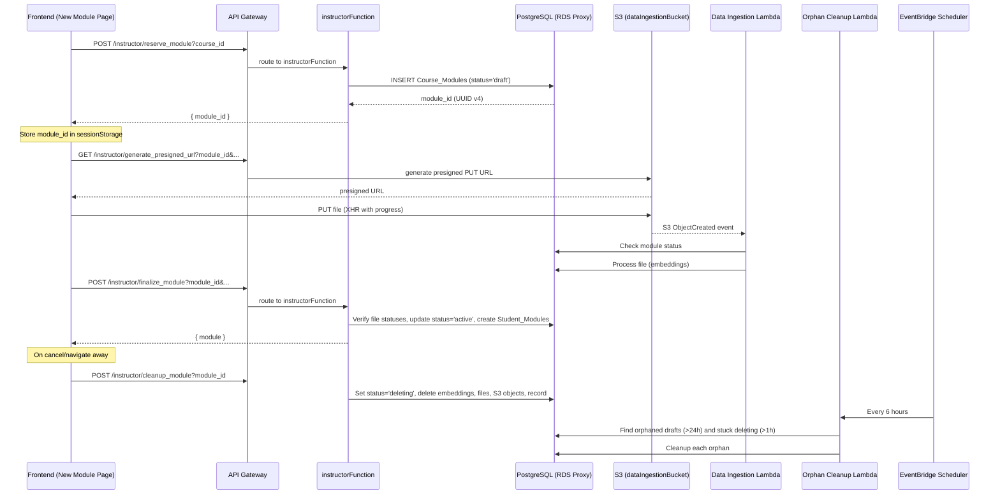

# Design Document: Eager Module Creation

## Overview

This feature restructures the "Create New Module" flow to generate a `module_id` eagerly — at page load — enabling immediate file uploads without waiting for the Save action. The current architecture requires `module_id` before generating presigned S3 URLs, creating a dependency that forces sequential module-create-then-upload behavior. By introducing a draft module lifecycle (`draft` → `active` / `deleting`), uploads begin as soon as files are selected, matching the existing Edit Module experience.

The design introduces three new backend endpoints (reserve, finalize, cleanup), a schema migration adding a `status` column, a scheduled orphan cleanup Lambda, and frontend changes to the New Module page to orchestrate the draft lifecycle.

## Architecture



### Key Architectural Decisions

1. **Three new routes in instructorFunction** rather than modifying `create_module`. The existing `create_module` route remains untouched for backward compatibility — it still works for any client that hasn't been updated. The new routes (`reserve_module`, `finalize_module`, `cleanup_module`) handle the lifecycle.

2. **Status column on Course_Modules** with CHECK constraint (`draft`, `active`, `deleting`). Default `active` ensures zero-impact migration for existing records.

3. **Orphan cleanup as a scheduled Lambda** triggered by EventBridge Scheduler (every 6 hours). A dedicated Lambda keeps the IAM scope tight (needs VPC, DB, S3, vectorstore access) and avoids coupling to the main API stack.

4. **sendBeacon for beforeunload cleanup** — best-effort, fire-and-forget. The orphan job is the safety net for cases where sendBeacon fails (browser killed, network lost).

5. **Data ingestion guards** — the ingestion Lambda checks module status before processing. If `deleting`, it discards the event. This prevents race conditions between cleanup and in-flight processing.

## Components and Interfaces

### Backend: New API Routes (instructorFunction.js)

#### POST /instructor/reserve_module

| Parameter | Source | Required | Description |
|-----------|--------|----------|-------------|
| course_id | query string | yes | Course to create draft in |
| instructor_email | query string | yes | Email from authorizer context (verified) |

**Response (201):**
```json
{ "module_id": "uuid-v4", "status": "draft" }
```

**Logic:**
1. Verify instructor enrollment in course (`Enrolments` table, role check)
2. INSERT into `Course_Modules` with `uuid_generate_v4()`, `status='draft'`, `course_id` reference via concept (requires a default/null concept handling or passing concept_id)

**Design decision**: The reservation only needs `course_id` — concept assignment happens at finalization. The draft record stores `concept_id = NULL` until finalize. This requires making `concept_id` nullable or using a sentinel. Since `concept_id` is a FK referencing `Course_Concepts`, we'll pass `course_id` and store it directly on the draft record via a new nullable `course_id` column on `Course_Modules`, OR we can require `concept_id` at reserve time.

**Chosen approach**: Keep `concept_id` NOT NULL as-is — require the frontend to select a concept before navigating to the new module page (this is already the case: `InstructorNewModule` receives `course_id` from location state which comes from the concept selection flow). The reservation endpoint will accept `course_id` only and store a placeholder `concept_id` as NULL by making the column nullable for draft records. At finalization, `concept_id` is required.

**Revised approach**: After reviewing the existing flow, `concept_id` is available at page load (instructor selects concept before creating a module). The reserve endpoint will accept `course_id` only and defer concept assignment. To avoid schema changes to the FK constraint, we'll make `concept_id` nullable (`ALTER COLUMN concept_id DROP NOT NULL`). Draft modules have `concept_id = NULL`; finalization sets it.

#### POST /instructor/finalize_module

| Parameter | Source | Required | Description |
|-----------|--------|----------|-------------|
| module_id | query string | yes | Draft module to finalize |
| course_id | query string | yes | For enrollment verification |
| concept_id | query string | yes | Concept to assign module to |
| module_name | query string | yes | Display name |
| module_number | query string | yes | Sequence number |
| instructor_email | query string | yes | From authorizer context |
| module_prompt | body | no | Custom prompt |
| key_topics | body | no | Array of topic strings |

**Response (200):**
```json
{ "module_id": "...", "module_name": "...", "status": "active", ... }
```

**Error responses:**
- 400: Duplicate module name in concept
- 403: Instructor not enrolled in course
- 404: Draft module not found
- 409: Files still processing (pending/processing status in Module_Files)

**Logic:**
1. Verify instructor enrollment in course
2. Verify module exists with `status = 'draft'`
3. Check for duplicate `module_name` within `concept_id`
4. Check `Module_Files` — reject if any have `processing_status` IN ('pending', 'processing')
5. UPDATE `Course_Modules`: set `concept_id`, `module_name`, `module_number`, `module_prompt`, `key_topics`, `status = 'active'`
6. INSERT `Student_Modules` for all enrollments in the course
7. INSERT `User_Engagement_Log` entry
8. Return updated module record

#### POST /instructor/cleanup_module

| Parameter | Source | Required | Description |
|-----------|--------|----------|-------------|
| module_id | query string | yes | Module to clean up |
| course_id | query string | yes | For enrollment verification |
| instructor_email | query string | yes | From authorizer context |

**Response (200):**
```json
{ "message": "Module cleaned up successfully" }
```

**Error responses:**
- 400: Module not in `draft` or `deleting` status
- 403: Instructor not enrolled in course

**Logic:**
1. Verify instructor enrollment in course
2. Verify module status is `draft` or `deleting`
3. Set `status = 'deleting'`
4. Delete vector embeddings: `DELETE FROM langchain_pg_embedding WHERE collection_id = (SELECT uuid FROM langchain_pg_collection WHERE name = module_id)`
5. Delete collection record: `DELETE FROM langchain_pg_collection WHERE name = module_id`
6. Delete `Module_Files` records for the module
7. Delete S3 objects under `{course_id}/{module_id}/documents/` prefix
8. Delete the `Course_Modules` record
9. All steps are idempotent — missing resources are treated as already deleted

### Backend: Orphan Cleanup Lambda (Python)

**New Lambda**: `orphanCleanupFunction` — Python 3.11, container-based (needs psycopg2 + boto3 + aws-lambda-powertools + aws-xray-sdk).

**Trigger**: EventBridge Scheduler rule, every 6 hours.

**Logic:**
1. Query orphans: `SELECT module_id, course_id FROM Course_Modules WHERE (status = 'draft' AND created_at < NOW() - INTERVAL '24 hours') OR (status = 'deleting' AND updated_at < NOW() - INTERVAL '1 hour')`
2. For each orphan, perform the same cleanup steps as `cleanup_module`
3. On error for any individual module, log the error and continue with the next
4. Return summary: `{ processed: N, failed: N, errors: [...] }`

**Required schema addition**: `created_at` and `updated_at` timestamps on `Course_Modules` (for age-based orphan detection). The migration will set existing records' `created_at` to `NOW()`.

### Backend: Data Ingestion Lambda Changes

Add a status check at the start of file processing in `handler()`:

```python
# After parsing file path and before processing
module_status = get_module_status(module_id)
if module_status in ('deleting', None):
    logger.warning("Module is deleting or not found, skipping processing",
                   extra={"module_id": module_id, "status": module_status})
    return {"statusCode": 200, "body": "Skipped - module deleting"}
```

New helper function `get_module_status(module_id)` queries `Course_Modules.status`.

### Frontend: InstructorNewModule Page Changes

**New hook: `useDraftModule`**

```javascript
function useDraftModule(courseId) {
  // Returns: { moduleId, isReserving, error, cleanup }
  // On mount:
  //   1. Check sessionStorage for existing draft
  //   2. If found, verify with backend (GET /instructor/verify_draft?module_id)
  //   3. If valid, reuse; if invalid, clear and reserve new
  //   4. If not found, POST /instructor/reserve_module?course_id
  //   5. Store module_id in sessionStorage
  // cleanup():
  //   POST /instructor/cleanup_module?module_id
  //   Clear sessionStorage
}
```

**sessionStorage key format**: `draft_module_{course_id}`

**Page flow changes:**
1. On mount → call `useDraftModule(courseId)` → get `moduleId`
2. Pass `moduleId` to `useFileUpload` and `useProcessingPoller`
3. File selection → immediate upload (existing behavior, now has moduleId from start)
4. Save button disabled while: `isReserving || hasActiveUploads || hasProcessingFiles`
5. Save → call finalize endpoint → on success, clear sessionStorage, navigate to module list
6. Back/Cancel → call cleanup, clear sessionStorage, navigate away
7. `beforeunload` → sendBeacon to cleanup endpoint

**sendBeacon payload**: The cleanup endpoint needs authentication. Since sendBeacon can't set custom headers, we'll use a separate unauthenticated cleanup path with a short-lived signed token in the body, OR use a `keepalive: true` fetch with the auth header. Chosen: `fetch` with `keepalive: true` since it supports custom headers.

```javascript
window.addEventListener('beforeunload', () => {
  if (draftModuleId && !isSaved) {
    fetch(cleanupUrl, {
      method: 'POST',
      headers: { Authorization: token, 'Content-Type': 'application/json' },
      body: JSON.stringify({ module_id: draftModuleId, course_id: courseId }),
      keepalive: true,
    });
    sessionStorage.removeItem(`draft_module_${courseId}`);
  }
});
```

### CDK Infrastructure Changes

1. **EventBridge Scheduler Rule** + **orphanCleanupFunction** Lambda (Python container)
2. IAM role for orphan cleanup: SecretsManager, EC2 VPC, CloudWatch Logs, S3 (dataIngestionBucket read/delete), RDS Proxy connect
3. New route resources on API Gateway for `reserve_module`, `finalize_module`, `cleanup_module` under `/instructor/`

## Data Models

### Course_Modules Table (Modified)

```sql
ALTER TABLE "Course_Modules"
  ADD COLUMN status VARCHAR(10) NOT NULL DEFAULT 'active'
    CHECK (status IN ('draft', 'active', 'deleting')),
  ADD COLUMN created_at TIMESTAMP WITH TIME ZONE NOT NULL DEFAULT NOW(),
  ADD COLUMN updated_at TIMESTAMP WITH TIME ZONE NOT NULL DEFAULT NOW();

-- Make concept_id nullable for draft modules
ALTER TABLE "Course_Modules"
  ALTER COLUMN concept_id DROP NOT NULL;

-- Backfill existing records
UPDATE "Course_Modules" SET status = 'active', created_at = NOW(), updated_at = NOW();

-- Index for orphan cleanup queries
CREATE INDEX idx_course_modules_status_created ON "Course_Modules" (status, created_at)
  WHERE status IN ('draft', 'deleting');
```

**Updated schema:**

| Column | Type | Nullable | Default | Notes |
|--------|------|----------|---------|-------|
| module_id | UUID | NO | uuid_generate_v4() | PK |
| concept_id | UUID | YES | NULL | FK to Course_Concepts; NULL for drafts |
| module_name | VARCHAR | YES | NULL | Set on finalization |
| module_number | INTEGER | YES | NULL | Set on finalization |
| module_prompt | TEXT | YES | NULL | Set on finalization |
| key_topics | JSONB | YES | NULL | Set on finalization |
| generated_topics | JSONB | YES | NULL | Existing column |
| conflict_metadata | JSONB | YES | NULL | Existing column |
| status | VARCHAR(10) | NO | 'active' | draft/active/deleting |
| created_at | TIMESTAMPTZ | NO | NOW() | For orphan detection |
| updated_at | TIMESTAMPTZ | NO | NOW() | For orphan detection |

### Module_Files Table (No changes)

The existing `processing_status` column (`pending`, `processing`, `complete`, `failed`) is sufficient. Files are linked to modules by `module_id` — draft modules can have files.

### Student View Query Change

The student-facing module query in `studentFunction.js` adds a WHERE filter:

```sql
WHERE "Course_Concepts".course_id = ${courseId}
  AND "Course_Modules".status = 'active'   -- NEW: exclude drafts
ORDER BY "Course_Modules".module_number;
```

The `verifyStudentAccess` function also needs the filter to prevent students from accessing draft module resources directly.

## Correctness Properties

*A property is a characteristic or behavior that should hold true across all valid executions of a system — essentially, a formal statement about what the system should do. Properties serve as the bridge between human-readable specifications and machine-verifiable correctness guarantees.*

### Property 1: Reservation creates a valid draft

*For any* valid course_id where the requesting instructor is enrolled, calling the reservation service SHALL produce a new Course_Modules record with a valid UUID v4 as module_id and status = 'draft'.

**Validates: Requirements 1.2**

### Property 2: Draft module isolation from student views

*For any* set of Course_Modules records with mixed statuses (draft, active, deleting), student-facing queries SHALL return only modules with status = 'active'.

**Validates: Requirements 2.1**

### Property 3: Duplicate module name blocks finalization

*For any* concept that already contains an active module with name X, attempting to finalize a draft module with the same name X in that concept SHALL be rejected with a 400 error.

**Validates: Requirements 4.2, 4.3**

### Property 4: Finalization transitions draft to active with full metadata

*For any* valid finalization request (draft module exists, no processing files, no duplicate name), the module record SHALL have status = 'active' and all provided metadata fields (concept_id, module_name, module_number, module_prompt, key_topics) populated after finalization.

**Validates: Requirements 4.4**

### Property 5: Finalization creates Student_Modules for all enrollments

*For any* course with N enrolled students, finalizing a module in that course SHALL create exactly N Student_Modules entries, one per enrollment.

**Validates: Requirements 4.5**

### Property 6: Processing files block finalization

*For any* draft module where at least one associated Module_Files record has processing_status IN ('pending', 'processing'), finalization SHALL be rejected with HTTP 409. Files with status 'failed' or 'complete' do not block. Zero files do not block.

**Validates: Requirements 4.7, 4.8, 4.9, 4.10**

### Property 7: Failed finalization preserves draft and files

*For any* draft module with associated files, if finalization is rejected (duplicate name, processing files, etc.), the draft Course_Modules record and all Module_Files records SHALL remain unchanged.

**Validates: Requirements 4.11**

### Property 8: Complete cleanup removes all module resources

*For any* draft module with N file records, M vector embeddings, and K S3 objects, after successful cleanup: the Course_Modules record SHALL not exist, Module_Files count for that module_id SHALL be 0, vector embeddings for that collection SHALL be 0, and S3 objects under the module prefix SHALL be 0.

**Validates: Requirements 5.2, 5.3, 5.4, 5.5, 5.6**

### Property 9: Cleanup rejects non-draft/non-deleting modules

*For any* module with status = 'active', calling the cleanup service SHALL return HTTP 400 and leave the module record unchanged.

**Validates: Requirements 5.7**

### Property 10: Cleanup is idempotent

*For any* draft module, calling cleanup twice in sequence SHALL succeed both times without error. The second call encounters already-deleted resources and treats them as successful.

**Validates: Requirements 5.8**

### Property 11: Data ingestion skips modules with status = 'deleting'

*For any* S3 event where the associated module has status = 'deleting' (or the module record does not exist), the Data Ingestion Lambda SHALL skip processing and return success without writing embeddings or updating file status.

**Validates: Requirements 5.9, 5.10**

### Property 12: Orphan identification by age threshold

*For any* set of Course_Modules records, the orphan cleanup query SHALL return exactly those modules where (status = 'draft' AND created_at < NOW() - 24 hours) OR (status = 'deleting' AND updated_at < NOW() - 1 hour), and no others.

**Validates: Requirements 6.1**

### Property 13: Batch cleanup continues despite individual failures

*For any* batch of N orphaned modules where cleanup of module K fails, the orphan cleanup job SHALL still attempt cleanup of the remaining N-1 modules and report the failure in its summary.

**Validates: Requirements 6.3**

### Property 14: Status column constraint enforcement

*For any* string value not in the set {'draft', 'active', 'deleting'}, attempting to set the Course_Modules.status column to that value SHALL raise a database constraint violation.

**Validates: Requirements 8.2**

### Property 15: Course enrollment gates all module lifecycle operations

*For any* user not enrolled as an instructor in a given course, all module lifecycle operations (reserve, finalize, cleanup) for that course SHALL return HTTP 403. Conversely, *for any* instructor enrolled in the course, these operations SHALL not be rejected on authorization grounds (they may fail for other reasons).

**Validates: Requirements 9.1, 9.2, 9.3, 9.4, 9.5**

## Error Handling

### Backend Error Strategy

| Scenario | HTTP Code | Response | Recovery |
|----------|-----------|----------|----------|
| Instructor not enrolled | 403 | `{ error: "Forbidden" }` | Frontend shows access denied |
| Missing required params | 400 | `{ error: "Missing parameter: X" }` | Frontend validation should prevent |
| Duplicate module name | 400 | `{ error: "A module with this name already exists" }` | Instructor changes name and retries |
| Draft not found | 404 | `{ error: "Draft module not found" }` | Frontend clears sessionStorage, creates new draft |
| Files still processing | 409 | `{ error: "Files are still being processed" }` | Frontend waits, retries when processing completes |
| Cleanup of active module | 400 | `{ error: "Cannot cleanup module with status: active" }` | Frontend should never send this |
| DB connection failure | 500 | `{ error: "Internal server error" }` | Client retries; orphan job catches abandoned drafts |
| S3 deletion failure | Logged, continues | Non-blocking | Orphan job retries later |
| Vector deletion failure | Logged, continues | Non-blocking | Orphan job retries later |

### Frontend Error Strategy

- **Reservation failure**: Display toast error, disable file upload zone, show retry button
- **Finalization failure (409)**: Keep Save disabled, show "Files are still processing" message, auto-retry when poller shows all complete
- **Finalization failure (400 duplicate)**: Show inline error on module name field, keep form editable
- **Cleanup failure**: Log to console, don't block navigation — orphan job is the safety net
- **sendBeacon/keepalive failure**: Silent — best-effort only, orphan job handles it

### Data Ingestion Resilience

The ingestion Lambda checks module status before processing:
- `status = 'deleting'` or module not found → skip silently, return 200
- `status = 'draft'` → process normally (files uploaded to draft modules should be ingested)
- `status = 'active'` → process normally (re-uploads on active modules)

If the module transitions to `deleting` mid-processing, the final status update or chunk write may fail. The Lambda catches this, logs a warning, and returns success. The cleanup job will remove any partial embeddings on its next run.

## Testing Strategy

### Property-Based Tests (fast-check)

Property-based testing is appropriate for this feature because it involves:
- Pure business logic with clear input/output (reservation, finalization gates, cleanup guards)
- Universal properties across varying inputs (any course, any instructor, any file set)
- State machine transitions with invariants

**Library**: `fast-check` (JavaScript, already available via npm)
**Configuration**: Minimum 100 iterations per property test
**Tag format**: `Feature: eager-module-creation, Property {N}: {title}`

Tests will focus on the backend logic layer (instructorFunction handlers) with mocked database connections, testing:
- Reservation produces valid drafts (Property 1)
- Student view filtering (Property 2)
- Finalization validation gates (Properties 3, 4, 5, 6, 7)
- Cleanup state guards and idempotence (Properties 8, 9, 10)
- Authorization checks (Property 15)

### Unit Tests (Example-Based)

- Frontend `useDraftModule` hook: mount/unmount lifecycle, sessionStorage interactions
- Frontend sendBeacon/keepalive behavior on beforeunload
- Finalization API call with correct parameters
- Save button disabled state based on upload/processing status
- Orphan cleanup query correctness with specific age boundaries

### Integration Tests

- End-to-end: reserve → upload → finalize → verify student can see module
- End-to-end: reserve → upload → navigate away → verify cleanup occurred
- Data ingestion with `deleting` module → verify skip behavior
- Orphan cleanup Lambda with aged draft records

### CDK Assertion Tests

- Verify EventBridge rule exists with correct schedule
- Verify orphan cleanup Lambda has correct IAM permissions (scoped)
- Verify new API Gateway resources exist for the three new routes
- Verify Lambda environment variables include required values
