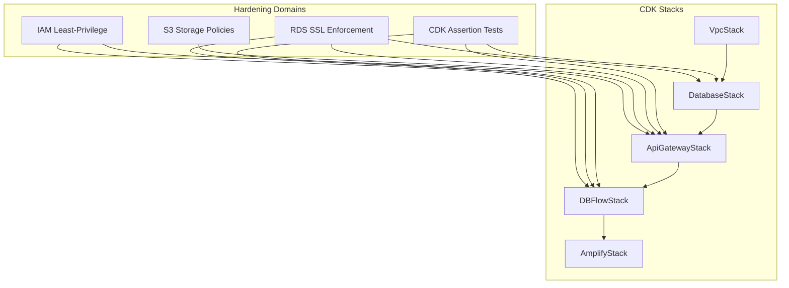
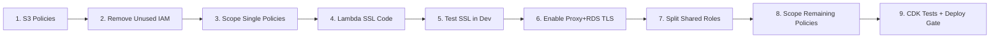

# Design Document: Infrastructure Hardening

## Overview

This design covers the infrastructure hardening of the AILA (AI Learning Assistant) CDK application across four domains: IAM least-privilege enforcement, S3 storage policy fixes, RDS SSL enforcement, and CDK assertion tests to prevent configuration drift.

The application is deployed as five CDK stacks: `VpcStack` → `DatabaseStack` → `ApiGatewayStack` → `DBFlowStack` → `AmplifyStack`. The hardening primarily targets `ApiGatewayStack` (IAM roles, S3 buckets, Lambda functions), `DatabaseStack` (RDS proxies, parameter groups), and `DBFlowStack` (initializer Lambda role). Lambda application code across 13 database connection paths also requires SSL parameter additions.

### Design Decisions

1. **Per-function-group IAM roles over per-function roles**: Functions with identical permission needs (e.g., `studentFunction` and `instructorFunction`) share a role to reduce CloudFormation resource count while still achieving least-privilege.
2. **Zero-downtime SSL deployment**: Lambda code is updated first (SSL works with `force_ssl: '0'`), then proxy TLS is enabled, then RDS force SSL — avoiding any window where connections fail.
3. **CDK assertion tests over snapshot tests**: Targeted property assertions are more maintainable than full-template snapshots for a 1781-line stack that changes frequently.
4. **Remove archive tier rather than add restore flow**: The engineering cost of implementing `RestoreObject` polling exceeds the ~$0.009/GB/month savings from archive tiering at educational-app scale.

## Architecture

The hardening changes are layered across the existing stack architecture:



### Deployment Order (9 Steps)



## Components and Interfaces

### Component 1: IAM Role Restructuring (ApiGatewayStack)

**Current state**: Two shared roles (`lambdaRole` serving 7 functions, `coglambdaRole` serving 4 functions) with union-of-all-permissions.

**Target state**: Seven per-function-group roles:

| Role | Functions | Permissions |
|------|-----------|-------------|
| `dbLambdaRole` | studentFunction, instructorFunction | SecretsManager (secretPathUser), EC2 VPC, CloudWatch Logs |
| `adminLambdaRole` | adminFunction | SecretsManager (secretPathTableCreator), EC2 VPC, CloudWatch Logs, Cognito admin |
| `notificationLambdaRole` | notificationFunction | SecretsManager (secretPathUser), EC2 VPC, CloudWatch Logs, AppSync |
| `authorizerRole` | 3 authorizer functions | SecretsManager (Cognito secret), CloudWatch Logs (no VPC) |
| `cognitoTriggerRole` | addStudentOnSignUp, adjustUserRoles | SecretsManager (secretPathTableCreator), EC2 VPC, CloudWatch Logs, Cognito admin |
| `preSignupRole` | preSignupLambda | SSM (/AILA/AllowedEmailDomains), CloudWatch Logs (no VPC) |
| `sqsLambdaRole` | sqsFunction | SecretsManager (secretPathUser), EC2 VPC, CloudWatch Logs, SQS |

**Interface**: Each role is an `iam.Role` construct assigned to its Lambda function(s) via the `role` property. Secrets Manager resources are scoped to specific secret ARNs using CDK construct `.secretArn` references. CloudWatch Logs resources are scoped to `/aws/lambda/${functionName}:*` patterns.

### Component 2: IAM Cleanup (DbFlowStack)

**Changes**:
- Remove `AmazonS3FullAccess` managed policy (initializer uses zero S3 calls)
- Remove `AmazonSSMReadOnlyAccess` managed policy (initializer uses zero SSM calls)
- Scope Secrets Manager to specific secret ARNs: `db.secretPathAdminName`, `db.secretPathUser.secretArn`, `db.secretPathTableCreator.secretArn`
- Scope CloudWatch Logs to `/aws/lambda/${id}-initializerFunction:*`

### Component 3: S3 Bucket Hardening (ApiGatewayStack)

**Changes to all 3 buckets** (`dataIngestionBucket`, `embeddingStorageBucket`, `chatlogsBucket`):
- Remove `archiveAccessTierTime: Duration.days(90)` from Intelligent Tiering config
- Add `encryption: s3.BucketEncryption.S3_MANAGED`
- Add lifecycle rule: `abortIncompleteMultipartUploadAfter: Duration.days(1)`

**Additional for `embeddingStorageBucket`**:
- Add lifecycle rule: object expiration after 7 days (cleans orphaned temp files from failed Lambda runs)

### Component 4: RDS SSL Enforcement (DatabaseStack)

**Infrastructure changes**:
- `rds.force_ssl` parameter: `'0'` → `'1'`
- All 3 RDS proxies: `requireTLS: false` → `requireTLS: true`

**Interface**: No API changes — proxies continue to expose the same endpoints. Lambda clients must present TLS connections.

### Component 5: Lambda SSL Connection Updates

**Node.js functions** (2 files, serving 7 Lambda functions):
- `cdk/lambda/lib/lib.js`: `ssl: false` → `ssl: 'require'`
- `cdk/lambda/adminFunction/libadmin.js`: `ssl: false` → `ssl: 'require'`

**Python psycopg2 functions** (6 files):
- Add `'sslmode': 'require'` to `connection_params` dict in: `deleteFile.py`, `deleteLastMessage.py`, `getFilesFunction.py`, `sqsTrigger/src/main.py`, `text_generation/src/main.py`, `data_ingestion/src/main.py`

**Python SQLAlchemy URI** (2 files):
- Append `?sslmode=require` to connection URI in: `data_ingestion/src/helpers/helper.py`, `text_generation/src/helpers/helper.py`

**Python raw psycopg2** (1 file):
- Add `sslmode=require` to connection string in: `text_generation/src/helpers/vectorstore.py`

**Python keyword args** (1 file):
- Uncomment `sslmode="require"` in: `lambda/initializer/initializer.py`

### Component 6: DynamoDB Policy Scoping

**textGenLambdaDockerFunc**: Split into two statements:
1. `dynamodb:ListTables`, `dynamodb:CreateTable`, `dynamodb:DescribeTable` on `arn:aws:dynamodb:${region}:${account}:table/*` (required for management operations)
2. `dynamodb:PutItem`, `dynamodb:GetItem`, `dynamodb:UpdateItem` on specific table ARN constructed from `tableNameParameter`

**deleteLastMessage**: Scope `dynamodb:GetItem`, `dynamodb:UpdateItem` to specific table ARN using `tableNameParameter` value.

### Component 7: RDS Proxy Connect Scoping (DatabaseStack)

**Change**: `rds-db:connect` resource from `'*'` to `arn:aws:rds-db:${region}:${account}:dbuser:${dbInstance.instanceResourceId}/*`

### Component 8: CDK Assertion Test Suite

**Test infrastructure**: Jest + ts-jest (already configured), `aws-cdk-lib/assertions` (bundled with aws-cdk-lib).

**Test file organization**:
```
cdk/test/
├── helpers/
│   └── stack-setup.ts          # Shared stack instantiation with context
├── iam-policies.test.ts        # IAM guardrail assertions
├── s3-buckets.test.ts          # S3 security assertions
├── database.test.ts            # RDS security assertions
├── lambda-config.test.ts       # Lambda runtime/config assertions
├── cognito.test.ts             # Cognito password policy assertions
└── network-security.test.ts    # WAF, API Gateway assertions
```

**Shared helper** (`helpers/stack-setup.ts`):
```typescript
import * as cdk from 'aws-cdk-lib';
import { Template } from 'aws-cdk-lib/assertions';
import { VpcStack } from '../../lib/vpc-stack';
import { DatabaseStack } from '../../lib/database-stack';
import { ApiGatewayStack } from '../../lib/api-gateway-stack';
import { DBFlowStack } from '../../lib/dbFlow-stack';

export function createTestStacks() {
  const app = new cdk.App({
    context: { StackPrefix: 'Test', environment: 'dev' },
  });
  const env = { account: '123456789012', region: 'ca-central-1' };
  const vpcStack = new VpcStack(app, 'Test-VpcStack', { env, environment: 'dev' });
  const dbStack = new DatabaseStack(app, 'Test-DatabaseStack', vpcStack, { env, environment: 'dev' });
  const apiStack = new ApiGatewayStack(app, 'Test-ApiGatewayStack', dbStack, vpcStack, { env, environment: 'dev' });
  const dbFlowStack = new DBFlowStack(app, 'Test-DBFlowStack', vpcStack, dbStack, apiStack, { env });
  return {
    apiTemplate: Template.fromStack(apiStack),
    dbTemplate: Template.fromStack(dbStack),
    dbFlowTemplate: Template.fromStack(dbFlowStack),
  };
}
```

**Note**: Tests require Docker installed (for `DockerImageCode.fromImageAsset()` synthesis of `textGenLambdaDockerFunc` and `dataIngestLambdaDockerFunc`).

### Component 9: Pre-Deploy Test Gate

Add npm lifecycle hook to `package.json`:
```json
"scripts": {
  "predeploy": "npm test",
  "deploy": "cdk deploy --all",
  "deploy:prod": "cdk deploy --all -c environment=prod"
}
```

## Data Models

No new data models are introduced. This feature modifies infrastructure configuration only. The existing data models (PostgreSQL schema, DynamoDB conversation table, S3 object keys) remain unchanged.

**Affected configuration surfaces**:

| Resource | Property Changed | Before | After |
|----------|-----------------|--------|-------|
| RDS ParameterGroup | `rds.force_ssl` | `'0'` | `'1'` |
| RDS Proxies (×3) | `requireTLS` | `false` | `true` |
| S3 Buckets (×3) | `archiveAccessTierTime` | `90 days` | removed |
| S3 Buckets (×3) | `encryption` | implicit | `S3_MANAGED` |
| S3 Buckets (×3) | `abortIncompleteMultipartUpload` | none | `1 day` |
| Embedding Bucket | object expiration | none | `7 days` |
| Lambda connections (×13) | SSL/TLS | disabled | `require` |
| IAM Roles | count | 2 shared + 1 dbFlow | 7 scoped + 1 dbFlow |

## Error Handling

### SSL Migration Failure Modes

| Failure | Cause | Mitigation |
|---------|-------|------------|
| Lambda connection timeout after proxy TLS enabled | Lambda code not updated to use SSL | Deploy Lambda SSL code first (Step 4) before enabling proxy TLS (Step 6) |
| Initializer Lambda fails on redeploy | `sslmode="require"` uncommented but RDS not yet enforcing SSL | SSL connections work even with `force_ssl: '0'` — no issue |
| RDS Proxy certificate mismatch | Using `sslmode=verify-full` | Use `sslmode=require` (no cert verification) — appropriate for VPC-internal proxy connections |

### IAM Role Split Failure Modes

| Failure | Cause | Mitigation |
|---------|-------|------------|
| Lambda AccessDenied after role split | Missing permission in new role | Map permissions from code evidence (phase-3 doc tables); test each function in dev |
| CloudFormation rollback on role deletion | Old role still referenced | CDK handles replacement — new role is created before old is deleted |

### S3 Lifecycle Rule Considerations

| Scenario | Handling |
|----------|----------|
| Object expiration deletes needed file | 7-day window only applies to `embeddingStorageBucket` where objects are normally deleted within seconds; anything surviving 7 days is an orphan |
| Multipart abort interrupts active upload | 1-day threshold is safe — no Lambda upload takes more than minutes |

## Testing Strategy

### Why Property-Based Testing Does NOT Apply

This feature is Infrastructure as Code (IaC) — CDK constructs producing CloudFormation templates. There are no pure functions with variable input spaces to test. The changes are declarative configuration (set this property to this value) verified by CDK assertion tests that check synthesized CloudFormation output.

### CDK Assertion Tests (Primary Testing Approach)

CDK assertion tests synthesize stacks locally (no AWS credentials needed) and verify resource properties in the resulting CloudFormation template. They run in seconds via `npm test`.

**Category 1: IAM Policy Guardrails**
- Verify no policy grants `secretsmanager:GetSecretValue` on wildcard secret resource
- Verify no role has `AmazonS3FullAccess` managed policy
- Verify no role has `AmazonSSMReadOnlyAccess` managed policy
- Verify no policy grants `iam:AddUserToGroup`
- Verify no policy grants CloudWatch Logs actions on `arn:aws:logs:*:*:*`

**Category 2: S3 Bucket Security**
- Verify all buckets have `BlockPublicAccess` set to BLOCK_ALL
- Verify all buckets enforce SSL (`aws:SecureTransport` condition)
- Verify no bucket has `archiveAccessTierTime` in Intelligent Tiering
- Verify all buckets have `AbortIncompleteMultipartUpload` lifecycle rule

**Category 3: Database Security**
- Verify RDS parameter group sets `rds.force_ssl` to `'1'`
- Verify all 3 RDS proxies have `RequireTLS: true`
- Verify RDS instance has `PubliclyAccessible: false`
- Verify RDS instance has `StorageEncrypted: true`

**Category 4: Lambda & Cognito & Network**
- Verify all Node.js Lambdas use `NODEJS_22_X` runtime
- Verify all Python Lambdas use `PYTHON_3_11` runtime
- Verify Cognito password policy (min 10, lowercase, uppercase, digits, symbols)
- Verify WAF WebACL associated with API Gateway
- Verify WAF includes `AWSManagedRulesCommonRuleSet` and `AWSManagedRulesSQLiRuleSet`

### Manual Verification (SSL)

After deploying SSL changes to dev:
- Invoke each Lambda function and verify successful database queries
- Check CloudWatch Logs for connection errors
- Verify RDS Proxy metrics show TLS connections

### Test Prerequisites

- **Docker**: Required for CDK synthesis (2 DockerImageCode Lambda functions)
- **No AWS credentials**: CDK assertion tests are purely local synthesis
- **Runtime**: ~10–30 seconds for the full suite

### Pre-Deploy Gate

Tests run automatically before deployment via npm `predeploy` lifecycle hook. Any test failure blocks the deploy.
