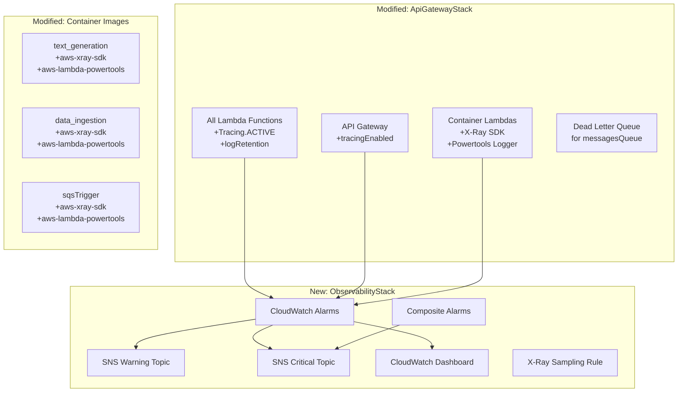

# Design Document: Observability & Reliability

## Overview

This design adds comprehensive observability and reliability infrastructure to the AILA application through four pillars:

1. **Alarm Infrastructure** — CloudWatch Alarms with SNS notification routing, composite alarms for noise reduction, and environment-specific thresholds
2. **Distributed Tracing** — X-Ray tracing on API Gateway and all Lambda functions, with X-Ray SDK instrumentation in container Lambdas
3. **Structured Logging** — Migration from basic `logging.basicConfig()` and `print()` to AWS Lambda Powertools Logger across all Python functions
4. **Operational Dashboard** — A CloudWatch Dashboard consolidating key metrics and alarm states

The implementation introduces a new `ObservabilityStack` CDK stack that owns alarms, SNS topics, the dashboard, and X-Ray sampling rules. Modifications to the existing `ApiGatewayStack` enable X-Ray tracing on Lambda functions and API Gateway. Container Dockerfile and Python handler changes add X-Ray SDK patching and Powertools Logger.

### Design Decisions

- **Separate stack**: Alarms and dashboard live in a dedicated `ObservabilityStack` to avoid bloating the already-large `ApiGatewayStack` (~1900 lines) and to allow independent deployment of observability changes.
- **Powertools Logger over custom solution**: The Powertools layer is already referenced in the stack (`powertoolsLayer`). Container Lambdas will add `aws-lambda-powertools` to their `requirements.txt` since they can't use Lambda layers.
- **X-Ray SDK patching at module level**: Patching `boto3` and `httpx` at import time ensures all downstream calls are traced without modifying individual call sites.
- **Environment-aware configuration**: The existing `environment` context parameter (already used in `database-stack.ts` and `api-gateway-stack.ts`) drives alarm thresholds, sampling rates, log retention, and notification routing.

## Architecture



## Components and Interfaces

### 1. ObservabilityStack (`cdk/lib/observability-stack.ts`)

A new CDK stack that receives references to resources from other stacks and creates all observability resources.

**Constructor Parameters:**
```typescript
interface ObservabilityStackProps extends cdk.StackProps {
  environment: string;
  apiGatewayRestApiId: string;
  apiGatewayStageName: string;
  lambdaFunctions: LambdaFunctionInfo[];
  rdsInstanceId: string;
  rdsAllocatedStorage: number;
  rdsInstanceClass: string;
  messagesQueueName: string;
  messagesQueueArn: string;
  dlqName: string;
  dlqArn: string;
  appSyncApiId: string;
  containerLambdaNames: string[];
}

interface LambdaFunctionInfo {
  functionName: string;
  timeoutSeconds: number;
  isContainer: boolean;
}
```

**Resources Created:**
- 2 SNS Topics (warning, critical) with KMS encryption, both subscribed by `vincent.lam@ubc.ca`
- Per-Lambda alarms: error rate (warning + critical), duration, throttle
- API Gateway alarms: 5xx warning + critical, missing traffic
- RDS alarms: CPU (warning + critical), storage (warning + critical), connections, latency
- SQS alarms: DLQ depth, queue depth, queue age, consumer delay
- AppSync alarms: 5xx errors, latency
- 2 Composite alarms: SystemHealthCritical, DataPipelineHealth
- 1 CloudWatch Dashboard
- 1 X-Ray Sampling Rule (environment-aware)

### 2. API Gateway Stack Modifications (`cdk/lib/api-gateway-stack.ts`)

**Changes:**
- Add `tracingEnabled: true` to `deployOptions`
- Add `tracing: lambda.Tracing.ACTIVE` to all Lambda function definitions
- Add `logRetention` property to all Lambda functions (30 days dev, 90 days prod)
- Create a FIFO Dead Letter Queue for `messagesQueue` with `maxReceiveCount: 3`
- Export function metadata (names, timeouts) for the ObservabilityStack
- Add `xray:PutTraceSegments` and `xray:PutTelemetryRecords` to Lambda execution roles

**New Exports (public properties):**
```typescript
public readonly lambdaFunctionInfos: LambdaFunctionInfo[];
public readonly messagesQueueDlq: sqs.Queue;
```

### 3. Container Image Changes

#### 3.1 requirements.txt additions (all three containers)

```
aws-xray-sdk
aws-lambda-powertools
```

#### 3.2 Handler Module Changes (X-Ray + Powertools)

Each container handler (`main.py`) will be modified to:
1. Import and configure Powertools Logger with appropriate service name
2. Patch boto3 and httpx with X-Ray SDK
3. Replace `logging.basicConfig()` / `logging.getLogger()` with Powertools Logger
4. Replace all `print()` statements with logger calls
5. Add `@logger.inject_lambda_context(clear_state=True)` decorator
6. Add `logger.append_keys()` for request-scoped correlation (session_id, course_id)

### 4. Zip Lambda Changes

#### 4.1 `deleteLastMessage.py`
- Replace `logging.getLogger()` + `logger.setLevel()` with Powertools Logger (service="delete-last-message")
- Add `@logger.inject_lambda_context(clear_state=True)` decorator
- Add `logger.append_keys(session_id=...)` for correlation
- Powertools layer already attached in CDK

#### 4.2 `eventNotification.py`
- Replace `print()` statements with Powertools Logger (service="event-notification")
- Add `@logger.inject_lambda_context(clear_state=True)` decorator
- Powertools layer needs to be added in CDK (currently not attached)

## Data Models

### Alarm Threshold Configuration

```typescript
interface AlarmThresholds {
  lambdaErrorRateWarning: number;    // 5% prod, 10% dev
  lambdaErrorRateCritical: number;   // 25% both
  lambdaDurationPercent: number;     // 80% of timeout
  lambdaThrottleThreshold: number;   // 0 (any throttle)
  apiGateway5xxWarning: number;      // 1%
  apiGateway5xxCritical: number;     // 5%
  apiGatewayMinRequests: number;     // 50
  rdsCpuWarning: number;             // 80% prod, 90% dev
  rdsCpuCritical: number;            // 95% both
  rdsStorageWarningPercent: number;  // 20%
  rdsStorageCriticalPercent: number; // 10%
  rdsConnectionsPercent: number;    // 80% of max
  rdsLatencyMs: number;             // 100ms
  sqsConsumerDelaySeconds: number;  // 300
  sqsQueueDepth: number;            // 100
  sqsQueueAgeSeconds: number;       // 600
  appSync5xxThreshold: number;      // 0
  appSyncLatencyMs: number;         // 5000
  missingTrafficMinutes: number;    // 15
}
```

### RDS Instance Class Connection Limits

```typescript
const maxConnectionsByInstanceClass: Record<string, number> = {
  "db.t3.micro": 70,
  "db.t3.medium": 120,
  "db.t3.large": 240,
};
```

### Structured Log Schema (Powertools Default + Custom Keys)

Every log entry will contain:
```json
{
  "level": "INFO",
  "location": "handler:42",
  "message": "Processing request",
  "timestamp": "2024-01-15T10:30:00.000Z",
  "service": "text-generation",
  "function_name": "AILA-TextGenLambdaDockerFunc",
  "function_memory_size": 1024,
  "function_arn": "arn:aws:lambda:...",
  "cold_start": true,
  "xray_trace_id": "1-abc123-def456",
  "correlation_id": "1-abc123-def456",
  "session_id": "uuid-session",
  "course_id": "uuid-course"
}
```

### X-Ray Sampling Rule Configuration

```typescript
interface SamplingRuleConfig {
  ruleName: string;
  serviceName: string;
  fixedRate: number;      // 1.0 dev, 0.05 prod
  reservoirSize: number;  // 1 prod, 10 dev
  priority: number;
  version: number;
}
```

## Error Handling

### Alarm False Positive Mitigation
- All alarms use `treatMissingDataAs: "notBreaching"` except the missing traffic alarm which uses `"breaching"`
- Evaluation periods use M-of-N datapoints (e.g., 3 of 5) to absorb transient spikes
- API Gateway percentage alarms require minimum 50 requests to avoid firing on small sample sizes
- Non-production environments route all alarms to warning topic only
- Composite alarms require multiple simultaneous failures before escalating

### X-Ray SDK Failure Isolation
- X-Ray SDK patching failures must not crash the Lambda function
- The X-Ray SDK is wrapped in a try/except at module level; if patching fails, the function continues without tracing
- Container Lambdas use `xray_recorder.configure(context_missing='LOG_ERROR')` to log rather than throw when no active segment exists

### Structured Logging Migration Safety
- Powertools Logger is a drop-in replacement for the standard `logging` module
- The `@logger.inject_lambda_context` decorator handles Lambda context injection automatically
- `clear_state=True` prevents state leakage between warm invocations
- `log_uncaught_exceptions=True` ensures unhandled errors are captured in structured format

### Dead Letter Queue
- Messages failing 3 times move to the DLQ automatically
- DLQ alarm fires immediately (1 of 1 datapoints) since any DLQ message indicates a processing failure requiring investigation
- DLQ messages retain the original message body for replay after fixes

## Testing Strategy

### CDK Snapshot and Assertion Tests

Since this feature is primarily Infrastructure as Code, property-based testing is **not applicable**. The feature involves declarative CDK resource configuration, alarm threshold settings, and Docker image modifications — none of which have pure function input/output behavior suitable for PBT.

**Why PBT does not apply:**
- CDK constructs are declarative configuration, not functions with variable inputs
- Alarm thresholds are static configuration values, not computed from user input
- Docker image changes are build-time modifications
- Logging migration is a code pattern replacement, not algorithmic logic

### Testing Approach

#### 1. CDK Assertion Tests (Jest)

Test that synthesized CloudFormation templates contain expected resources:

- **Alarm resource tests**: Verify each alarm type is created with correct metric, threshold, evaluation period, and actions
- **SNS topic tests**: Verify topics have encryption enabled and correct subscriptions
- **DLQ tests**: Verify DLQ is FIFO, has correct `maxReceiveCount`, and alarm is configured
- **X-Ray tests**: Verify `TracingConfig.Mode: Active` on all Lambda functions
- **Log retention tests**: Verify `logRetention` is set correctly per environment
- **Dashboard tests**: Verify dashboard contains expected widget types
- **Composite alarm tests**: Verify alarm rules reference correct child alarms
- **Environment-specific tests**: Verify dev vs prod threshold differences

#### 2. Integration Tests (Post-Deployment)

- Verify X-Ray traces appear in the X-Ray console after invoking a Lambda
- Verify structured JSON log output in CloudWatch Logs
- Verify alarm state transitions by injecting synthetic errors
- Verify DLQ receives messages after repeated processing failures
- Verify SNS notifications are delivered to subscribed endpoints

#### 3. Smoke Tests

- Verify the ObservabilityStack deploys without errors
- Verify the CloudWatch Dashboard renders correctly
- Verify SNS topics are accessible and have correct policies

### Test File Structure

```
cdk/test/
├── observability-stack.test.ts      # New: alarm, SNS, dashboard tests
├── lambda-tracing.test.ts           # New: X-Ray tracing configuration tests
├── log-retention.test.ts            # New: log retention policy tests
├── dlq-configuration.test.ts        # New: DLQ and SQS alarm tests
└── helpers/
    └── stack-setup.ts               # Existing: shared test setup
```
