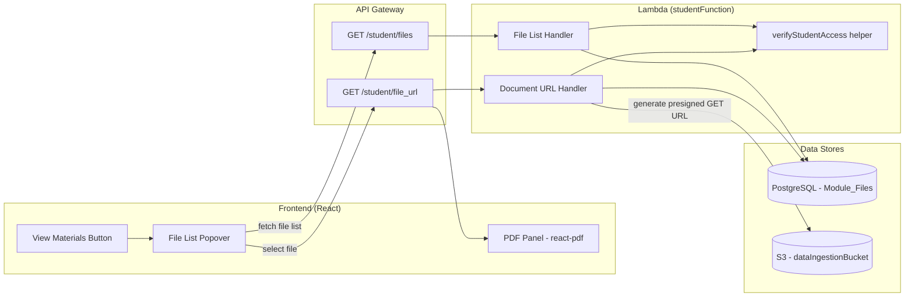

# Design Document: Student PDF Viewer

## Overview

This feature adds a side-by-side PDF viewer to the student chat interface, allowing students to read course materials while conversing with the AI assistant. The implementation touches three layers:

1. **Backend** — Two new route handlers in the existing `studentFunction` Lambda (file list + document URL generation), plus an IAM permission for S3 read access.
2. **API Gateway** — Two new paths in the OpenAPI definition, secured by the existing `studentAuthorizer`.
3. **Frontend** — A "View Materials" button, a file list popover, and a toggleable PDF viewer panel using `react-pdf`.

### Design Decisions

- **Extend `studentFunction` rather than create a new Lambda**: The student function already has DB access via `dbLambdaRole` and handles all student routes. Adding two more cases to the switch statement is simpler and doesn't require a new role or API Gateway integration.
- **Pre-signed URLs over CloudFront**: The data ingestion bucket has `blockPublicAccess: BLOCK_ALL` and no CloudFront distribution. Pre-signed URLs with a 1-hour TTL are the simplest secure access path without infrastructure changes.
- **`react-pdf` over `<iframe>`**: An iframe with a pre-signed URL would work but gives no control over page navigation, zoom, or error handling. `react-pdf` (wrapping PDF.js) gives page-level control needed for the future page-linking feature. However, PDF.js uses HTTP range requests for large documents, so a longer TTL (1 hour) is needed to avoid mid-session expiry.
- **Enrolment check inline rather than at API Gateway level**: The authorization check requires a DB join between Enrolments and Course_Modules. Since the Lambda already has a DB connection, a SQL check is simpler than a separate authorizer Lambda or WAF rule.
- **Toggleable panel over always-visible panel**: Most student interactions are purely chat-based. Keeping the PDF panel hidden by default preserves the full chat width and only narrows it when the student explicitly requests document access.
- **No email in query parameters**: The authorizer already injects the student's email into `event.requestContext.authorizer.email`. Passing email as a query parameter adds attack surface, validation code, and PII in URLs for no benefit. Both new endpoints extract identity exclusively from the authorizer context.
- **File lookup by `file_id` not by name/type**: The file list response includes `file_id` (UUID). The document URL endpoint accepts only `file_id` as the identifier. This avoids filename edge cases (case sensitivity, renaming, special characters) and reduces query parameters.
- **S3 key from database, not reconstructed**: The `Module_Files` table stores the full `filepath` column (the exact S3 key written during upload). The document URL handler reads this directly instead of reconstructing `{course_id}/{module_id}/documents/{file_name}.{file_type}`. This prevents drift between DB records and S3 objects.
- **Lazy file list fetch**: The file list is fetched only when the student clicks "View Materials", not on module load. This avoids unnecessary API calls for students who never open materials.
- **Shared enrolment verification helper**: Both endpoints use the same enrolment check. This is extracted into a reusable `verifyStudentAccess()` helper function within `studentFunction.js` to prevent logic drift.

## Architecture



## Components and Interfaces

### 1. Shared Enrolment Verification Helper

Extracted as a function within `studentFunction.js` to prevent duplication:

```javascript
/**
 * Verifies the student is enrolled in the course that owns the given module.
 * Returns the enrolment_id if valid, or null if not enrolled.
 */
async function verifyStudentAccess(sqlConnection, email, courseId, moduleId) {
  const result = await sqlConnection`
    SELECT e.enrolment_id
    FROM "Enrolments" e
    JOIN "Users" u ON u.user_id = e.user_id
    JOIN "Course_Concepts" cc ON cc.course_id = e.course_id
    JOIN "Course_Modules" cm ON cm.concept_id = cc.concept_id
    WHERE u.user_email = ${email}
      AND cm.module_id = ${moduleId}
      AND e.course_id = ${courseId}
    LIMIT 1;
  `;
  return result.length > 0 ? result[0].enrolment_id : null;
}
```

**Security note:** The query explicitly joins `course_id` through `Course_Concepts` to `Course_Modules`, preventing a mixed-parameter attack where `course_id` belongs to Course A but `module_id` belongs to Course B. The join ensures the module is reachable only through the specified course's concept hierarchy.

### 2. Student File List Handler (Backend)

Added as a new `case` in `studentFunction.js`:

**Route:** `GET /student/files`

**Query Parameters:**
- `course_id` (required) — UUID of the course
- `module_id` (required) — UUID of the module

**Identity:** Extracted from `event.requestContext.authorizer.email` — no email in query parameters.

**Logic:**
1. Extract email from authorizer context
2. Call `verifyStudentAccess(sqlConnection, email, courseId, moduleId)`
3. If null → return 403
4. Query `Module_Files` for all records matching `module_id`
5. Return results

**Response (200):**
```json
[
  {
    "file_id": "uuid",
    "filename": "Chapter1_Introduction",
    "filetype": "pdf",
    "time_uploaded": "2024-01-15T10:30:00.000Z"
  }
]
```

**Error Responses:**
- 400: Missing required parameters (`course_id`, `module_id`)
- 403: Student not enrolled in the course
- 200 with `[]`: No files found (not an error)

### 3. Student Document URL Handler (Backend)

Added as a new `case` in `studentFunction.js`:

**Route:** `GET /student/file_url`

**Query Parameters:**
- `file_id` (required) — UUID of the file (from the file list response)

**Identity:** Extracted from `event.requestContext.authorizer.email`.

**Logic:**
1. Extract email from authorizer context
2. Look up the file record by `file_id` in `Module_Files`, retrieving `module_id`, `filepath` (the exact S3 key), and `s3_bucket_reference`
3. If file not found → return 404
4. Look up the `course_id` via `Course_Modules` → `Course_Concepts` → `Courses` using the file's `module_id`
5. Call `verifyStudentAccess(sqlConnection, email, courseId, moduleId)`
6. If null → return 403
7. Generate a GET pre-signed URL using the stored `filepath` as the S3 key, with 1-hour TTL
8. Return the URL

**Response (200):**
```json
{
  "presignedurl": "https://s3.ca-central-1.amazonaws.com/..."
}
```

**Error Responses:**
- 400: Missing `file_id` parameter
- 403: Student not enrolled in the course that owns this file
- 404: File not found in Module_Files table

**S3 Client Configuration:**
```javascript
const { S3Client, GetObjectCommand } = require("@aws-sdk/client-s3");
const { getSignedUrl } = require("@aws-sdk/s3-request-presigner");

const s3Client = new S3Client({ region: process.env.REGION });

// Use the exact S3 key stored in the database — no reconstruction
const url = await getSignedUrl(s3Client, new GetObjectCommand({
  Bucket: process.env.BUCKET,
  Key: fileRecord.filepath,  // e.g., "abc123/def456/documents/Chapter1.pdf"
}), { expiresIn: 3600 }); // 1 hour
```

### 4. IAM Permission Change (CDK)

Add to `dbLambdaRole` in `api-gateway-stack.ts`:

```typescript
new iam.PolicyStatement({
  effect: iam.Effect.ALLOW,
  actions: ["s3:GetObject"],
  resources: [`${dataIngestionBucket.bucketArn}/*`],
})
```

This grants the `studentFunction` and `instructorFunction` (both on `dbLambdaRole`) the ability to generate GET pre-signed URLs. The `instructorFunction` already has broader access via a separate policy, so this addition is effectively for the student path.

**Environment variable addition:**
- Add `BUCKET: dataIngestionBucket.bucketName` to the `studentFunction` environment
- Add `REGION: this.region` to the `studentFunction` environment (if not already present)

### 5. OpenAPI Definition (API Gateway)

Two new paths added to `cdk/OpenAPI_Swagger_Definition.yaml`:

**`/student/files`** — CORS options + GET method
- Security: `studentAuthorizer`
- Integration: `aws_proxy` → `studentFunction`
- Parameters: `course_id`, `module_id` (query)

**`/student/file_url`** — CORS options + GET method
- Security: `studentAuthorizer`
- Integration: `aws_proxy` → `studentFunction`
- Parameters: `file_id` (query)

### 6. Frontend — View Materials Button & File List Popover

**Location:** `StudentChat.jsx` header area (between title and sign-out button)

**Behavior:**
1. The "View Materials" button is always rendered (unconditionally visible)
2. Clicking the button fetches the file list lazily (`GET /student/files`) — not on module load
3. If the list is non-empty, display the popover with files
4. If the list is empty, display "No materials available" in the popover
5. Each file item shows filename and type badge
6. Clicking a file item triggers the document URL fetch (by `file_id`) and opens the PDF panel

**State additions to `StudentChat.jsx`:**
```javascript
const [moduleFiles, setModuleFiles] = useState(null); // null = not yet fetched
const [filesLoading, setFilesLoading] = useState(false);
const [selectedFile, setSelectedFile] = useState(null);
const [pdfUrl, setPdfUrl] = useState(null);
const [pdfPanelOpen, setPdfPanelOpen] = useState(false);
```

**Caching:** Once fetched, `moduleFiles` is cached in state for the session. Re-opening the popover uses the cached list. A manual refresh button inside the popover allows re-fetching if needed.

### 7. Frontend — PDF Panel Component

**New component:** `src/components/PdfViewerPanel.jsx`

**Props:**
- `file` — the selected file object (`{ file_id, filename, filetype }`)
- `pdfUrl` — the pre-signed URL to render
- `files` — full list for file switching
- `onFileSelect` — callback to switch files (receives `file_id`)
- `onClose` — callback to close the panel
- `onRetry` — callback to re-fetch the pre-signed URL on error
- `loading` — boolean for loading state

**Internal state:**
- `currentPage` / `totalPages` — page navigation
- `zoom` — zoom level (50%–200%, default 100%)
- `error` — PDF load error state

**Layout change in `StudentChat.jsx`:**
```jsx
// Before (no PDF panel):
<div className="flex flex-row h-screen">
  <div className="w-1/4">  {/* Sessions sidebar */}
  <div className="w-3/4">  {/* Chat area */}
</div>

// After (PDF panel open):
<div className="flex flex-row h-screen">
  <div className="w-1/5">  {/* Sessions sidebar - narrower */}
  <div className="w-2/5">  {/* Chat area - narrower */}
  <div className="w-2/5">  {/* PDF panel */}
</div>
```

Width classes toggle based on `pdfPanelOpen` state.

### 8. Frontend — react-pdf Integration

**New dependency:** `react-pdf` (wraps `pdfjs-dist`)

**Worker setup** in `PdfViewerPanel.jsx`:
```javascript
import { Document, Page, pdfjs } from 'react-pdf';
pdfjs.GlobalWorkerOptions.workerSrc = `//unpkg.com/pdfjs-dist@${pdfjs.version}/build/pdf.worker.min.mjs`;
```

**Rendering pattern:**
```jsx
<Document
  file={pdfUrl}
  onLoadSuccess={({ numPages }) => setTotalPages(numPages)}
  onLoadError={(error) => setError(error)}
  loading={<Skeleton className="h-full w-full" />}
>
  <Page
    pageNumber={currentPage}
    scale={zoom / 100}
    renderTextLayer={true}
    renderAnnotationLayer={true}
  />
</Document>
```

### 9. Responsive Behavior

**Breakpoint:** `md` (768px)

- **Above md:** Side panel layout (Sessions | Chat | PDF)
- **Below md:** PDF panel renders as a fixed full-screen overlay with:
  - Back button (top-left) to close and return to chat
  - File name header
  - Full-width PDF rendering
  - Page nav and zoom controls at bottom

Detection via Tailwind responsive classes:
```jsx
<div className={`${pdfPanelOpen ? 'fixed inset-0 z-50 md:relative md:z-auto md:flex md:flex-col md:w-2/5' : 'hidden'}`}>
```

**Future mobile UX consideration:** The current mobile experience requires full context-switching between PDF and chat. A future iteration could introduce a bottom sheet or slide-over drawer pattern that allows partial PDF viewing while keeping the chat input visible. Not in scope for V1.

## Data Models

### Enrolment Verification Query

Used by both new endpoints via `verifyStudentAccess()`:

```sql
SELECT e.enrolment_id
FROM "Enrolments" e
JOIN "Users" u ON u.user_id = e.user_id
JOIN "Course_Concepts" cc ON cc.course_id = e.course_id
JOIN "Course_Modules" cm ON cm.concept_id = cc.concept_id
WHERE u.user_email = $1
  AND cm.module_id = $2
  AND e.course_id = $3
LIMIT 1;
```

If this returns 0 rows, the student is not enrolled → 403.

**Mixed-parameter attack protection:** The join chain `Enrolments.course_id → Course_Concepts.course_id → Course_Modules.concept_id` ensures that `module_id` is only valid if it belongs to a concept within the specified `course_id`. A request with `course_id=A` and `module_id` from Course B will return 0 rows because the join will not connect them.

### Module Files Query

```sql
SELECT file_id, filename, filetype, time_uploaded
FROM "Module_Files"
WHERE module_id = $1
ORDER BY time_uploaded DESC;
```

### File Lookup by ID (for document URL)

```sql
SELECT file_id, module_id, filepath, s3_bucket_reference, filename, filetype
FROM "Module_Files"
WHERE file_id = $1
LIMIT 1;
```

### Course ID Resolution (from file's module_id)

```sql
SELECT cc.course_id
FROM "Course_Modules" cm
JOIN "Course_Concepts" cc ON cc.concept_id = cm.concept_id
WHERE cm.module_id = $1
LIMIT 1;
```

## Error Handling

### Pre-Signed URL Expiry and Range Requests
- URLs have a **1-hour TTL**. This is longer than a typical 15-minute estimate because PDF.js uses HTTP range requests for large documents — each page navigation can trigger a new range request to S3, and each request must carry a valid signature.
- For typical course materials (< 50 pages), `react-pdf` will fetch the entire document on initial load. But for large textbooks (hundreds of pages), range requests may continue throughout the viewing session.
- If a student keeps a PDF open for over an hour, the next page navigation will fail. The error handler detects this and shows the "Retry" button, which fetches a fresh URL and reloads from the current page.
- **Testing note:** The range request behavior should be verified with a large PDF (300+ pages) during integration testing to confirm 1 hour is sufficient for a typical study session.

### Network Errors
- File list fetch failure: show error state in the popover with a "Retry" button (chat still works)
- PDF load failure: show inline error state in the panel with "Retry" button
- Never block the chat interface due to PDF-related errors

### Missing Files
- If a file is deleted from S3 after being listed (race condition): the pre-signed URL will return 404, which `react-pdf` surfaces as a load error → error state with retry
- If Module_Files record exists but S3 object doesn't: same behavior — retry won't fix it, but it's non-blocking

### Authorization Failures
- 403 from file list: show "Access denied" in popover, don't hide the button (student might retry after re-enrolling)
- 403 from document URL: show error in panel, don't retry automatically

## Testing Strategy

### CDK Assertion Tests

- Verify `s3:GetObject` permission added to `dbLambdaRole` scoped to `dataIngestionBucket/*`
- Verify no additional S3 actions are granted (no `s3:PutObject`, `s3:DeleteObject`, `s3:ListBucket`)
- Verify `BUCKET` and `REGION` environment variables added to `studentFunction`
- Verify new API Gateway paths exist in the synthesized template

### Manual Integration Tests (Post-Deployment)

- Enrolled student can fetch file list for their module
- Enrolled student can generate a pre-signed URL by `file_id` and download a PDF
- Unenrolled student receives 403 on both endpoints
- Mixed-parameter attack: `course_id` from Course A + `module_id` from Course B → 403
- Pre-signed URL works for at least 1 hour (verify range requests with large PDF)
- PDF renders correctly in the viewer panel

### Frontend Smoke Tests (Manual)

- "View Materials" button is visible in chat header
- Clicking button fetches file list and shows popover
- Empty file list shows "No materials available" message
- File list popover shows correct files with name and type
- PDF loads and displays in side panel
- Page navigation works (prev/next/jump)
- Zoom in/out works
- Close button restores full chat width
- File switching within the panel works (uses `file_id`)
- Error state with retry button on load failure
- Mobile: PDF opens as full-screen overlay
- Re-opening popover uses cached file list (no re-fetch)
