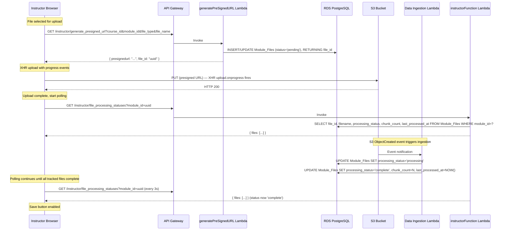
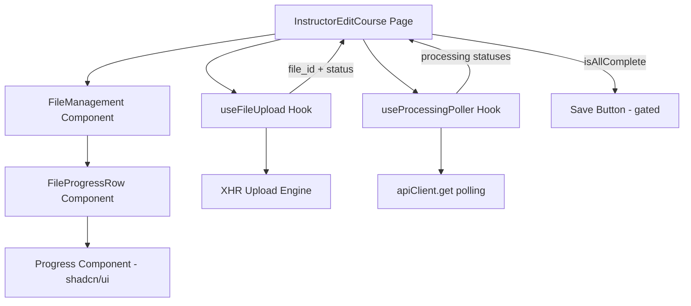

# Design Document: Upload Progress Feedback

## Overview

This feature adds real-time upload progress feedback and data ingestion status tracking to the instructor file management workflow. The design introduces three key capabilities:

1. **XHR-based upload with progress events** — replaces `fetch()` PUT with `XMLHttpRequest` to expose byte-level transfer progress
2. **Processing status polling** — a batch endpoint + frontend polling loop that tracks file ingestion (chunking/embedding) after upload
3. **Save button gating** — prevents premature saves while files are still uploading or processing

The implementation spans frontend (React hooks, UI components) and backend (modified presigned URL Lambda, new route in instructorFunction). All file state transitions flow through a well-defined state machine (see requirements state diagram).

### Design Decisions

| Decision | Choice | Rationale |
|---|---|---|
| Upload mechanism | XHR instead of fetch | `fetch()` does not expose upload progress events; XHR `upload.onprogress` provides `loaded`/`total` bytes |
| Polling vs WebSocket | Polling at 3s interval | Simpler to implement, no persistent connection infrastructure needed; 3s balances UX responsiveness with backend load |
| Batch endpoint location | New route in `instructorFunction` Lambda | Already has DB connection and instructor auth; avoids a new Lambda + IAM role |
| file_id acquisition | `generatePreSignedURL` Lambda creates DB record | Guarantees file_id is available before upload begins; eliminates race between upload completion and polling start |
| Progress UI | shadcn/ui `Progress` component | Consistent with frontend conventions; supports both determinate and indeterminate states |
| State management | React hook with `useReducer` | Complex state transitions (uploading, pending, processing, etc.) map cleanly to reducer actions |

---

## Architecture



### Component Architecture (Frontend)



---

## Components and Interfaces

### Frontend Components

#### 1. `useFileUpload` Hook

Custom hook encapsulating XHR-based upload logic with progress tracking.

```javascript
/**
 * @param {Object} options
 * @param {string} options.courseId - Course UUID
 * @param {string} options.moduleId - Module UUID
 * @param {string} options.moduleName - Module name for presigned URL request
 * @returns {Object} { uploadFiles, fileStates, abortFile, retryFile, removeFile }
 */
function useFileUpload({ courseId, moduleId, moduleName })
```

**State per file:**
```javascript
{
  fileId: string,          // UUID from backend
  fileName: string,        // Display name
  status: 'uploading' | 'upload_failed',
  progress: number,        // 0-100 (only meaningful during 'uploading')
  error: string | null,    // Error message if failed
  xhr: XMLHttpRequest,     // Reference for abort capability
  uploadStartedAt: number, // Date.now() for timeout tracking
}
```

**Key behaviors:**
- Calls `apiClient.get('instructor/generate_presigned_url', {...})` to obtain presigned URL + file_id
- Creates XHR with `upload.onprogress` listener computing `(loaded / total) * 100`
- On success (HTTP 200): marks file as ready for polling, returns `file_id`
- On failure: sets `status: 'upload_failed'` with error message
- Timeout: 300s (matching presigned URL expiry)
- Exposes `abortFile(fileId)` to cancel in-progress uploads

#### 2. `useProcessingPoller` Hook

Custom hook managing the 3-second polling loop for file processing statuses.

```javascript
/**
 * @param {Object} options
 * @param {string} options.moduleId - Module UUID
 * @param {Array} options.trackedFileIds - Array of file_ids to track
 * @param {boolean} options.enabled - Whether polling should be active
 * @returns {Object} { processingStates, removeTrackedFile, addTrackedFiles }
 */
function useProcessingPoller({ moduleId, trackedFileIds, enabled })
```

**State per tracked file:**
```javascript
{
  fileId: string,
  status: 'pending' | 'processing' | 'complete' | 'failed' | 'not_found' | 'timed_out',
  chunkCount: number | null,
  lastProcessedAt: string | null,
  uploadCompletedAt: number,  // Date.now() when upload finished (for not_found timing)
  pollingStartedAt: number,   // Date.now() when polling began (for timeout)
}
```

**Key behaviors:**
- Polls `GET /instructor/file_processing_statuses?module_id=<uuid>` every 3 seconds
- Derives `not_found` locally when a tracked file_id is absent from response
- Derives `timed_out` when POLLING_TIMEOUT_SECONDS (300s) elapsed without `complete` or `failed`
- Stops polling when all tracked files are `complete`, `failed`, or removed
- On page load: issues initial fetch, adds files with `pending`/`processing` to tracked set
- Continues including `timed_out` and `not_found` files in polling (does not stop tracking them)

#### 3. `FileProgressRow` Component

Renders the progress/status indicator for a single file within the file table.

```javascript
/**
 * @param {Object} props
 * @param {string} props.fileName - Display name
 * @param {string} props.status - Current file state
 * @param {number} props.progress - Upload progress percentage (0-100)
 * @param {string|null} props.error - Error description
 * @param {number|null} props.uploadCompletedAt - Timestamp for not_found timing
 * @param {function} props.onRetry - Retry handler
 * @param {function} props.onRemove - Remove handler
 * @param {function} props.onAbort - Abort handler (during upload)
 */
function FileProgressRow(props)
```

**Renders based on status:**
| Status | Visual |
|---|---|
| `uploading` | Determinate `Progress` bar (0-100%) + abort button |
| `pending` / `processing` | Indeterminate (pulsing) `Progress` bar |
| `complete` | Green check icon (`CheckCircle2` from lucide-react) |
| `upload_failed` / `failed` | Red alert icon (`AlertCircle`) + error tooltip + retry/remove buttons |
| `not_found` (< 30s) | Indeterminate bar + "Waiting for processing..." text |
| `not_found` (> 60s) | Warning icon + "Processing hasn't started — this may indicate an issue" |
| `timed_out` | Warning icon (`Clock`) + timeout message, still polling |

#### 4. Modified `FileManagement` Component

The existing `FileManagement.jsx` will be extended with a progress column. New files being uploaded/processed show `FileProgressRow` in place of the download button.

### Backend Components

#### 5. Modified `generatePreSignedURL` Lambda

**Changes:**
- Add DB connection (via RDS Proxy, `sslmode=require`)
- Before generating presigned URL: INSERT or UPDATE `Module_Files` record with `processing_status='pending'`
- Return `{ presignedurl: "...", file_id: "uuid" }` instead of `{ presignedurl: "..." }`
- Requires new environment variables: `SM_DB_CREDENTIALS`, `RDS_PROXY_ENDPOINT`
- Requires VPC access (security group, subnets) and SecretsManager permission

**Upsert logic (SQL):**
```sql
INSERT INTO "Module_Files" (module_id, filename, filetype, processing_status, time_uploaded)
VALUES ($1, $2, $3, 'pending', NOW())
ON CONFLICT (module_id, filename, filetype)
DO UPDATE SET processing_status = 'pending', time_uploaded = NOW(), content_hash = NULL, chunk_count = NULL, last_processed_at = NULL
RETURNING file_id;
```

Note: This requires a UNIQUE constraint on `(module_id, filename, filetype)` — an idempotent migration will add it if missing.

#### 6. New Route in `instructorFunction` Lambda

**Route:** `GET /instructor/file_processing_statuses`

**Query parameter:** `module_id` (UUID, required)

**Response:**
```json
{
  "files": [
    {
      "file_id": "uuid",
      "filename": "lecture-notes",
      "processing_status": "complete",
      "chunk_count": 42,
      "last_processed_at": "2024-01-15T10:30:00Z"
    }
  ]
}
```

**Implementation (in switch statement):**
```javascript
case "GET /instructor/file_processing_statuses":
  const moduleId = event.queryStringParameters?.module_id;
  // Validate UUID format
  const uuidRegex = /^[0-9a-f]{8}-[0-9a-f]{4}-[0-9a-f]{4}-[0-9a-f]{4}-[0-9a-f]{12}$/i;
  if (!moduleId || !uuidRegex.test(moduleId)) {
    response.statusCode = 400;
    response.body = JSON.stringify({ error: "module_id is required and must be a valid UUID" });
    break;
  }
  const files = await sqlConnection`
    SELECT file_id, filename, processing_status, chunk_count, last_processed_at
    FROM "Module_Files"
    WHERE module_id = ${moduleId};
  `;
  response.body = JSON.stringify({ files });
  break;
```

#### 7. CDK Changes

- **API Gateway:** Add `GET /instructor/file_processing_statuses` resource + method in OpenAPI spec, integrated with `instructorFunction` Lambda
- **generatePreSignedURL Lambda:** Add VPC config, SecretsManager access, RDS Proxy endpoint environment variable
- **IAM:** Add SecretsManager permission (scoped to `secretPathUser` ARN) and EC2 VPC networking to generatePreSignedURL role
- **Database migration:** Add UNIQUE constraint on `Module_Files(module_id, filename, filetype)` via initializer Lambda

---

## Data Models

### Module_Files Table (Existing — no schema changes needed)

The table already has all required columns from a prior migration:

| Column | Type | Notes |
|---|---|---|
| `file_id` | uuid (PK) | Auto-generated via `uuid_generate_v4()` |
| `module_id` | uuid (FK) | References `Course_Modules.module_id` |
| `filetype` | varchar | File extension (pdf, docx, etc.) |
| `s3_bucket_reference` | varchar | S3 bucket name |
| `filepath` | varchar | Full S3 key |
| `filename` | varchar | Cleaned file name (no extension) |
| `time_uploaded` | timestamp | When presigned URL was issued |
| `metadata` | text (migrated to JSONB) | File metadata (description, topic_extraction) |
| `content_hash` | text | SHA-256 of file content (deduplication) |
| `processing_status` | text | `'pending'` / `'processing'` / `'complete'` / `'failed'` |
| `last_processed_at` | timestamptz | When ingestion completed |
| `chunk_count` | integer | Number of vector chunks produced |

**Required migration:** Add UNIQUE constraint on `(module_id, filename, filetype)` for the upsert logic:

```sql
CREATE UNIQUE INDEX IF NOT EXISTS idx_module_files_unique_file
ON "Module_Files" (module_id, filename, filetype);
```

### Frontend State Model

```javascript
// Combined state managed by InstructorEditCourse
{
  uploadStates: Map<fileId, {
    fileId: string,
    fileName: string,
    status: 'uploading' | 'upload_failed',
    progress: number,
    error: string | null,
  }>,
  processingStates: Map<fileId, {
    fileId: string,
    fileName: string,
    status: 'pending' | 'processing' | 'complete' | 'failed' | 'not_found' | 'timed_out',
    chunkCount: number | null,
    lastProcessedAt: string | null,
    uploadCompletedAt: number,
    pollingStartedAt: number,
  }>,
}
```

### Constants

```javascript
// frontend/src/constants/uploadConfig.js
export const POLLING_INTERVAL_MS = 3000;
export const POLLING_TIMEOUT_SECONDS = 300;
export const XHR_UPLOAD_TIMEOUT_MS = 300000; // 300s matching presigned URL expiry
export const NOT_FOUND_GRACE_PERIOD_MS = 30000; // 30s before showing "waiting" message
export const NOT_FOUND_WARNING_THRESHOLD_MS = 60000; // 60s before showing warning
```

---

## Correctness Properties

*A property is a characteristic or behavior that should hold true across all valid executions of a system — essentially, a formal statement about what the system should do. Properties serve as the bridge between human-readable specifications and machine-verifiable correctness guarantees.*

### Property 1: Upload progress monotonically increases

*For any* file upload via XHR, the sequence of progress values reported by `onprogress` events SHALL be monotonically non-decreasing, starting at 0 and ending at 100 upon success.

**Validates: Requirements 1.1, 1.2, 1.3**

### Property 2: Save button disabled while tracked files incomplete

*For any* set of tracked files, the Save button SHALL be disabled if and only if at least one tracked file has a status in `{ uploading, upload_failed, pending, processing, not_found, timed_out, failed }`.

**Validates: Requirements 5.1, 5.2, 5.3, 5.5, 5.6, 5.7**

### Property 3: File removal re-enables save when no remaining blockers

*For any* set of tracked files where the Save button is disabled, removing all files with blocking statuses SHALL result in the Save button becoming enabled (assuming no other blockers remain).

**Validates: Requirements 7.3, 7.7**

### Property 4: Batch endpoint response completeness

*For any* module_id with N files in Module_Files, the batch endpoint SHALL return exactly N file records, each containing `file_id`, `filename`, `processing_status`, `chunk_count`, and `last_processed_at`.

**Validates: Requirements 4.1, 4.2, 4.5**

### Property 5: Polling stops only when all tracked files terminal

*For any* set of tracked files being polled, the poller SHALL continue polling while at least one file has status in `{ pending, processing, not_found, timed_out }` and SHALL stop only when all files are in `{ complete, failed }` or have been removed.

**Validates: Requirements 3.6, 3.7**

### Property 6: file_id round-trip consistency

*For any* file uploaded via the presigned URL flow, the `file_id` returned by `generatePreSignedURL` SHALL appear in subsequent batch status endpoint responses for the same `module_id`, with an eventual `processing_status` transition through `pending` → `processing` → `complete|failed`.

**Validates: Requirements 9.1, 9.2, 3.1**

### Property 7: Idempotent re-upload preserves file_id

*For any* file with the same `(module_id, filename, filetype)` uploaded multiple times, the `generatePreSignedURL` endpoint SHALL return the same `file_id` and reset `processing_status` to `'pending'`.

**Validates: Requirements 9.3**

### Property 8: Invalid module_id returns 400

*For any* request to the batch status endpoint where `module_id` is missing or not a valid UUID, the endpoint SHALL return HTTP 400 with a descriptive error message.

**Validates: Requirements 4.3**

---

## Error Handling

### Upload Errors

| Error Type | Detection | User Experience | Recovery |
|---|---|---|---|
| Network failure | XHR `onerror` event | Red error icon + "Network error" tooltip | Retry button |
| Timeout (300s) | XHR `ontimeout` event | Red error icon + "Upload timed out" tooltip | Retry button |
| S3 rejection (non-2xx) | XHR `onload` with status !== 200 | Red error icon + HTTP status message | Retry button |
| Presigned URL failure | apiClient throws | Toast notification + file not added to upload queue | User re-selects file |

### Polling Errors

| Error Type | Detection | User Experience | Recovery |
|---|---|---|---|
| Network failure on poll | fetch throws | Silent retry on next interval (no UI interruption) | Auto-retries next cycle |
| 401/403 on poll | Response status | Toast "Session expired" | User re-authenticates |
| 500 on poll | Response status | Silent retry (up to 3 consecutive failures, then warning toast) | Auto-retries; manual page refresh |
| File `not_found` > 60s | Timer comparison | Warning text in progress row | User can remove file |
| Polling timeout (300s) | Timer comparison | Warning icon + "Taking longer than expected" | Continues polling; user can remove |

### Backend Errors

| Error Type | Detection | Response | Recovery |
|---|---|---|---|
| DB connection failure in generatePreSignedURL | Exception in psycopg2 connect | HTTP 500 + `logger.exception()` | Retry (Lambda warm start reconnects) |
| Invalid UUID in batch endpoint | Regex validation | HTTP 400 with message | Frontend should never send invalid UUID |
| Module not found | Empty result set | HTTP 200 with `{ files: [] }` | No error — valid state for new modules |

### Graceful Degradation

- If the batch status endpoint is unreachable, the upload itself still succeeds (S3 PUT is independent)
- If polling fails persistently, the Save button remains disabled but a warning toast tells the instructor they can refresh the page
- XHR abort on file removal is fire-and-forget — partial uploads are cleaned by S3 lifecycle rules (7-day expiry already configured)

---

## Testing Strategy

### Unit Tests (Example-based)

| Area | Test Cases |
|---|---|
| `useFileUpload` hook | Successful upload → state transitions; Failed upload → error state; Abort → XHR.abort() called |
| `useProcessingPoller` hook | Polling starts when enabled; Stops when all complete; Timeout detection at 300s |
| `FileProgressRow` component | Renders correct visual for each status; Shows tooltip on error; Shows timing-based messages for `not_found` |
| Save gate logic | Disabled when any file uploading/pending/processing; Enabled when all complete or no tracked files |
| Batch endpoint handler | Valid module_id → returns files; Invalid UUID → 400; Missing param → 400 |
| generatePreSignedURL (modified) | Returns file_id in response; Upserts correctly on re-upload |

### Property-Based Tests

Property-based testing applies to the pure logic components of this feature:

- **Library:** [fast-check](https://github.com/dubzzz/fast-check) (already compatible with the JS/JSX codebase)
- **Minimum iterations:** 100 per property
- **Tag format:** `Feature: upload-progress-feedback, Property {N}: {title}`

| Property | Generator | Assertion |
|---|---|---|
| Property 2: Save gate | Random sets of file statuses | `isSaveDisabled === trackedFiles.some(f => BLOCKING_STATUSES.includes(f.status))` |
| Property 3: File removal | Random tracked set + random removal | After removal, save enabled iff no blockers remain |
| Property 5: Polling termination | Random file status sequences | Polling active iff any file in non-terminal state |
| Property 7: Upsert idempotence | Random (module_id, filename, filetype) tuples | Same file_id returned, status reset to pending |
| Property 8: UUID validation | Random strings (valid UUIDs + garbage) | 400 iff not valid UUID format |

### Integration Tests

| Scenario | Approach |
|---|---|
| End-to-end upload + polling | Manual test with dev environment; verify state transitions in UI |
| generatePreSignedURL DB integration | Deploy to dev, call endpoint, verify Module_Files row created |
| Batch endpoint with real data | Deploy, upload files, verify response matches DB state |

### CDK Assertion Tests

| Test | Assertion |
|---|---|
| generatePreSignedURL has VPC config | Template hasResourceProperties with VpcConfig |
| generatePreSignedURL has SecretsManager permission | IAM policy statement includes `secretsmanager:GetSecretValue` scoped to ARN |
| OpenAPI spec includes new route | Template resource contains `/instructor/file_processing_statuses` |
| New unique index migration | Initializer Lambda code includes the constraint creation SQL |
