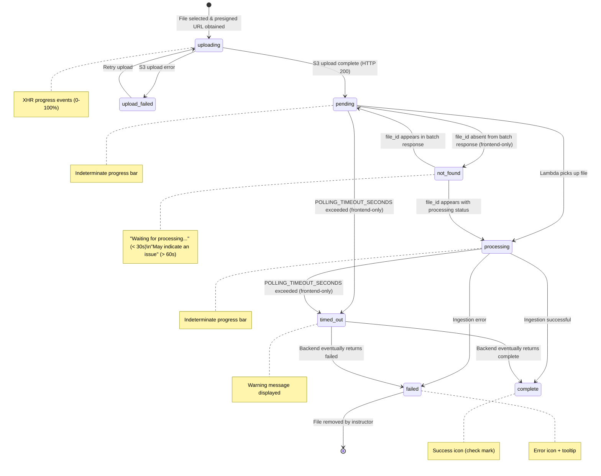

# Requirements Document

## Introduction

This feature adds real-time upload progress feedback to the instructor file management UI. Instructors currently have no visibility into file upload progress or data ingestion status — the UI simply blocks during save with no indication of what is happening. This feature introduces per-file upload progress bars, processing status indicators, and save-button gating so instructors know exactly where each file stands and cannot accidentally save before processing completes.

## Glossary

- **Upload_Progress_Tracker**: Frontend component responsible for tracking and displaying S3 upload progress using XHR progress events
- **Tracked_File**: A file uploaded during the current edit session OR a file loaded from the module whose `processing_status` is `pending` or `processing`. Only Tracked_Files gate the Save button. Files that are already `complete` on page load are NOT tracked (they do not affect Save state).
- **Processing_Status_Poller**: Frontend service that polls the Batch_File_Processing_Status_Endpoint to monitor data ingestion progress for Tracked_Files
- **Batch_File_Processing_Status_Endpoint**: Backend API endpoint (`GET /instructor/file_processing_statuses?module_id=<uuid>`) that returns the current `processing_status` of all files in a module from the Module_Files table
- **Save_Gate**: Frontend logic that controls the enabled/disabled state of the Save button based on file upload and processing completion
- **Progress_Indicator**: UI element (shadcn/ui Progress component) showing either determinate upload progress or indeterminate processing progress
- **S3_Upload_Phase**: The period during which a file is being transferred to S3 via presigned URL PUT request
- **Data_Ingestion_Phase**: The period after S3 upload completes during which the data ingestion Lambda processes the file (text extraction, chunking, embedding, indexing)
- **Processing_Status**: Enum of file processing states stored in the Module_Files table. Valid values: `pending`, `processing`, `complete`, `failed`. The frontend derives two transient states locally (not stored in DB, not returned by endpoint): `not_found` when a Tracked_File's file_id is absent from the batch endpoint response, and `timed_out` when POLLING_TIMEOUT_SECONDS is exceeded for a Tracked_File without reaching `complete` or `failed`. Developers MUST NOT introduce variants such as `completed`, `success`, `done`, or `error`.
- **file_id**: UUID primary key assigned to a file record in the Module_Files table, used as the unique identifier for polling processing status. Eliminates ambiguity with re-uploads of the same filename.
- **POLLING_TIMEOUT_SECONDS**: Configurable constant (default 300 seconds) controlling how long the Processing_Status_Poller continues polling before displaying a timeout warning

## Requirements

### Requirement 1: S3 Upload Progress Tracking

**User Story:** As an instructor, I want to see a progress bar for each file being uploaded to S3, so that I know how much of the transfer has completed.

#### Acceptance Criteria

1. WHEN a file upload to S3 begins, THE Upload_Progress_Tracker SHALL display a determinate progress bar for that file showing 0% completion
2. WHILE the S3 upload is in progress, THE Upload_Progress_Tracker SHALL update the progress bar percentage based on XHR `progress` event data (`loaded / total * 100`)
3. WHEN the S3 upload completes successfully (HTTP 200), THE Upload_Progress_Tracker SHALL display the progress bar at 100% for that file
4. IF the S3 upload fails (non-2xx response or network error), THEN THE Upload_Progress_Tracker SHALL display an error state for that file with a descriptive message
5. WHEN multiple files are being uploaded, THE Upload_Progress_Tracker SHALL display independent progress bars for each file simultaneously

### Requirement 2: XHR-Based Upload Implementation

**User Story:** As an instructor, I want file uploads to use XHR instead of fetch, so that real-time progress events are available.

#### Acceptance Criteria

1. WHEN a file is uploaded to S3 via presigned URL, THE Upload_Progress_Tracker SHALL use XMLHttpRequest instead of fetch to enable progress event monitoring
2. THE Upload_Progress_Tracker SHALL attach an `onprogress` event listener to the XHR `upload` property to receive transfer progress updates
3. WHEN the XHR upload completes, THE Upload_Progress_Tracker SHALL resolve with the same success/failure semantics as the current fetch-based implementation
4. IF the XHR request times out (300 seconds matching presigned URL expiry), THEN THE Upload_Progress_Tracker SHALL report a timeout error for that file

### Requirement 3: Data Ingestion Status Polling

**User Story:** As an instructor, I want to see when my uploaded files are being processed (chunked and indexed), so that I know the system is working on them.

#### Acceptance Criteria

1. WHEN a file's S3 upload completes successfully, THE Processing_Status_Poller SHALL add that file to the set of Tracked_Files and begin polling the Batch_File_Processing_Status_Endpoint using the module_id
2. THE Processing_Status_Poller SHALL issue a single batch poll request per cycle that covers ALL Tracked_Files simultaneously
3. WHILE the `processing_status` is `'pending'` or `'processing'` for a Tracked_File, THE Processing_Status_Poller SHALL display an indeterminate (pulsing) progress indicator for that file
4. WHEN the `processing_status` transitions to `'complete'` for a Tracked_File, THE Processing_Status_Poller SHALL display a success state for that file
5. IF the `processing_status` transitions to `'failed'` for a Tracked_File, THEN THE Processing_Status_Poller SHALL display an error state for that file
6. THE Processing_Status_Poller SHALL continue polling while at least one Tracked_File remains in `pending`, `processing`, `not_found`, or `timed_out` state
7. THE Processing_Status_Poller SHALL stop polling when all Tracked_Files are either `complete`, `failed`, or removed
8. THE Processing_Status_Poller SHALL poll at an interval of 3 seconds to balance responsiveness with backend load
9. IF the Processing_Status_Poller has polled for more than POLLING_TIMEOUT_SECONDS (default 300 seconds) without a Tracked_File reaching `'complete'` or `'failed'`, THEN THE Processing_Status_Poller SHALL mark that file as `timed_out`, display a timeout warning, and CONTINUE including the file in batch polling until it reaches `complete`, `failed`, or is removed
10. IF a Tracked_File's file_id is absent from the batch response, THE Processing_Status_Poller SHALL treat that file as `not_found` locally
11. WHEN a Tracked_File is treated as `not_found` within 30 seconds of upload completion, THE Processing_Status_Poller SHALL display "Waiting for processing..." with an indeterminate indicator
12. WHEN a Tracked_File is treated as `not_found` for more than 60 seconds after upload completion, THE Processing_Status_Poller SHALL display a warning message ("Processing hasn't started — this may indicate an issue")

### Requirement 4: Batch File Processing Status Endpoint

**User Story:** As a frontend developer, I want a backend endpoint that returns all file processing statuses for a module in a single request, so that the UI can poll efficiently regardless of file count.

#### Acceptance Criteria

1. THE Batch_File_Processing_Status_Endpoint SHALL respond to `GET /instructor/file_processing_statuses` with query parameter `module_id` (UUID)
2. WHEN a valid `module_id` is provided, THE Batch_File_Processing_Status_Endpoint SHALL return a JSON response containing an array of all file records for that module: `{ "files": [{ "file_id": "...", "filename": "...", "processing_status": "...", "chunk_count": 0, "last_processed_at": "..." }, ...] }` where `chunk_count` SHALL be `null` when the file has not been processed yet (pending/processing), and `0` when the file was processed but produced no extractable content (valid final state); non-null values indicate processing has completed for that field. `last_processed_at` is null for pending or processing files.
3. IF the `module_id` query parameter is missing or not a valid UUID, THEN THE Batch_File_Processing_Status_Endpoint SHALL return HTTP 400 with a descriptive error message
4. THE Batch_File_Processing_Status_Endpoint SHALL be accessible only to authenticated users with the instructor role via the existing API Gateway authorizer
5. THE Batch_File_Processing_Status_Endpoint SHALL return one response per poll cycle regardless of how many files are in the module, reducing N individual requests to a single batch request

### Requirement 5: Save Button Gating

**User Story:** As an instructor, I want the Save button to be disabled until all file uploads and processing are complete, so that I cannot accidentally save a module with incomplete data.

#### Acceptance Criteria

1. WHILE any Tracked_File's S3 upload is in progress, THE Save_Gate SHALL disable the Save button
2. WHILE any Tracked_File's `processing_status` is `'pending'` or `'processing'`, THE Save_Gate SHALL disable the Save button
3. WHEN no Tracked_Files remain in `uploading`, `pending`, `processing`, `not_found`, `timed_out`, or `failed` state, THE Save_Gate SHALL enable the Save button
4. WHILE the Save button is disabled due to file processing, THE Save_Gate SHALL display a tooltip explaining the reason (e.g., "Files are still processing...")
5. IF any Tracked_File reaches `processing_status: 'failed'`, THEN THE Save_Gate SHALL keep the Save button disabled until the failed file is removed from the upload queue or successfully retried
6. IF any Tracked_File has timed out (POLLING_TIMEOUT_SECONDS elapsed without reaching `'complete'` or `'failed'`), THEN THE Save_Gate SHALL keep the Save button disabled until the timed-out file eventually completes via continued polling, fails, is retried, or is removed by the instructor
7. WHEN no Tracked_Files are pending upload or processing (e.g., only metadata edits or all files already complete on page load), THE Save_Gate SHALL allow the Save button to remain enabled

### Requirement 6: Progress UI Display

**User Story:** As an instructor, I want the progress indicators to be visually clear and integrated into the file table, so that I can easily see the status of each file.

#### Acceptance Criteria

1. THE Progress_Indicator SHALL use the shadcn/ui Progress component for determinate upload progress display
2. THE Progress_Indicator SHALL use an indeterminate animated variant (pulsing/striped) of the Progress component for the data ingestion phase
3. WHEN a file upload is complete and processing is complete, THE Progress_Indicator SHALL display a success icon (check mark) replacing the progress bar
4. WHEN a file is in an error state (upload failed or processing failed), THE Progress_Indicator SHALL display a destructive-colored error icon with a tooltip describing the error
5. THE Progress_Indicator SHALL be rendered as an additional column or row element in the existing file table for each new file being uploaded
6. THE Progress_Indicator SHALL follow the 4pt grid spacing system and use semantic colour tokens (`bg-primary` for progress, `bg-destructive` for errors, `text-muted-foreground` for pending states)

### Requirement 7: Error Recovery and File Removal

**User Story:** As an instructor, I want to be able to retry, remove, or cancel files that failed during upload or processing, so that I can recover without reloading the page.

#### Acceptance Criteria

1. WHEN a file's S3 upload fails, THE Upload_Progress_Tracker SHALL allow the instructor to retry the upload for that specific file
2. WHEN a file's processing status is `'failed'`, THE Processing_Status_Poller SHALL allow the instructor to remove the file from the upload queue
3. IF a file is removed from the upload queue after failure, THEN THE Save_Gate SHALL re-evaluate whether the Save button can be enabled based on remaining files
4. THE Upload_Progress_Tracker SHALL preserve successfully uploaded files' status when one file in a batch fails
5. WHEN a file is removed while its S3 upload is in progress, THE Upload_Progress_Tracker SHALL abort the XHR request and remove the progress UI for that file
6. WHEN a file is removed while its processing is being polled, THE Processing_Status_Poller SHALL stop polling for that file and remove the progress UI for that file
7. WHEN a file is removed, THE Save_Gate SHALL re-evaluate whether the Save button can be enabled based on remaining files

### Requirement 8: Page Refresh Polling Resumption

**User Story:** As an instructor, I want the progress UI to resume tracking files that are still processing when I navigate to the module edit page, so that I do not lose visibility into ongoing processing.

#### Acceptance Criteria

1. WHEN the module edit page loads, THE Processing_Status_Poller SHALL query the Batch_File_Processing_Status_Endpoint to retrieve current statuses for all files in the module
2. IF any files have `processing_status` of `'pending'` or `'processing'` on page load, THEN THE Processing_Status_Poller SHALL add those files to the set of Tracked_Files and automatically resume polling
3. WHEN all files on page load already have `processing_status: 'complete'`, THE Processing_Status_Poller SHALL NOT add any files to the Tracked_Files set and the Save_Gate SHALL allow the Save button to remain enabled
4. WHILE resumed polling is active for Tracked_Files loaded on page entry, THE Save_Gate SHALL disable the Save button until all Tracked_Files reach `'complete'` or are removed

### Requirement 9: File Registration and file_id Acquisition

**User Story:** As a frontend developer, I want to receive a file_id before the S3 upload begins, so that the uploaded file can be immediately added to the Tracked_Files set for polling after upload completes.

#### Acceptance Criteria

1. WHEN the frontend requests a presigned URL, THE generate_presigned_url endpoint SHALL create or update the file record in Module_Files (with `processing_status: 'pending'`) and return both the presigned URL and the file_id in the response: `{ "presignedurl": "...", "file_id": "..." }`
2. THE frontend SHALL store the returned file_id and associate it with the file being uploaded, so it can be used for Tracked_File identification after upload completes
3. IF the file record already exists (same module_id + filename + filetype), THEN THE generate_presigned_url endpoint SHALL update the existing record, reset `processing_status` to `'pending'`, and return the existing file_id. The subsequent data ingestion will delete old vector chunks for this file_id and replace them with new chunks from the re-uploaded content.

## File Processing State Diagram

States `uploading` and `upload_failed` are frontend-only (not stored in Module_Files). States `not_found` and `timed_out` are frontend-only (derived locally from polling responses). States `pending`, `processing`, `complete`, `failed` are stored in the `processing_status` column of Module_Files.
