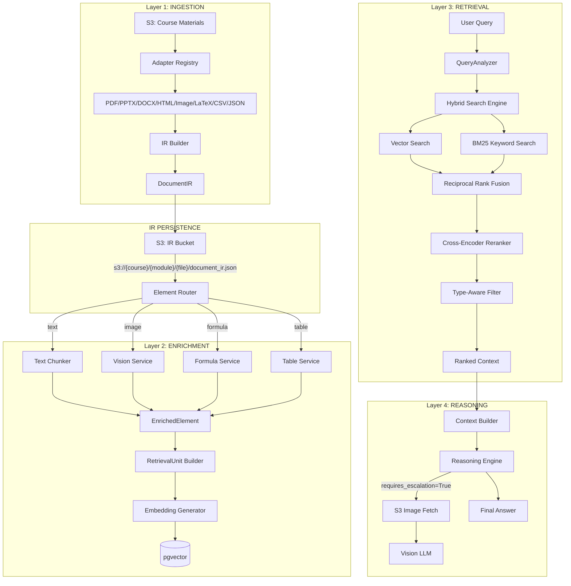
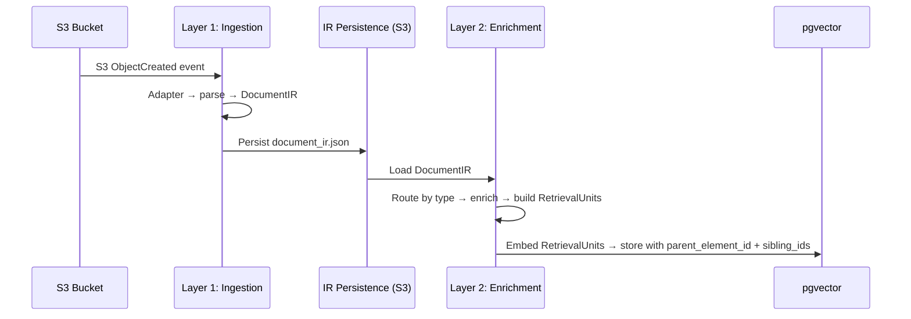
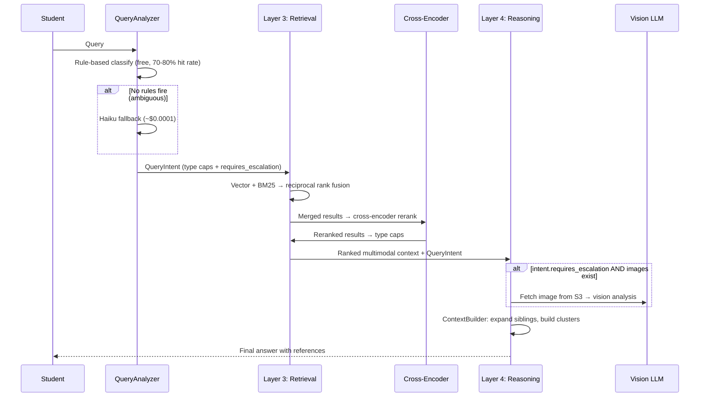

# Design Document: 4-Layer Multimodal RAG Architecture (V2)

## Overview

Production-grade 4-layer multimodal RAG for the AI Learning Assistant. V2 introduces strict layer boundaries (vs V1's monolithic `data_ingestion` Lambda), enabling independent scaling, cost isolation, and clean debugging.

Layers: **Ingestion** (format → IR), **Enrichment** (multimodal intelligence → RetrievalUnits), **Retrieval** (search + cross-encoder reranking), **Reasoning** (LLM + tool use). Between Ingestion and Enrichment: **IR Persistence** (S3) enables re-enrichment without re-parsing.

Key V2 additions over initial design: **RetrievalUnit** abstraction (one IRElement → many searchable units), **Cross-Encoder Reranker**, expanded **ContextBuilder** (source grouping, parent-child expansion, cluster construction, token budgets), **Version tracking** (ir_version, enrichment_version, embedding_version), **Content-hash caching** (embedding + context-aware enrichment), **DocumentSummary** + **DocumentMetadata** (document-level retrieval with metadata filtering for lecture/week queries), **QueryAnalyzer** (rule-based first 70-80% free, Haiku fallback — single call handles intent + escalation classification, replacing separate ImageEscalation classifier).

## Architecture



> **Flow:** IRElement → Enrichment Service → EnrichedElement → RetrievalUnit(s) → pgvector

## Sequence Diagrams

### Ingestion + IR Persistence + Enrichment Flow



### Query + Retrieval + Reasoning Flow



## Components and Interfaces

### Layer 1: Ingestion + IR Persistence

```python
class AdapterRegistry:
    """Routes files to format-specific adapters. No AI — pure dispatch."""
    def register(self, extension: str, adapter: "BaseAdapter") -> None: ...
    def get_adapter(self, file_key: str) -> "BaseAdapter": ...

class BaseAdapter(ABC):
    """Parse file → extract raw elements. NO AI calls."""
    @abstractmethod
    def extract(self, file_bytes: bytes, file_key: str) -> list["RawElement"]: ...

class IRBuilder:
    """Normalizes adapter output → DocumentIR. Assigns IDs, dedup, ordering."""
    def build(self, raw_elements: list["RawElement"], file_metadata: "FileMetadata") -> "DocumentIR": ...

class IRPersistence:
    """Persists DocumentIR to S3. Key: s3://ir-bucket/{course}/{module}/{file}/ir_v{version}/document_ir.json
    ir_version stored in the path enables parallel re-enrichment when schema changes."""
    def persist(self, document_ir: "DocumentIR") -> str: ...
    def load(self, course_id: str, module_id: str, file_id: str) -> "DocumentIR": ...
```

### Layer 2: Enrichment Layer

```python
class ElementRouter:
    """Routes elements to correct enrichment service by type. TEXT=no topics, IMAGE/TABLE=topics."""
    def enrich_document(self, document_ir: "DocumentIR") -> list["RetrievalUnit"]: ...

class RetrievalUnitBuilder:
    """EnrichedElement → N RetrievalUnits. Table→summary+column units, Text→semantic chunks, Image→single unit."""
    def build(self, enriched: "EnrichedElement") -> list["RetrievalUnit"]: ...

class VisionService:
    """Structured image descriptions via Claude 3 Haiku vision."""
    def describe(self, element: "IRElement", context: "ElementContext") -> "EnrichedElement": ...

class FormulaService:
    """LaTeX/MathML parsing (text-layer) or vision fallback (raster). Output: formula_text + latex_repr + concepts."""
    def enrich(self, element: "IRElement", context: "ElementContext") -> "EnrichedElement": ...

class TableService:
    """Structured extraction: headers, rows, summary."""
    def enrich(self, element: "IRElement", context: "ElementContext") -> "EnrichedElement": ...
```

### Layer 3: Retrieval Layer

```python
@dataclass
class TypeCaps:
    max_text: int = 8
    max_image: int = 4
    max_formula: int = 3
    max_table: int = 2

class QueryAnalyzer:
    """Two-tier: rules first (free, 70-80%), Haiku fallback (~$0.0001) for ambiguous."""
    RULES = {
        "requires_image": ["figure", "diagram", "graph", "chart", "image", "picture", "map", "visual"],
        "requires_formula": ["equation", "formula", "derive", "solve", "calculate", "prove"],
        "requires_table": ["data", "table", "compare", "statistics", "values"],
        "needs_summary": ["covered", "lecture", "overview", "topics", "about"],
        "requires_escalation": ["show me", "look at", "in the figure", "this diagram"],
    }
    def analyze(self, query: str) -> "QueryIntent":
        """Rules fire → return immediately (zero cost). No match → Haiku."""
        ...

@dataclass
class QueryIntent:
    needs_summary: bool = False
    requires_image: bool = False
    requires_formula: bool = False
    requires_table: bool = False
    requires_escalation: bool = False  # replaces separate ImageEscalation classifier

class HybridSearchEngine:
    """Vector + BM25 → merge → cross-encoder rerank → type caps.
    Filters to only compare against vectors with matching embedding_version."""
    def search(self, query, query_embedding, collection_names, allowed_file_ids=None,
               k=15, type_caps=None, embedding_version: str = CURRENT_VERSION) -> list["RankedResult"]: ...

class CrossEncoderReranker:
    """Reranks merged results using cross-encoder. Applied AFTER RRF, BEFORE type caps."""
    def rerank(self, query: str, results: list["MergedResult"], top_k: int = 30) -> list["MergedResult"]: ...

class ProductionRanker:
    """Post-cross-encoder: score = cross_encoder_score + metadata_boost. TypeCaps for diversity."""
    def rank(self, results: list["MergedResult"]) -> list["RankedResult"]: ...
```

### Layer 4: Reasoning Layer

```python
class ContextBuilder:
    """Core orchestrator. Groups by page → expands siblings → builds clusters → manages token budget.
    Escalation analysis (from QueryIntent.requires_escalation) injected into context BEFORE final prompt assembly.
    """
    def build_context(self, results: list["RankedResult"]) -> "StructuredContext": ...
    def group_by_source(self, results: list["RankedResult"]) -> dict[int, list["RankedResult"]]: ...
    def expand_siblings(self, result: "RankedResult",
                        max_expansion_tokens: int = 500,
                        max_sibling_distance: int = 2) -> list["RankedResult"]:
        """Expand ±max_sibling_distance chunks from same parent.
        Stop expanding when total added tokens exceed max_expansion_tokens.
        Prevents accidentally diluting relevance with 15 siblings of a short chunk."""
        ...
    def build_clusters(self, results: list["RankedResult"], module_id: str) -> list["ContextCluster"]:
        """V2: Clusters by same-page and same-parent only (deterministic, high-precision).
        V3: Topic-overlap clustering (requires retrieval logs to validate).
        """
        ...
    def allocate_token_budget(self, clusters: list["ContextCluster"], max_tokens: int = 128000) -> list["ContextCluster"]: ...
    def format_for_prompt(self, context: "StructuredContext", module_context: str | None = None) -> str: ...

class ReasoningEngine:
    """Generates answers from multimodal context. Handles image escalation."""
    def answer(self, query, context, chat_history, system_prompt) -> "ReasoningResult": ...

class ImageEscalation:
    """Execution-only: fetches images from S3 + calls vision LLM for analysis.
    Classification is handled by QueryAnalyzer (requires_escalation field).
    """
    def escalate(self, query, image_s3_keys, s3_client) -> list["ImageAnalysis"]: ...
```

## Data Models

```python
from dataclasses import dataclass, field
from enum import Enum
from typing import Any

class ElementType(Enum):
    TEXT = "text"; IMAGE = "image"; TABLE = "table"; FORMULA = "formula"

@dataclass
class FileMetadata:
    file_key: str; file_id: str; course_id: str; module_id: str
    file_type: str; upload_timestamp: str

@dataclass
class Provenance:
    page_num: int | None = None; slide_num: int | None = None
    section: str | None = None; position_index: int = 0

@dataclass
class RawElement:
    content: bytes | str; element_type: ElementType
    provenance: Provenance; raw_metadata: dict[str, Any] = field(default_factory=dict)

@dataclass
class IRElement:
    element_id: str           # SHA256(content + provenance)
    content: bytes | str
    element_type: ElementType
    provenance: Provenance
    content_hash: str         # SHA256 of content (for dedup)
    metadata: dict[str, Any] = field(default_factory=dict)

@dataclass
class DocumentIR:
    file_metadata: FileMetadata
    elements: list[IRElement]
    element_count: dict[ElementType, int] = field(default_factory=dict)
    ir_version: str = "2.0"  # tracks IR schema version for re-processing decisions

@dataclass
class EnrichedElement:
    element_id: str
    element_type: ElementType
    provenance: Provenance
    embedding_text: str
    # Topics/labels/keywords: only for IMAGE, TABLE, and raster FORMULA (not TEXT)
    topics: list[str] = field(default_factory=list)
    labels: list[str] = field(default_factory=list)
    keywords: list[str] = field(default_factory=list)
    source_ref: str = ""
    image_s3_key: str | None = None
    # Formula-specific
    formula_text: str | None = None
    latex_repr: str | None = None
    formula_concepts: list[str] = field(default_factory=list)  # e.g., ["ideal gas law", "pressure"]
    # Table-specific
    table_headers: list[str] = field(default_factory=list)
    table_rows: list[list[str]] = field(default_factory=list)
    table_summary: str | None = None
    # Image-specific
    image_type: str | None = None
    image_description: str | None = None
    # Context
    file_id: str = ""; course_id: str = ""; module_id: str = ""
    enrichment_version: str = ""  # e.g., "haiku-v3-2026-06" — identifies model used

@dataclass
class RetrievalUnit:
    """Searchable unit stored in pgvector. One IRElement can produce multiple RetrievalUnits."""
    retrieval_id: str              # unique ID for this retrieval unit
    parent_element_id: str         # links back to the IRElement that produced this
    embedding_text: str            # what gets embedded and searched
    element_type: ElementType      # inherited from parent
    provenance: Provenance         # inherited from parent
    metadata: dict[str, Any] = field(default_factory=dict)
    sibling_ids: list[str] = field(default_factory=list)  # other chunks from same element
    embedding_version: str = ""  # e.g., "titan-v2-1024" — detects stale embeddings

@dataclass
class MergedResult:
    retrieval_id: str; parent_element_id: str; content: str
    element_type: ElementType; rrf_score: float
    vector_score: float; keyword_score: float
    cross_encoder_score: float = 0.0
    metadata: dict[str, Any] = field(default_factory=dict)
    sibling_ids: list[str] = field(default_factory=list)

@dataclass
class RankedResult:
    retrieval_id: str; parent_element_id: str; content: str
    element_type: ElementType; score: float
    cross_encoder_score: float; metadata_boost: float
    metadata: dict[str, Any] = field(default_factory=dict)
    image_s3_key: str | None = None
    sibling_ids: list[str] = field(default_factory=list)

@dataclass
class StructuredContext:
    text_passages: list[RankedResult]
    image_descriptions: list[RankedResult]
    formula_results: list[RankedResult]
    table_results: list[RankedResult]

@dataclass
class ContextCluster:
    primary_element: RankedResult; related_elements: list[RankedResult]
    relationship_note: str; module_context: str; token_cost: int = 0

@dataclass
class ReasoningResult:
    answer: str; sources: list[str]
    escalation_used: bool = False
    image_analyses: list["ImageAnalysis"] = field(default_factory=list)

@dataclass
class ImageAnalysis:
    image_s3_key: str; analysis: str; confidence: float

@dataclass
class DocumentSummary:
    """Document-level summary for "What's in Lecture X?" queries."""
    file_id: str
    topics: list[str]
    summary: str                # 2-3 sentence overview
    learning_objectives: list[str] = field(default_factory=list)
    enrichment_version: str = ""

@dataclass
class DocumentMetadata:
    """Structured metadata for exact-match filtered retrieval (lecture_number, week).
    Stored in pgvector metadata on DocumentSummary RetrievalUnit."""
    file_id: str
    title: str
    lecture_number: int | None = None
    week: int | None = None
    module_name: str = ""
    source_type: str = ""       # pdf, pptx, tex, csv, etc.
    page_count: int = 0
    upload_date: str = ""

class EmbeddingCache:
    """Cache: content_hash → embedding vector. Avoids re-embedding identical content.
    Valuable for courses reusing slides semester over semester.
    Stored in DynamoDB (content_hash as partition key).
    """
    def get(self, content_hash: str, embedding_version: str) -> list[float] | None: ...
    def put(self, content_hash: str, embedding: list[float], embedding_version: str) -> None: ...

class EnrichmentCache:
    """Cache: (content_hash, context_hash, enrichment_version) → EnrichedElement.
    Text/formula: context_hash is empty (context-independent).
    Image/table: context_hash = SHA256(course_topic + module_name).
    """
    def get(self, content_hash: str, context_hash: str, enrichment_version: str) -> "EnrichedElement | None": ...
    def put(self, content_hash: str, context_hash: str, enriched: "EnrichedElement", enrichment_version: str) -> None: ...
```

### pgvector Metadata Schema

```python
# RetrievalUnits stored with parent linkage, sibling references, and version tracking
{"retrieval_id": "uuid", "parent_element_id": "hash", "source": "s3://...", "file_id": "uuid",
 "content_type": "text", "page_num": 3, "sibling_ids": ["uuid1", "uuid2"],
 "embedding_version": "titan-v2-1024", "enrichment_version": "haiku-v3-2026-06"}
{"retrieval_id": "uuid", "parent_element_id": "hash", "source": "s3://...", "file_id": "uuid",
 "content_type": "image", "page_num": 5, "image_s3_key": "...", "topics": [...], "sibling_ids": [],
 "embedding_version": "titan-v2-1024", "enrichment_version": "haiku-v3-2026-06"}
{"retrieval_id": "uuid", "parent_element_id": "hash", "source": "s3://...", "file_id": "uuid",
 "content_type": "formula", "page_num": 7, "latex_repr": "...", "formula_concepts": ["ideal gas law"],
 "embedding_version": "titan-v2-1024"}
{"retrieval_id": "uuid", "parent_element_id": "hash", "source": "s3://...", "file_id": "uuid",
 "content_type": "text", "page_num": 1, "is_document_summary": true,
 "title": "Linear Algebra Intro", "lecture_number": 7, "week": 3,
 "embedding_version": "titan-v2-1024", "enrichment_version": "haiku-v3-2026-06"}
```

## Algorithmic Pseudocode

### Layer 1: Ingestion + IR Persistence

```python
def ingest_document(file_bytes, file_key, file_metadata) -> DocumentIR:
    adapter = adapter_registry.get_adapter(file_key)
    raw_elements = adapter.extract(file_bytes, file_key)  # NO AI calls
    document_ir = ir_builder.build(raw_elements, file_metadata)
    ir_persistence.persist(document_ir)
    return document_ir
```

### Layer 2: Enrichment → RetrievalUnits

```python
def enrich_document(document_ir: DocumentIR) -> list[RetrievalUnit]:
    all_units = []
    visual_count = 0; VISUAL_CAP = 30

    for element in document_ir.elements:
        context = build_context(element, document_ir)
        # Context-aware cache key: text/formula = content_hash only, image/table = content_hash + context_hash
        context_hash = ""
        if element.element_type in (IMAGE, TABLE):
            context_hash = sha256(context.course_topic + context.module_name)
        cached_enriched = enrichment_cache.get(element.content_hash, context_hash, ENRICHMENT_VERSION)
        if cached_enriched:
            units = retrieval_unit_builder.build(cached_enriched)
            all_units.extend(units); continue

        try:
            match element.element_type:
                case TEXT:
                    enriched = text_chunker.chunk(element, context)  # zero LLM cost
                case IMAGE:
                    if visual_count >= VISUAL_CAP: enriched = [fallback(element)]; continue
                    enriched = [vision_service.describe(element, context)]
                    visual_count += 1
                case FORMULA:
                    enriched = [formula_service.enrich(element, context)]
                    if isinstance(element.content, bytes): visual_count += 1
                case TABLE:
                    enriched = [table_service.enrich(element, context)]
        except Exception:
            enriched = [fallback(element)]

        for ee in enriched:
            ee.enrichment_version = ENRICHMENT_VERSION
            enrichment_cache.put(element.content_hash, context_hash, ee, ENRICHMENT_VERSION)
            units = retrieval_unit_builder.build(ee)
            all_units.extend(units)

    # Document-level summary: one lightweight LLM call per document
    doc_summary = generate_document_summary(document_ir)
    doc_metadata = extract_document_metadata(document_ir)  # from filename/headers
    summary_unit = RetrievalUnit(
        retrieval_id=uuid4(), parent_element_id=f"summary-{document_ir.file_metadata.file_id}",
        embedding_text=doc_summary.summary, element_type=ElementType.TEXT,
        provenance=Provenance(page_num=0),
        metadata={"is_document_summary": True, "topics": doc_summary.topics,
                  "title": doc_metadata.title, "lecture_number": doc_metadata.lecture_number,
                  "week": doc_metadata.week},
        embedding_version=EMBEDDING_VERSION)
    all_units.append(summary_unit)

    # Embedding: RetrievalUnits passed to embedding generator which handles cache + pgvector storage
    embedding_generator.embed_and_store(all_units, EMBEDDING_VERSION)  # handles cache internally
    return all_units
```

### Layer 3: Retrieval (with Cross-Encoder + QueryAnalyzer)

```python
def retrieve(query, query_embedding, collection_names, allowed_file_ids, k=15, type_caps=TypeCaps()):
    intent = query_analyzer.analyze(query)  # rules first, Haiku fallback
    if intent.requires_image: type_caps.max_image = 6
    if intent.requires_formula: type_caps.max_formula = 5
    if intent.requires_table: type_caps.max_table = 4

    # Metadata filter: needs_summary + lecture reference → exact filter on lecture_number
    metadata_filter = None
    if intent.needs_summary:
        lecture_num = extract_lecture_number(query)  # regex: "lecture 7", "lec 3"
        if lecture_num:
            metadata_filter = {"is_document_summary": True, "lecture_number": lecture_num}

    overfetch_k = k * 3
    vector_results = pgvector_search(query_embedding, collection_names, allowed_file_ids, overfetch_k,
                                     embedding_version=CURRENT_VERSION, metadata_filter=metadata_filter)
    keyword_results = bm25_search(query, collection_names, allowed_file_ids, overfetch_k)
    merged = reciprocal_rank_fusion(vector_results, keyword_results)
    reranked = cross_encoder_reranker.rerank(query, merged, top_k=30)
    ranked = production_ranker.rank(reranked)  # score = cross_encoder_score + metadata_boost
    filtered = type_aware_filter.filter(ranked, type_caps)
    return filtered[:k], intent  # intent passed to Layer 4 for escalation
```

### Layer 4: Reasoning (Escalation via QueryIntent → Context Assembly)

```python
def reason(query, ranked_results, chat_history, system_prompt, intent: QueryIntent) -> ReasoningResult:
    # Escalation decision already in QueryIntent (single call, no separate classifier)
    escalation_results = []
    if intent.requires_escalation:
        image_keys = [r.image_s3_key for r in ranked_results if r.image_s3_key][:2]
        if image_keys:
            escalation_results = image_escalation.escalate(query, image_keys, s3_client)

    # Build context with escalation analysis injected
    expanded = []
    for result in ranked_results:
        expanded.extend(context_builder.expand_siblings(
            result, max_expansion_tokens=500, max_sibling_distance=2))
    clusters = context_builder.build_clusters(expanded, module_id)
    budgeted_clusters = context_builder.allocate_token_budget(clusters, max_tokens=128000)
    context = context_builder.build_context(budgeted_clusters)

    prompt = context_builder.format_for_prompt(context, escalation_analyses=escalation_results)
    answer = reasoning_engine.generate(query, prompt, chat_history, system_prompt)
    return ReasoningResult(answer=answer, sources=extract_sources(ranked_results),
                           escalation_used=bool(escalation_results), image_analyses=escalation_results)
```

## Key Functions with Formal Specifications

**IRBuilder.build()** — Pre: valid `raw_elements`, non-empty `file_id`/`course_id`/`module_id`. Post: unique `element_id`s, no duplicate `content_hash`, sorted by provenance. Invariant: `seen_hashes` = hashes of all processed elements.

**RetrievalUnitBuilder.build()** — Pre: valid `EnrichedElement` with non-empty `embedding_text`. Post: ≥1 RetrievalUnit per EnrichedElement, every unit has valid `parent_element_id` linking to source IRElement, all `sibling_ids` reference units from same parent.

**CrossEncoderReranker.rerank()** — Pre: non-empty `query`, non-empty `results`, `top_k > 0`. Post: `len(output) ≤ top_k`, sorted desc by cross_encoder_score, all scores in [0, 1].

**HybridSearchEngine.search()** — Pre: non-empty `query`, embedding dim=1024, `k > 0`, valid `embedding_version`. Post: `len(result) ≤ k`, type caps respected, sorted desc, only vectors with matching `embedding_version` compared.

**ContextBuilder.expand_siblings()** — Pre: valid `RankedResult` with `sibling_ids`, `max_expansion_tokens > 0`, `max_sibling_distance ≥ 1`. Post: returns ≤ `2 * max_sibling_distance` siblings from same parent, total added tokens ≤ `max_expansion_tokens`, preserving provenance ordering.

**ContextBuilder.allocate_token_budget()** — Pre: non-empty clusters, `max_tokens > 0`. Post: total token cost ≤ max_tokens, highest-scored clusters prioritized, lowest-scored trimmed.

## Correctness Properties

*A property is a characteristic or behavior that should hold true across all valid executions of a system — essentially, a formal statement about what the system should do. Properties serve as the bridge between human-readable specifications and machine-verifiable correctness guarantees.*

### Property 1: Layer 1 Isolation (No AI Calls)

*For any* file processed by the Ingestion_Layer, regardless of format or content, the layer SHALL produce a DocumentIR without invoking any AI/LLM service (Bedrock, vision models, embedding models). Mocking all external AI clients and asserting zero invocations after ingestion validates this property.

**Validates: Requirements 1.2, 12.4**

### Property 2: Adapter Dispatch Correctness

*For any* file key with a supported extension, the AdapterRegistry SHALL return the adapter registered for that extension. *For any* file key with an unsupported extension, the AdapterRegistry SHALL raise UnsupportedFormatError.

**Validates: Requirements 1.1, 1.3**

### Property 3: IR Deduplication and Completeness

*For any* set of RawElements extracted from a document, the IRBuilder SHALL produce exactly one IRElement per unique content_hash, with no two elements sharing the same content_hash, and the total count equals unique content hashes minus images smaller than 100x100 pixels. Elements SHALL be sorted by provenance order.

**Validates: Requirements 1.6, 1.7**

### Property 4: IR Persistence Round-Trip

*For any* valid DocumentIR, persisting to S3 and then loading from S3 SHALL produce a DocumentIR equivalent to the original (all elements, metadata, and provenance intact). The storage path SHALL follow the format `s3://ir-bucket/{course}/{module}/{file}/ir_v{version}/document_ir.json`.

**Validates: Requirements 2.1, 2.2, 2.3**

### Property 5: Enrichment Fault Isolation

*For any* document with N elements where enrichment of element E fails, the Enrichment_Layer SHALL still produce output for all N elements — the failed element receives a fallback EnrichedElement and all other elements are enriched normally, unaffected by the failure.

**Validates: Requirements 3.6, 3.7**

### Property 6: Visual Cap Enforcement

*For any* document with V visual elements (images + raster formulas) where V > 30, the Enrichment_Layer SHALL invoke vision LLM for at most 30 elements. Remaining visual elements SHALL receive fallback enrichment.

**Validates: Requirement 3.8**

### Property 7: Text Elements Never Receive Topics

*For any* TEXT element processed by the TextChunker, the resulting EnrichedElement SHALL have empty topics, labels, and keywords lists. No LLM service SHALL be called for text enrichment.

**Validates: Requirement 3.2**

### Property 8: RetrievalUnit Structural Validity

*For any* EnrichedElement processed by the RetrievalUnitBuilder: (a) at least one RetrievalUnit is produced, (b) every unit has a valid parent_element_id matching the source IRElement, (c) every unit has non-empty embedding_text, (d) all sibling_ids reference other units that share the same parent_element_id.

**Validates: Requirements 4.1, 4.5, 4.6**

### Property 9: Table Decomposition

*For any* TABLE EnrichedElement, the RetrievalUnitBuilder SHALL produce a summary RetrievalUnit plus at least one column-level RetrievalUnit — total units > 1.

**Validates: Requirement 4.2**

### Property 10: Text Chunk Sibling References

*For any* TEXT EnrichedElement that produces multiple RetrievalUnits, each unit's sibling_ids SHALL reference all other units from the same parent, and all siblings SHALL share the same parent_element_id.

**Validates: Requirements 4.3, 4.6**

### Property 11: Cache Version Isolation

*For any* content_hash and two distinct versions (V_old, V_new): (a) EmbeddingCache entries stored under V_old SHALL NOT be returned when queried with V_new, (b) EnrichmentCache entries stored under V_old SHALL NOT be returned when queried with V_new. Each cache treats version changes as full invalidation of prior entries.

**Validates: Requirements 6.3, 6.6**

### Property 12: Context-Aware Enrichment Caching

*For any* TEXT or FORMULA element, the EnrichmentCache key SHALL depend only on content_hash (context-independent) — the same content in different course contexts SHALL cache-hit. *For any* IMAGE or TABLE element, the cache key SHALL include context_hash = SHA256(course_topic + module_name) — the same image in different contexts SHALL NOT cache-hit.

**Validates: Requirements 6.4, 6.5**

### Property 13: Rule-Based Query Classification

*For any* query containing keywords from the QueryAnalyzer rule sets, the QueryAnalyzer SHALL return a QueryIntent with the corresponding flags set to true at zero LLM cost (no Haiku invocation). The keyword matching SHALL be exact against the predefined rule lists.

**Validates: Requirements 7.1, 7.2**

### Property 14: Intent-Driven Type Cap Adjustment

*For any* QueryIntent where requires_image=true, max_image cap SHALL be 6 (up from 4). *For any* QueryIntent where requires_formula=true, max_formula cap SHALL be 5 (up from 3). Default caps apply when the corresponding intent flag is false.

**Validates: Requirements 7.4, 7.5**

### Property 15: Type Cap Enforcement

*For any* result set R after type-aware filtering with caps C: count of results with type=t SHALL be ≤ C[t] for all types t. Default caps: text=8, image=4, formula=3, table=2 (adjusted by QueryIntent).

**Validates: Requirement 8.6**

### Property 16: Cross-Encoder Output Constraints

*For any* set of merged results reranked by the CrossEncoder_Reranker, the output SHALL contain at most top_k results (default 30), sorted descending by cross_encoder_score, with all scores in the range [0, 1].

**Validates: Requirement 8.3**

### Property 17: Score Composition and Non-Negativity

*For any* reranked result, the ProductionRanker SHALL compute final_score = cross_encoder_score + metadata_boost. The final_score SHALL never be negative.

**Validates: Requirement 8.5**

### Property 18: Ranking Determinism

*For any* identical input (same query, same collection, same allowed_file_ids, same data), the Retrieval_Layer SHALL produce identical output ordering. No randomness is permitted in the ranking pipeline.

**Validates: Requirement 8.8**

### Property 19: Version-Filtered Retrieval

*For any* search query, the HybridSearch_Engine SHALL only compare query embeddings against vectors whose embedding_version matches the current version. Vectors with mismatched versions SHALL be excluded from results.

**Validates: Requirements 8.7, 11.5**

### Property 20: Token Budget Compliance

*For any* context assembled by the ContextBuilder, total_tokens(context) SHALL be ≤ max_tokens budget (default 128,000). When clusters exceed the budget, the lowest-scored clusters SHALL be trimmed first.

**Validates: Requirements 9.4, 9.5, 12.2**

### Property 21: Sibling Expansion Guardrails

*For any* result expansion, the ContextBuilder SHALL expand at most ±max_sibling_distance (2) siblings from the same parent element, and SHALL stop expanding when total added tokens exceed max_expansion_tokens (500).

**Validates: Requirements 9.1, 9.2**

### Property 22: Deterministic Clustering

*For any* set of expanded results, elements sharing the same page AND same parent SHALL be placed in the same cluster. Clustering is deterministic — same inputs always produce same clusters.

**Validates: Requirement 9.3**

### Property 23: Image Escalation Trigger Correctness

*For any* query where QueryIntent.requires_escalation=true AND retrieved results contain image_s3_key values, the Reasoning_Layer SHALL invoke escalation with at most 2 images. *For any* query where requires_escalation=true but no results have image_s3_key, escalation SHALL be skipped.

**Validates: Requirements 10.1, 10.2**

### Property 24: Reasoning Layer Fault Tolerance

*For any* failure during image escalation (S3 fetch failure, vision LLM failure) or LLM answer generation, the Reasoning_Layer SHALL produce a valid (possibly degraded) ReasoningResult — the system SHALL never raise an unhandled exception to the user.

**Validates: Requirements 10.4, 12.3**

### Property 25: Version Metadata Completeness

*For any* DocumentIR produced by the Ingestion_Layer, ir_version SHALL be non-empty. *For any* EnrichedElement, enrichment_version SHALL be non-empty. *For any* RetrievalUnit stored in pgvector, embedding_version SHALL be non-empty.

**Validates: Requirements 11.1, 11.2, 11.3, 3.9, 6.7**

### Property 26: IR Version Path Isolation

*For any* two DocumentIR instances of the same document with different ir_versions, the IR_Persistence SHALL store them at distinct S3 paths (differing in the ir_v{version} segment) without overwriting prior versions.

**Validates: Requirement 11.4**

### Property 27: Backward Compatibility for Text-Only Documents

*For any* text-only document (containing no images, formulas, or tables), processing through the V2 pipeline SHALL produce retrieval results equivalent to V1 behavior for the same queries. Text-only processing SHALL not require vision or formula enrichment services to be available.

**Validates: Requirements 13.1, 13.2**

### Property 28: Metadata-Filtered Retrieval for Lecture Queries

*For any* query where QueryIntent.needs_summary=true and a lecture number N is detected, the Retrieval_Layer SHALL apply a metadata filter restricting results to DocumentSummary units with lecture_number=N.

**Validates: Requirements 5.3, 7.7**

### Property 29: Hybrid Search Overfetch

*For any* search with requested result count k, the HybridSearch_Engine SHALL execute both vector and BM25 search with overfetch_k = 3*k before merging via reciprocal rank fusion.

**Validates: Requirements 8.1, 8.2**

## Error Handling

| Layer | Scenario | Response |
|-------|----------|----------|
| 1 | Unsupported extension | `UnsupportedFormatError` → 400 |
| 1 | Corrupted file / page failure | Log, mark failed; other pages unaffected |
| 2 | Vision/Formula LLM failure | Fallback element; continue processing |
| 2 | Bedrock throttling | Exponential backoff (3 retries) → fallback |
| 2 | Visual cap (>30) | Fallback for remaining; first 30 enriched |
| 3 | pgvector/BM25 unavailable | 503 / vector-only fallback |
| 3 | Cross-encoder unavailable | Skip reranking; use RRF scores directly |
| 4 | LLM/S3 failure | Graceful fallback; never raises |
| 4 | Context too large | Token budget trims lowest-scored clusters |

## Testing Strategy

**Unit:** Adapters, IRBuilder (dedup/ordering), IR Persistence (roundtrip), RetrievalUnitBuilder (1→N mapping, sibling_ids), Enrichment (topics, formula_concepts), CrossEncoderReranker (score ordering), ContextBuilder (grouping, expansion guardrails, budget), QueryAnalyzer (rule-based keyword matching, Haiku fallback), ImageEscalation (execution only), EmbeddingCache (hit/miss/version-mismatch), EnrichmentCache, DocumentSummary generation, DocumentMetadata extraction

**Property-Based (hypothesis):** Type caps respected, dedup N→1, ranking deterministic, scores non-negative, embedding_text non-empty, TEXT never gets topics, every RetrievalUnit has valid parent_element_id, sibling_ids all share same parent, token budget never exceeded, expansion respects max_expansion_tokens, version filtering at query time, context-aware enrichment cache (same image + different context = different cache entry), rule-based classification matches keyword list exactly, metadata filter returns only matching lecture_number

**Integration:** E2E PDF→IR→enrich→RetrievalUnits→pgvector, re-enrichment from S3, cross-encoder rerank path, parent-child expansion at retrieval, multi-format ingestion, escalation via QueryIntent path (rules fire → escalate without LLM), backward compat, cache hit path (identical content re-ingested), DocumentSummary retrieval for "what's in this lecture" queries, metadata-filtered retrieval (lecture_number=N)

## Performance Considerations

| Layer | Cost Driver | Strategy |
|-------|-------------|----------|
| Ingestion | CPU (parsing) | Cheap — Lambda compute only |
| IR Persistence | S3 storage + PUT/GET | Negligible (~$0.005/1000 requests) |
| Enrichment | Vision LLM (~$0.001/image) | Async batch, cap 30/doc |
| Retrieval | QueryAnalyzer (rules+Haiku) | Free for 70-80%; ~$0.0001 for ambiguous (Haiku fallback) |
| Retrieval | Cross-encoder inference | ~10-50ms per query (lightweight model) |
| Retrieval | pgvector queries | Sub-100ms (filtered by embedding_version) |
| Reasoning | LLM tokens + escalation | Dynamic — per-query (escalation classified by QueryAnalyzer, no extra call) |

**Key optimizations:** Visual cap (30/doc), SHA256 dedup (20-60% savings), content-hash caching (embedding + context-aware enrichment), 3x overfetch for type diversity, RetrievalUnit parent linkage (enables expansion without extra DB round-trips), cross-encoder top_k=30, token budget management, sibling expansion guardrails (max 500 tokens / ±2 distance), QueryAnalyzer (rule-based 70-80% free + Haiku fallback; merged escalation classification = one call not two), metadata filtering for lecture-number queries.

## Observability (Cross-Cutting)

Uses existing `aws-lambda-powertools` structured logging + X-Ray traces. No new infrastructure.

```python
# Structured fields per query (aws-lambda-powertools logger)
{"query_id": "uuid", "timestamp": "ISO8601",
 "retrieval_latency_ms": 45, "rerank_latency_ms": 12,
 "escalation_used": False, "escalation_latency_ms": 0,
 "context_tokens": 3200, "answer_tokens": 480,
 "retrieved_sources": ["s3://..."],  "used_sources": ["s3://..."],
 "cost_estimate_usd": 0.0032}
```

X-Ray segments: one per layer boundary. Subsegments for cross-encoder, escalation, embedding.

## Security Considerations

- **Layer 1**: No external API calls — minimal attack surface
- **IR Persistence**: Private S3 bucket, IAM-scoped access, encryption at rest (SSE-S3)
- **Layer 2**: Bedrock calls encrypted in transit; structured prompts prevent injection; rate limiting
- **Layer 3**: RDS Proxy with IAM auth + SSL; collection-level isolation; cross-encoder model in same VPC or Bedrock
- **Layer 4**: Image escalation from private S3 only; Bedrock Guardrails applied
- **IAM**: Dedicated role per layer Lambda, least-privilege, Bedrock model ARNs explicitly scoped

## Dependencies

**Existing:** PyMuPDF, LangChain, Bedrock SDK, pgvector/RDS, S3, DynamoDB (embedding/enrichment cache), boto3, aws-lambda-powertools, psycopg2

**New:** python-pptx, python-docx, beautifulsoup4, pylatexenc, rank-bm25, Claude 3 Haiku Vision, cross-encoder model (Bedrock or self-hosted)

**Future (V3+):** Calculator tool, table query engine, graph plotting, citation lookup, co-retrieval boosting, KnowledgeStore abstraction, hierarchical search

## V3 Roadmap & Known Limitations

**Query retrieval logs:** Persist per-query scores for analytics/tuning. Enables topic-overlap clustering and co-retrieval boosting.
**Hierarchical search:** Document-level → chunk retrieval within top docs → cross-encoder. Scales at 20k+ chunks.
**Knowledge Store abstraction:** Decouple from pgvector. Enables swapping pgvector/OpenSearch/Weaviate/Pinecone.
**Richer formula metadata:** equation_type, formula_name, variables, units — requires reliable classifier.
**BM25 for non-text:** V3: metadata filtering + cross-encoder-only for multimodal types.
**Topic-overlap clustering:** Deferred from V2 (requires retrieval logs). V2 uses deterministic same-page/same-parent.
**Co-retrieval boosting:** Same-source elements frequently co-retrieved → score boost. Requires query logs.
