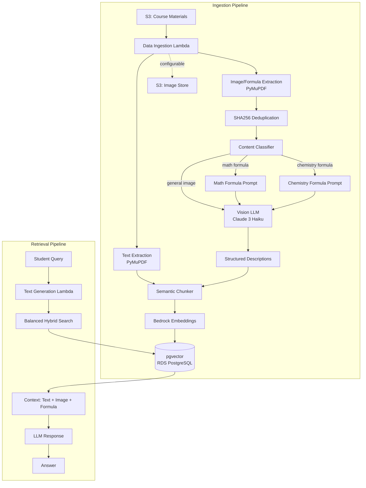
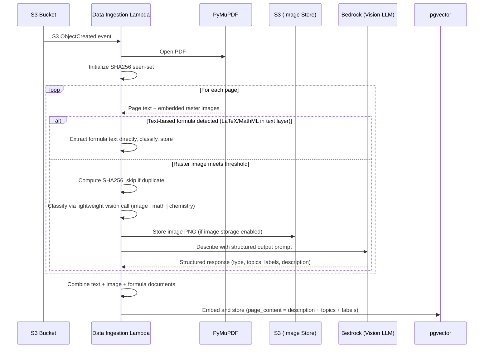
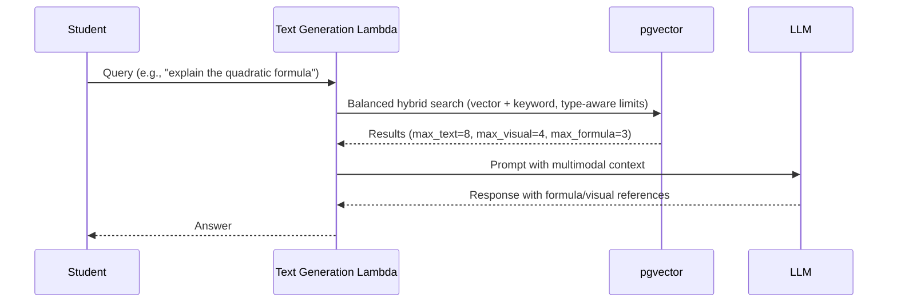

# Design Document: Multimodal RAG

## Overview

Extends the AI Learning Assistant's RAG pipeline to understand visual and formulaic content — images, diagrams, charts, mathematical equations, and chemical formulas — embedded in course PDFs. Currently, data ingestion extracts only text via PyMuPDF, discarding all visual and formula content.

This design adds image/formula extraction and description to the ingestion pipeline, storing descriptions as vector embeddings alongside text chunks. A vision-capable LLM (Claude 3 Haiku) generates structured descriptions during ingestion. For formulas, specialized detection classifies content as mathematical or chemical, and description prompts output structured representations (LaTeX notation, textual chemical notation) rather than generic prose. Images produce structured output with topics/labels/keywords to improve multi-concept retrieval.

## Architecture



## Sequence Diagrams

### Ingestion Flow



### Retrieval Flow



## Components and Interfaces

### ImageExtractor

Extracts raster images from PDF pages, deduplicates via SHA256, filters by quality thresholds, optionally stores in S3.

```python
class ImageExtractor:
    def __init__(self, s3_client, image_bucket: str, min_width: int = 100,
                 min_height: int = 100, store_images: bool = True):
        self._seen_hashes: set[str] = set()  # SHA256 dedup within document
        self._store_images = store_images     # Configurable: disable if images never shown
        ...

    def extract_page_images(self, page: fitz.Page, page_num: int, file_key: str) -> list[ExtractedImage]:
        """Extract qualifying, non-duplicate images from a PDF page."""
        ...

    def _is_duplicate(self, image_bytes: bytes) -> bool:
        """Compute SHA256; return True if already seen in this document."""
        h = hashlib.sha256(image_bytes).hexdigest()
        if h in self._seen_hashes:
            return True
        self._seen_hashes.add(h)
        return False

    def store_image(self, image: ExtractedImage, course_id: str, module_id: str) -> str | None:
        """Store image in S3 if enabled, return S3 key or None."""
        ...

    def is_valid_image(self, pixmap: fitz.Pixmap) -> bool:
        """Check minimum quality thresholds (100x100px, 5KB, aspect ratio < 10)."""
        ...
```

### FormulaDetector

Simplified classifier. Uses text-layer regex ONLY for detecting formulas in text (where vision isn't needed). For raster images, uses heuristics only for obvious skips (logos, decorations, tiny icons). Ambiguous raster images are classified by a lightweight Haiku vision call.

```python
class FormulaDetector:
    # Text-layer detection only — used when formula is embedded as text, not raster
    MATH_TEXT_PATTERNS = [
        r'\\(frac|sqrt|sum|int|prod|lim|infty|partial)',  # LaTeX commands
        r'<math[^>]*>',                                     # MathML tags
        r'[\u2200-\u22FF]',                                 # Mathematical operators Unicode block
        r'[\u0391-\u03C9]',                                 # Greek letters
    ]
    CHEM_TEXT_PATTERNS = [
        r'\b[A-Z][a-z]?\d*[⟶→⇌+]\s*[A-Z]',              # Reaction notation
        r'\\ce\{',                                          # mhchem LaTeX
    ]

    # Obvious-skip heuristics for raster images (no vision call needed)
    SKIP_CRITERIA = {
        "too_small": (30, 30),        # Likely icon/decoration
        "logo_aspect": (1.0, 0.1),    # Nearly square + tiny = logo
    }

    def classify_text(self, text: str) -> ContentType:
        """Classify text-layer content using regex. Returns math_formula, chemistry_formula, or text."""
        ...

    def classify_image(self, image_bytes: bytes, surrounding_text: str) -> ContentType:
        """
        Classify a raster image:
        1. Apply obvious-skip heuristics (logos, decorations, tiny icons) → skip
        2. For everything else → lightweight Haiku classification call
        
        Returns: IMAGE, MATH_FORMULA, or CHEMISTRY_FORMULA
        """
        ...

    def extract_text_formulas(self, page: fitz.Page, page_text: str) -> list[ExtractedFormula]:
        """Extract formulas embedded in text layer (LaTeX, MathML, Unicode math)."""
        ...
```

### ImageDescriber

Generates structured descriptions using vision LLM. Outputs structured data with topics/labels for multi-concept images to improve retrieval.

```python
class ImageDescriber:
    def __init__(self, bedrock_client, model_id: str = "anthropic.claude-3-haiku-20240307-v1:0"):
        ...

    def describe(self, image_bytes: bytes, context: ImageContext, content_type: ContentType) -> StructuredDescription:
        """
        Generate structured description. For general images, extracts:
        - type: diagram/chart/photo/table/etc.
        - topics: list of concepts depicted
        - labels: list of visible text labels/annotations
        - description: prose description
        
        For formulas, additionally extracts:
        - formula_name: human-readable name (e.g., "quadratic formula")
        - equation_type: category (e.g., "algebraic", "differential", "organic reaction")
        - related_concepts: list of concepts students might search for
        - structured_repr: LaTeX or chemical notation
        """
        ...

    def batch_describe(self, items: list[DescriptionRequest]) -> list[StructuredDescription]:
        """Describe multiple items with rate limiting and exponential backoff."""
        ...
```

### Enhanced Hybrid Search (with Retrieval Balancing)

```python
def hybrid_search(
    query: str,
    query_embedding: list[float],
    connection_string: str,
    collection_names: list[str],
    allowed_file_ids: list[str] | None,
    k: int = TOP_K,
    connection=None,
    content_types: list[str] | None = None,
    # Retrieval balancing — prevents any single type from crowding results
    max_text: int = 8,
    max_visual: int = 4,
    max_formula: int = 3,
) -> list[Document]:
    """
    Content-type-aware retrieval. Fetches candidates beyond K, then applies
    per-type caps before returning final top-K ranked results.
    Ensures instructional text isn't crowded out by image descriptions.
    """
    ...
```

## Data Models

```python
from dataclasses import dataclass, field
from enum import Enum

class ContentType(Enum):
    TEXT = "text"
    IMAGE = "image"
    MATH_FORMULA = "math_formula"
    CHEMISTRY_FORMULA = "chemistry_formula"

@dataclass
class ExtractedImage:
    image_bytes: bytes
    page_num: int
    image_index: int
    width: int
    height: int
    file_key: str
    sha256: str = ""         # Deduplication hash
    s3_key: str | None = None

@dataclass
class ExtractedFormula:
    """Formula extracted from text layer (not raster)."""
    raw_text: str
    page_num: int
    content_type: ContentType
    source: str  # "text_layer" | "raster"

@dataclass
class ImageContext:
    course_topic: str
    page_text: str         # Surrounding text (first 500 chars)
    page_num: int
    filename: str

@dataclass
class StructuredDescription:
    """Structured output from vision LLM."""
    description: str
    content_type: ContentType
    topics: list[str] = field(default_factory=list)       # Concept keywords
    labels: list[str] = field(default_factory=list)       # Visible text labels
    image_type: str = ""                                   # diagram/chart/photo/table
    # Formula-specific fields
    formula_name: str | None = None                        # e.g., "quadratic formula"
    equation_type: str | None = None                       # e.g., "algebraic", "differential"
    related_concepts: list[str] = field(default_factory=list)  # Student search terms
    structured_repr: str | None = None                     # LaTeX or chemical notation
    # Source reference
    image: ExtractedImage | None = None
    s3_key: str | None = None

    @property
    def page_content(self) -> str:
        """Combined string for embedding: description + topics + labels."""
        parts = [self.description]
        if self.topics:
            parts.append("Topics: " + ", ".join(self.topics))
        if self.labels:
            parts.append("Labels: " + ", ".join(self.labels))
        if self.related_concepts:
            parts.append("Related: " + ", ".join(self.related_concepts))
        return " | ".join(parts)
```

### Document Metadata Schema (pgvector)

```python
# General image metadata — topics stored for filtering/boosting
{"source": "s3://...", "file_id": "uuid", "content_type": "image", "page_num": 3,
 "image_s3_key": "course/module/images/file_id/3_0.png",  # None if storage disabled
 "image_type": "diagram", "topics": ["photosynthesis", "chloroplast", "light reactions"],
 "labels": ["H2O", "O2", "ATP"]}

# Math formula metadata — includes searchable concept fields
{"source": "s3://...", "file_id": "uuid", "content_type": "math_formula", "page_num": 5,
 "image_s3_key": "course/module/images/file_id/5_1.png",
 "formula_source": "raster",
 "formula_name": "quadratic formula",
 "equation_type": "algebraic",
 "related_concepts": ["solving quadratic equations", "discriminant", "roots"],
 "structured_repr": "\\frac{-b \\pm \\sqrt{b^2 - 4ac}}{2a}"}

# Chemistry formula metadata — best-effort textual representation (no SMILES requirement)
{"source": "s3://...", "file_id": "uuid", "content_type": "chemistry_formula", "page_num": 7,
 "image_s3_key": "course/module/images/file_id/7_0.png",
 "formula_source": "raster",
 "formula_name": "water synthesis",
 "equation_type": "inorganic reaction",
 "related_concepts": ["combustion", "hydrogen", "oxidation"],
 "structured_repr": "2H2 + O2 → 2H2O"}
```

## Algorithmic Pseudocode

### Main Processing Algorithm

```python
def process_pdf_multimodal(bucket, file_key, course_id, module_id, file_id) -> list[Document]:
    """
    Preconditions:
        - file_key points to valid PDF in S3
        - Bedrock vision model accessible
    Postconditions:
        - Returns Documents with content_type in {text, image, math_formula, chemistry_formula}
        - Image/formula failures do not block text processing
        - No duplicate images (SHA256 dedup within document)
        - Maximum 30 visual elements processed per document
    """
    all_documents = []
    visual_count = 0
    MAX_VISUAL_ITEMS = 30

    pdf_bytes = s3_client.get_object(Bucket=bucket, Key=file_key)["Body"].read()
    doc = fitz.open(stream=pdf_bytes, filetype="pdf")
    image_extractor = ImageExtractor(s3, EMBEDDING_BUCKET_NAME, store_images=IMAGE_STORAGE_ENABLED)
    
    for page_num, page in enumerate(doc, start=1):
        page_text = page.get_text()
        
        # 1. Text chunks (existing pipeline — always succeeds independently)
        if page_text:
            chunks = semantic_chunker.create_documents([page_text])
            for c in chunks:
                c.metadata.update(content_type="text", page_num=page_num, file_id=file_id)
            all_documents.extend(chunks)
        
        # 2. Text-layer formulas
        try:
            text_formulas = formula_detector.extract_text_formulas(page, page_text)
            for formula in text_formulas:
                all_documents.append(Document(
                    page_content=formula.raw_text,
                    metadata={"content_type": formula.content_type.value, "page_num": page_num,
                              "file_id": file_id, "formula_source": "text_layer",
                              "structured_repr": formula.raw_text, "source": f"s3://{bucket}/{file_key}"}
                ))
        except Exception as e:
            logger.warning(f"Text formula extraction failed page {page_num}: {e}")
        
        # 3. Raster images (with dedup + cap)
        if visual_count >= MAX_VISUAL_ITEMS:
            continue
        try:
            images = image_extractor.extract_page_images(page, page_num, file_key)
            context = ImageContext(course_topic=module_topic, page_text=page_text[:500],
                                   page_num=page_num, filename=file_key.split("/")[-1])
            
            for image in images:
                if visual_count >= MAX_VISUAL_ITEMS:
                    logger.warning(f"Visual cap reached ({MAX_VISUAL_ITEMS}), skipping remaining")
                    break
                
                # SHA256 dedup — skip repeated logos/headers
                if image_extractor._is_duplicate(image.image_bytes):
                    continue
                
                content_type = formula_detector.classify_image(image.image_bytes, page_text)
                image.s3_key = image_extractor.store_image(image, course_id, module_id)
                structured_desc = image_describer.describe(image.image_bytes, context, content_type)
                
                metadata = {
                    "content_type": content_type.value,
                    "page_num": page_num,
                    "file_id": file_id,
                    "image_s3_key": image.s3_key,
                    "topics": structured_desc.topics,
                    "labels": structured_desc.labels,
                    "formula_source": "raster" if content_type != ContentType.IMAGE else None,
                    "source": f"s3://{bucket}/{file_key}",
                }
                if content_type in (ContentType.MATH_FORMULA, ContentType.CHEMISTRY_FORMULA):
                    metadata.update(
                        formula_name=structured_desc.formula_name,
                        equation_type=structured_desc.equation_type,
                        related_concepts=structured_desc.related_concepts,
                        structured_repr=structured_desc.structured_repr,
                    )
                
                # Embed combined string: description + topics + labels
                all_documents.append(Document(
                    page_content=structured_desc.page_content,
                    metadata=metadata
                ))
                visual_count += 1
        except Exception as e:
            logger.warning(f"Image extraction failed page {page_num} (non-blocking): {e}")
    
    doc.close()
    return all_documents
```

### Content-Type-Specific Structured Prompts

```python
PROMPTS = {
    ContentType.IMAGE: """Analyze this image from an educational document about "{topic}".
Context: {page_text}

Respond in this exact JSON format:
{{
  "type": "<diagram|chart|photo|table|illustration|graph|map|other>",
  "topics": ["<concept1>", "<concept2>", ...],
  "labels": ["<visible text label 1>", "<visible text label 2>", ...],
  "description": "<factual description covering key information and relationships>"
}}""",

    ContentType.MATH_FORMULA: """This image contains a mathematical formula/equation from 
a document about "{topic}".
Context: {page_text}

Respond in this exact JSON format:
{{
  "formula_name": "<human-readable name, e.g. quadratic formula>",
  "equation_type": "<algebraic|differential|integral|statistical|geometric|other>",
  "related_concepts": ["<concept students might search for>", ...],
  "latex": "<exact LaTeX representation>",
  "description": "<one sentence explaining what the formula represents>",
  "variables": ["<var>: <meaning>", ...]
}}""",

    ContentType.CHEMISTRY_FORMULA: """This image contains a chemical formula, reaction, 
or molecular structure from a document about "{topic}".
Context: {page_text}

Respond in this exact JSON format:
{{
  "formula_name": "<human-readable name, e.g. water synthesis>",
  "equation_type": "<inorganic reaction|organic reaction|equilibrium|structure|other>",
  "related_concepts": ["<concept students might search for>", ...],
  "notation": "<best-effort textual representation: reaction text, molecule names, or standard chemical notation>",
  "description": "<one sentence explaining what the formula/reaction represents>",
  "components": ["<reactant/product/molecule>", ...]
}}""",
}
```

## Key Functions with Formal Specifications

### extract_page_images()

**Preconditions:** `page` is valid open fitz.Page, `page_num >= 1`, `file_key` non-empty  
**Postconditions:** Each returned image satisfies `is_valid_image()` OR `is_likely_formula_image()`. No duplicates (SHA256 checked). Original page unmodified.  
**Loop Invariant:** All previously processed images either passed validation or were filtered out; `_seen_hashes` contains hashes of all processed images.

### classify_image()

**Preconditions:** `image_bytes` is valid PNG/JPEG, `surrounding_text` is non-null  
**Postconditions:** Returns exactly one of `ContentType.IMAGE`, `ContentType.MATH_FORMULA`, `ContentType.CHEMISTRY_FORMULA`. No side effects. Obvious skips (logos, tiny icons) never reach vision LLM.

### describe()

**Preconditions:** `image_bytes` valid image, Bedrock accessible, `content_type` is valid enum  
**Postconditions:** Returns `StructuredDescription` with non-empty `description` and `topics`. On failure returns fallback. For `MATH_FORMULA`: contains `structured_repr` (LaTeX) + `formula_name` + `equation_type`. For `CHEMISTRY_FORMULA`: contains `structured_repr` (textual notation) + `formula_name`.

### hybrid_search() (Enhanced)

**Preconditions:** `query` non-empty, `query_embedding` correct dimensionality, `collection_names` non-empty  
**Postconditions:** Returns ≤ `k` Documents ordered by blended relevance. Per-type caps enforced: text ≤ `max_text`, visual ≤ `max_visual`, formula ≤ `max_formula`. Backward-compatible when `content_types` is None.

## Example Usage

### Ingestion

```python
processor = MultimodalDocumentProcessor(
    image_extractor=ImageExtractor(s3, EMBEDDING_BUCKET_NAME, store_images=IMAGE_STORAGE_ENABLED),
    formula_detector=FormulaDetector(bedrock_client),  # Uses Haiku for ambiguous classification
    image_describer=ImageDescriber(bedrock_runtime),
    embeddings=embeddings,
    text_splitter=SemanticChunker(embeddings),
)
documents = processor.process_pdf(bucket_name, file_key, course_id, module_id, file_id)
# documents contain text chunks + structured image/formula descriptions
# page_content for images = "description | Topics: x, y | Labels: a, b"
index(documents, record_manager, vectorstore, cleanup="full", source_id_key="source")
```

### Retrieval

```python
query = "What is the quadratic formula?"
results = hybrid_search(
    query=query, query_embedding=embed(query),
    connection_string=conn_str, collection_names=[module_id],
    allowed_file_ids=allowed_file_ids,
    max_text=8, max_visual=4, max_formula=3,
)
# Balanced results — instructional text won't be crowded out by image descriptions
# Formula results include: formula_name="quadratic formula", related_concepts=["discriminant", ...]
```

## Correctness Properties

Property 1: Every image meeting quality thresholds and passing SHA256 dedup produces a Document with appropriate `content_type` in the vectorstore after ingestion.

Property 2: Image/formula extraction failure for any page does not prevent text chunk ingestion. `text_extraction_success(page)` is independent of `image_extraction_success(page)`.

Property 3: Every Document has `content_type` ∈ {`text`, `image`, `math_formula`, `chemistry_formula`}. Formula documents have `structured_repr`, `formula_name`, `equation_type`, and `formula_source` fields. Image documents have `topics` and `labels` fields.

Property 4: Existing text documents remain searchable and retrievable. Additional multimodal documents may alter ranking.

Property 5: Re-ingesting the same PDF produces the same document set. `record_manager` with `cleanup="full"` prevents duplicates. SHA256 dedup ensures repeated images within a document produce exactly one Document.

Property 6: Text-layer formulas detected by regex are always classified as `math_formula` or `chemistry_formula`, never `image`.

Property 7: Math formula descriptions always contain a LaTeX representation, `formula_name`, and `equation_type`. Chemistry formula descriptions always contain a best-effort textual notation (reaction text, molecule names, or standard chemical notation).

Property 8: Retrieval balancing enforces per-type caps. No single content type can exceed its configured maximum within a result set.

## Error Handling

| Scenario | Response | Recovery |
|----------|----------|----------|
| Vision LLM failure/timeout | Fallback description with content type tag | Continue processing; no retry within invocation |
| Corrupted image (bad pixmap) | Log warning, skip image | Other images/text unaffected |
| S3 upload failure (when storage enabled) | Log error, set `image_s3_key=None` | Description still stored; image not viewable |
| Bedrock throttling | Exponential backoff, max 3 retries | Fallback description if all retries fail |
| Visual cap reached (>30 items) | Process first 30, log warning | Remaining skipped; text always fully processed |
| Classification ambiguous + vision call fails | Default to `ContentType.IMAGE` (general prompt) | Still produces usable description |
| Duplicate image (SHA256 match) | Skip silently | No wasted vision LLM calls |
| Structured JSON parse failure | Fall back to raw text as description | Topics/labels empty but document still indexed |

## Testing Strategy

**Unit Tests**:
- `ImageExtractor`: Mock fitz page, verify size/aspect filtering, verify SHA256 dedup skips duplicates
- `FormulaDetector`: Test text-layer regex patterns; verify obvious-skip heuristics for logos/icons; verify vision classification call for ambiguous images
- `ImageDescriber`: Mock Bedrock, verify structured JSON parsing, verify `page_content` combines description+topics+labels
- `StructuredDescription.page_content`: Verify combined string format

**Property-Based Tests** (hypothesis):
- All documents from `process_pdf` have valid `content_type` metadata
- `is_valid_image(img) == False` for any image where `width < 100 OR height < 100 OR bytes < 5KB`
- Formula classifier is deterministic: same input → same classification
- SHA256 dedup: processing N identical images produces exactly 1 Document
- Retrieval balancing: result counts per type never exceed configured caps

**Integration Tests**:
- Upload test PDF with known images + formulas → verify correct content_type counts in pgvector
- Verify topics/labels appear in `page_content` and improve retrieval for multi-concept queries
- Balanced hybrid search returns mix of types, not all one type
- Backward compatibility: text-only queries with `content_types=None` still work

## Performance Considerations

- **Vision LLM cost**: Claude 3 Haiku ~$0.001/image is best-case (small images, short output). Actual cost depends on image dimensions and output token count. **Must validate with real course materials before production.**
- **Hard cap**: Maximum 30 visual elements per document to bound cost and Lambda duration.
- **SHA256 dedup**: Eliminates repeated logos/headers — typical savings of 20-60% of vision calls on documents with consistent branding.
- **Lambda duration**: ~2-5s per image description. 30 items ≈ 60-150s. Within 15-min timeout.
- **Classification cost**: Lightweight Haiku call for ambiguous images adds ~0.5s per image but eliminates complex regex maintenance.
- **Storage**: PNGs average 50-200KB each. Configurable — disable if images never displayed to students.
- **Retrieval impact**: Collection size increases ~10-30% for image-heavy materials. Balanced retrieval prevents result flooding.

## Security Considerations

- Extracted images stored in private embedding bucket (not public). IAM scoped to bucket.
- Image storage is configurable — can be disabled to reduce data lifecycle burden.
- Vision LLM prompt requests factual descriptions only. Bedrock Guardrails applicable.
- Claude 3 Haiku vision requires model access in Bedrock console + IAM model ARN.
- Same PII risk as text extraction — descriptions may contain visible text from images.

## Phase 2: Vector Diagram Extraction

**Known coverage gap**: `page.get_images()` only extracts raster images. Vector diagrams (SVG paths, line charts, flowcharts stored as PDF drawing commands) are invisible to this API.

**Planned approach** (do not block V1):
1. Detect pages with vector-only visual content (drawing operators present but no raster images extracted)
2. Render those page regions to pixmaps via `page.get_pixmap(clip=rect)`
3. Pass rendered pixmaps through the same structured description pipeline

**Why deferred**: Requires heuristics to identify meaningful vector regions vs. decorative lines/borders. V1 covers the majority of educational content (photos, scanned formulas, raster charts).

## Dependencies

- **PyMuPDF (fitz)** — image extraction via `page.get_images()` / `doc.extract_image()` (already in requirements.txt)
- **Pillow** — image format validation (already in requirements.txt)
- **Claude 3 Haiku Vision** — `anthropic.claude-3-haiku-20240307-v1:0` (new Bedrock model, needs IAM + console access)
- **S3** — existing `EMBEDDING_BUCKET_NAME` for image storage (configurable, enabled by default)
- **pgvector (RDS)** — no schema changes; enriched metadata on existing document structure
- **LangChain** — `Document` class for unified storage (existing)
- **hashlib** — SHA256 for image deduplication (Python stdlib)
