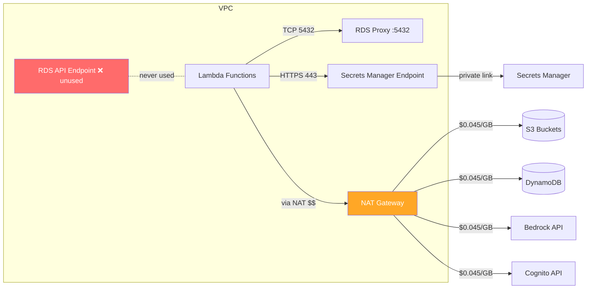
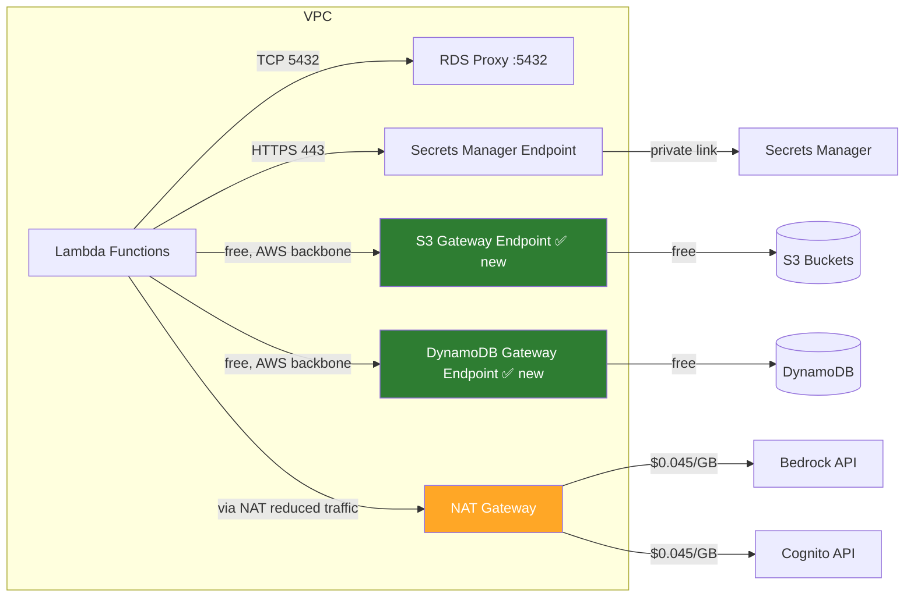
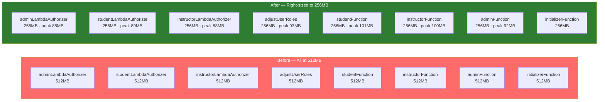
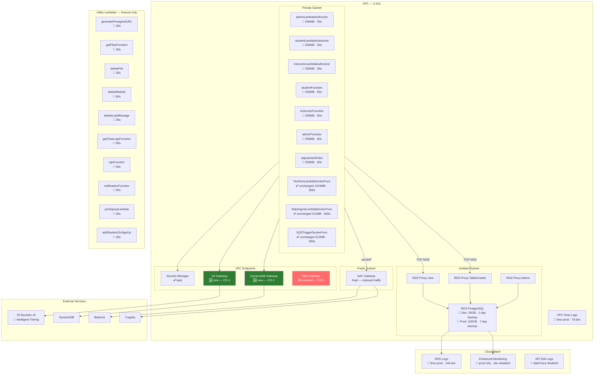

# Cost Optimization Diagrams

## 1. Network Traffic Flow — Before vs After (CO-1, CO-3)

### Before

### After

**Key changes:**
- S3 and DynamoDB traffic no longer routes through NAT Gateway (CO-1)
- RDS API endpoint removed — was never used (CO-3)
- NAT Gateway only handles Bedrock and Cognito traffic now

---

## 2. Lambda Configuration Changes (CO-2, CO-5)

### Memory Allocation — Before vs After

### Timeout Changes — Before vs After

```mermaid
gantt
    title Lambda Timeouts (seconds)
    dateFormat X
    axisFormat %s

    section Authorizers
    adminAuth BEFORE     :done, 0, 300
    adminAuth AFTER      :active, 0, 30
    studentAuth BEFORE   :done, 0, 300
    studentAuth AFTER    :active, 0, 30
    instructorAuth BEFORE :done, 0, 300
    instructorAuth AFTER :active, 0, 30

    section Cognito Triggers
    preSignup BEFORE     :done, 0, 300
    preSignup AFTER      :active, 0, 30
    addStudentOnSignUp BEFORE :done, 0, 300
    addStudentOnSignUp AFTER  :active, 0, 30
    adjustUserRoles BEFORE :done, 0, 300
    adjustUserRoles AFTER  :active, 0, 60

    section CRUD Functions
    studentFunc BEFORE   :done, 0, 300
    studentFunc AFTER    :active, 0, 60
    instructorFunc BEFORE :done, 0, 300
    instructorFunc AFTER :active, 0, 60
    adminFunc BEFORE     :done, 0, 300
    adminFunc AFTER      :active, 0, 60

    section Utility Functions
    generatePresignedURL BEFORE :done, 0, 300
    generatePresignedURL AFTER  :active, 0, 30
    getFiles BEFORE      :done, 0, 300
    getFiles AFTER       :active, 0, 30
    deleteFile BEFORE    :done, 0, 300
    deleteFile AFTER     :active, 0, 30
    deleteModule BEFORE  :done, 0, 300
    deleteModule AFTER   :active, 0, 60
    deleteLastMsg BEFORE :done, 0, 300
    deleteLastMsg AFTER  :active, 0, 30
    getChatLogs BEFORE   :done, 0, 300
    getChatLogs AFTER    :active, 0, 60
    sqsFunction BEFORE   :done, 0, 300
    sqsFunction AFTER    :active, 0, 60
    notification BEFORE  :done, 0, 300
    notification AFTER   :active, 0, 60

    section Unchanged
    SQSTrigger           :crit, 0, 300
    TextGenDocker        :crit, 0, 300
    DataIngestDocker     :crit, 0, 600
    initializer          :crit, 0, 300
```

---

## 3. Architecture Overview — Resources Changed

**Legend:**
- 🆕 New resource added
- 🔧 Configuration changed
- 🗑️ Resource removed
- ✅ Unchanged
